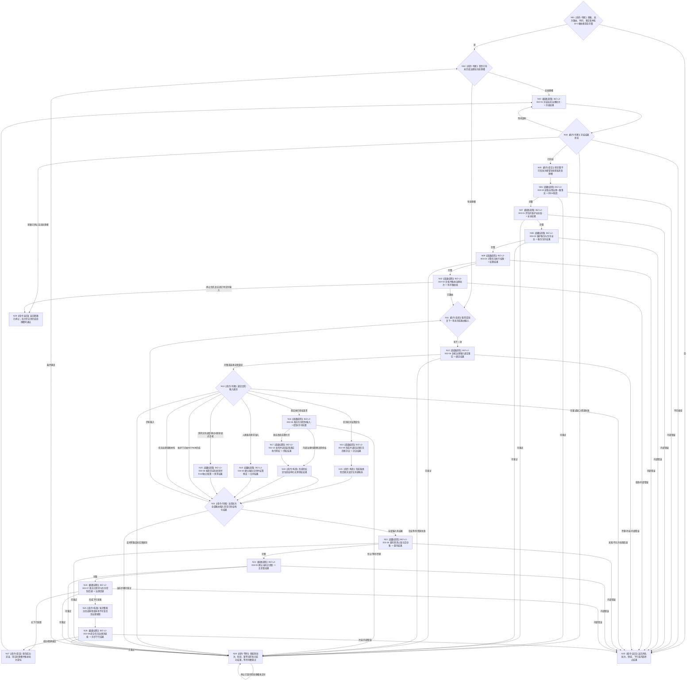

# BIZ-L1-T02 自我线程治理循环目标函数流程图 v0.4

更新时间：2026-08-26

## 依据

```text
0050、4050、5090 v0.8、5160 v0.5、8100 v0.8、8110、8200、8300
BIZ-L0-001 v0.4、BIZ-L1-T01 v0.4、BIZ-MAIN-001 v0.2
BIZ-L2-002-01—10、BIZ-L2-003-01—04、BIZ-L2-004-01/06 v0.2
当前工作区代码：海中鱼巣/线程/创建.自我线程.ixx
```

## 身份与边界

本图只冻结自我物理线程在治理运行门开放后的根循环。它是 BIZ-L0-02 中的一个并发运行模块：对象、邮箱、路由和线程由 T01 在 BIZ-L0-01 建立；T01 进入 BIZ-L0-03 后停止并连接该线程。

自我线程负责读取、比较、编排和形成不可变治理意图，不拥有任务状态、方法选择、执行冻结、任务结果、需求结论、安全值、服务值、自我任务后继决议或现实执行授权的第二写入权。具体事实只由对应领域 owner 的公开入口发布和独立读回。

## 函数合同

```text
根函数：运行治理循环
归属模块 / 文件 / 目标分解深度：海中鱼巣.线程.创建.自我线程 / 海中鱼巣/线程/创建.自我线程.ixx / BIZ-L1
完整身份：海中鱼巣::自我线程::运行治理循环
当前工作区签名：自我治理循环退出结果 运行治理循环() noexcept
可见性：自我线程私有成员；只由同对象线程入口在治理运行门开放后调用
参数：无显式参数；消费构造时冻结的邮箱、批次路由、时间、事实版本和16个具名BIZ-L2根服务借用
返回结果：结构化自我治理循环退出结果；线程入口随后保存该结果并形成物理退出见证
被调函数流程图：BIZ-L2-002-01—10、BIZ-L2-003-01—04、BIZ-L2-004-01、BIZ-L2-004-06 v0.2，共16个直接根
上级前置：T01已经取得停门见证并正式开放治理运行门
上级后继：返回线程入口；T01在BIZ-L0-03等待线程结束
```

## 流程图



## 16个直接 BIZ-L2 根与职责

| 根 | T02唯一职责 | 不能替代 |
| --- | --- | --- |
| 002-01 | 冻结或恢复唯一批次 | 后继业务处理 |
| 002-02 | 形成一个共享G0一致事实 | 安全/服务维护写入 |
| 002-03 | 九类唯一分类与路由 | 领域绑定与业务裁决 |
| 002-04 | 按类别独立复核强类型绑定 | 需求结算或后继决议 |
| 002-05 | 生存控制与执行许可前置 | 自我正向授权 |
| 002-06 | 需求父链与活动集重判 | 单需求满足结论 |
| 002-07 | 主需求和生存控制治理后继 | 单任务轮次后继决议 |
| 002-08 | 异步提交不可变任务治理意图 | 任务状态写入 |
| 002-09 | 形成并读回任务轮次后的self后继决议 | 现实执行授权 |
| 002-10 | 发布并读回一份自我现实执行授权 | 安全硬否决或技术许可 |
| 003-01 | 每批按合同维护分层安全 | 服务值维护 |
| 003-02 | 每批按完整秒维护服务与生存安全 | 线程循环计数 |
| 003-03 | 计算任务执行权限 | 正向授权或硬否决 |
| 003-04 | 人类服务需求合同准入和预支 | 需求满足 |
| 004-01 | 按当前目标材料确认正差距 | 需求正式结算 |
| 004-06 v0.2 | 需求实际使用时fresh独立核算 | 任务结果分配/容量 |

## 停止与重试合同

- 停止请求不得抛弃已经从邮箱冻结并接管的治理批次。存在处理槽时必须保留原批次、阶段、幂等请求及已成功结果，直到完成交付或形成结构化不可恢复终止。
- 只有邮箱已停止且当前没有待完成处理槽时，根循环才返回 `邮箱已停止`。
- 合法等待和资源失败只恢复首个未完成步骤，不重新读取邮箱、不改绑身份、不重复已成功写入。
- 根循环返回后，线程入口必须保存运行结果并发布物理退出见证；生命周期投影不能替代内部退出结果或业务终态。

## 当前工作区实现对照

| 能力 | 当前工作区事实 | 判断 |
| --- | --- | --- |
| 运行门后进入根循环 | 线程入口在运行门开放后调用 `运行治理循环()` | 已接线 |
| 批次冻结、路由和一致事实 | 已调用真实批次路由与一致事实骨架 | 部分实现；v3路由和完整provider仍未闭合 |
| 安全、服务和权限 | 已调用骨架入口 | 不能证明真实维护/权限闭环 |
| 任务结果窄路径 | 已按显式任务、轮次、结算身份和G读取轮次结算 | 部分实现 |
| self后继决议 | 当前工作区已有未发布provider WIP，根循环仍未完整接线 | 未闭合 |
| 自我现实执行授权 | 当前工作区已有未发布provider WIP，根循环仍未完整接线 | 未闭合 |
| 需求实际使用时fresh核算 | 旧结果后结算图已退出；v0.2目标根尚未实现 | 实现缺失 |
| 普通治理输入 | 当前多数路由后没有正式消费 | 实现缺失 |
| 停止期间保槽 | 循环顶部和等待分支仍可能直接返回邮箱已停止 | 实现偏差 |
| 线程入口保存循环结果 | 当前仅形成局部退出结果/生命周期，完整内部完成材料未闭合 | 实现缺失 |

## 关键边界

- 正式任务结果只是执行发生和动作后状态/动态/归因引用，不是容量、分配物或需求满足结论。
- 子任务轮次收束后只按 0..1 正式发起调用返回唯一上级调用槽；其它需求/任务在实际使用时 fresh 复核自身目标或条件。
- 优先级只决定任务和方法获得执行机会的次序，不决定需求满足、结果归属、自我授权或 self 后继。
- T02 是编排载体，不直达 ARCH-L1；所有写入均由具名 owner 正式入口发布并独立读回。
- 当前工作区实现和本图目标仍有具名差异；本图校正不等于代码、构建、运行或自我治理闭环完成。

## 未闭合的上层停机接口

`DRIFT-BIZ-L1-T02-STOP-WITH-PERMANENT-PROVIDER-FAILURE-UNFROZEN`：已接管批次在停止时不得丢弃，但永久 provider 失败下的持久交接 owner、可恢复见证、允许终止条件和超时合同仍未冻结。N28 因此只能保槽等待，不能自行改成丢批次、假成功或裸超时退出。

## v0.4 校正记录

- 恢复 BIZ-L1→BIZ-L2 严格分层，所有直接调用逐项落为16个具名根，不用“复核分类并路由”“安全维护与服务维护”等聚合自然语言节点代替多个函数。
- 新增 002-09 self后继决议和 002-10 自我现实执行授权，二者分账。
- 004-06替换为需求实际使用时fresh独立核算；撤回任务结果容量、分配和任务完成后批量T→D结算。
- 恢复002-02一致事实、003-03执行权限、002-06需求活动重判、004-01正差距和002-07全局治理后继在根循环中的明确位置。
