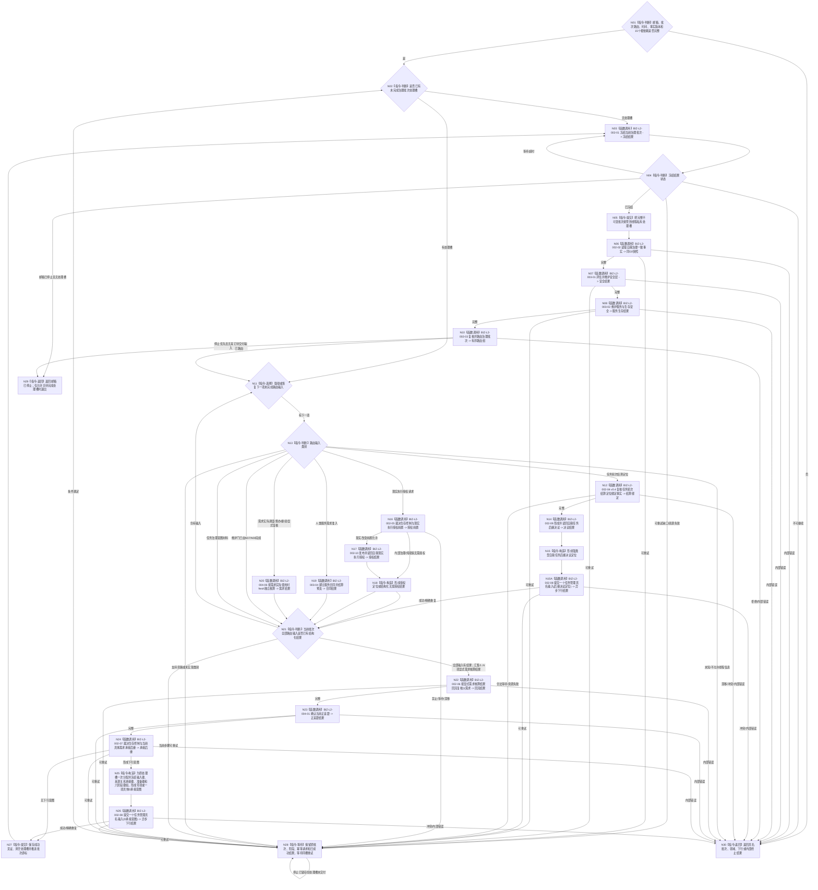

# BIZ-L1-T02 自我线程治理循环目标函数流程图 v0.6

更新时间：2026-08-27

## 依据

```text
0050 v1.5、4050、5090 v0.8、5160 v0.4、8100 v0.8、8110、8200 v0.7、8300 v0.6
BIZ-L0-001 v0.4、BIZ-L1-T01 v0.4、BIZ-MAIN-001 v0.4
BIZ-L2-002-01—10、BIZ-L2-003-01—02/04、BIZ-L2-004-01/06 v0.2
当前工作区代码：海中鱼巣/线程/创建.自我线程.ixx
```

## 身份与边界

本图只冻结自我物理线程在治理运行门开放后的根循环。它是 BIZ-L0-02 中的一个并发运行模块：对象、邮箱、路由和线程由 T01 在 BIZ-L0-01 建立；BIZ-L2-001-08 以同代次完整启动前置一次开门，并由线程入口在实际调用本函数前发布治理循环进入见证；T01 进入 BIZ-L0-03 后停止并连接该线程。

自我线程负责读取、比较、编排和形成不可变治理意图，不拥有任务状态、方法选择、执行冻结、任务结果、需求结论、安全值、服务值、自我任务后继决议或现实执行授权的第二写入权。具体事实只由对应领域 owner 的公开入口发布和独立读回。

## 函数合同

```text
根函数：运行治理循环
归属模块 / 文件 / 目标分解深度：海中鱼巣.线程.创建.自我线程 / 海中鱼巣/线程/创建.自我线程.ixx / BIZ-L1
现有或待新增：现有线程根函数；本图冻结目标行为，当前代码符合度另由实现映射表分账
完整身份：海中鱼巣::自我线程::运行治理循环
完整签名：自我治理循环退出结果 自我线程::运行治理循环() noexcept
可见性：自我线程私有成员；只由同对象线程入口在治理运行门开放后调用
参数：无显式参数；消费构造时冻结的邮箱、批次路由、时间、事实版本和15个具名BIZ-L2根服务借用
返回结果：结构化自我治理循环退出结果；线程入口随后保存该结果并形成物理退出见证
被调函数流程图：BIZ-L2-002-01—10、BIZ-L2-003-01—02、BIZ-L2-003-04、BIZ-L2-004-01、BIZ-L2-004-06 v0.2，共15个直接根；其中 BIZ-L2-002-08 v0.2 每次只提交一个具名任务管理输入。旧BIZ-L2-003-03全局调用边退出；当前003-03 v0.4已重挂T03 v0.5的执行冻结后、真实派发前路径
上级前置：T01已经持有阶段20停门见证及001-04—07同代次完整结果；001-08已提交治理运行门开放，线程入口发布治理循环进入见证后才调用本函数
上级后继：返回线程入口；T01在BIZ-L0-03等待线程结束
```

## 流程图



## 节点合同

| 节点 | 类型 | 参数 / 输入绑定 | 结果 / 输出绑定 | 事实读写 | 后继条件 | 验证 |
| --- | --- | --- | --- | --- | --- | --- |
| N01—N05 | 判断 / 函数调用 / 提交 | 构造依赖与邮箱批次 | 唯一私有处理槽 | 读取邮箱；只写线程私有槽 | 已冻结或结构化等待 / 终止 | 无处理槽时才取新批次 |
| N06—N08/N10 | 函数调用 | 冻结批次与共享G0 | 一致事实、安全 / 服务维护和有序路由 | 只经具名owner读写；线程无领域写权 | 全部完整后进入逐项路由 | 不在主需求选择前计算任务调度资格；全部实际来源截止互证 |
| N11—N20 | 选择 / 函数调用 / 构造 | 下一路由项与类别 | 任务结果绑定、self决议、现实授权、合同或需求核算结果 | 只经具名owner读写；self决议定位经002-08单项提交 | 当前项有结构化结果 | 先分类再调用类别专属根；提交成功不等于T03已消费 |
| N21—N27 | 判断 / 函数调用 / 提交 | 当前批次全部结果 | 需求重判、正差距、治理后继和下行意图 | 只经具名owner写入；线程只写私有游标 | 全批完成或具名重试 | 不重复已经成功的owner写入 |
| N28—N30 | 等待 / 返回 | 未完成槽或终止原因 | 结构化循环退出结果 | 只保留私有槽；无领域写入 | 条件满足重试或返回线程入口 | 停止不得丢弃已接管批次 |

## 15个直接 BIZ-L2 根与职责

| 根 | T02唯一职责 | 不能替代 |
| --- | --- | --- |
| 002-01 | 冻结或恢复唯一批次 | 后继业务处理 |
| 002-02 | 形成一个共享G0一致事实 | 安全/服务维护写入 |
| 002-03 | 九类唯一分类与路由 | 领域绑定与业务裁决 |
| 002-04 v0.4 | 按显式T/R/结算身份/G复核并独立读回任务轮次结算 | 任务实际结果、当前实例猜测或其它路由类别 |
| 002-05 | 生存控制与现实执行授权前置 | 调度资格、自我正向授权、技术许可或安全硬否决 |
| 002-06 v0.2 | 只沿显式需求核算结果回流复核当前父需求 | 任意任务结果扫描、跨需求活动集事务或其它受益任务批量结算 |
| 002-07 v0.2 | 生存控制与当前具体需求承接后继 | 当前任务查询、执行许可、调度资格或单任务轮次后继决议 |
| 002-08 v0.2 | 每次异步提交一个具名任务管理输入：具体D承接意图或self后继决议定位 | 通用消息组、任务状态写入或其它未冻结治理类型 |
| 002-09 | 形成并读回任务轮次后的self后继决议 | 现实执行授权 |
| 002-10 | 发布并读回一份自我现实执行授权 | 安全硬否决或技术许可 |
| 003-01 | 每批按合同维护分层安全 | 服务值维护 |
| 003-02 | 每批按完整秒维护服务与生存安全 | 线程循环计数 |
| 003-04 | 人类服务需求合同准入和预支 | 需求满足 |
| 004-01 | 按当前目标材料确认正差距 | 需求正式结算 |
| 004-06 v0.2 | 需求实际使用时fresh独立核算 | 任务结果分配/容量 |

## 停止与重试合同

- 停止请求不得抛弃已经从邮箱冻结并接管的治理批次。存在处理槽时必须保留原批次、阶段、幂等请求及已成功结果，直到完成交付或形成结构化不可恢复终止。
- 只有邮箱已停止且当前没有待完成处理槽时，根循环才返回 `邮箱已停止`。
- 合法等待和资源失败只恢复首个未完成步骤，不重新读取邮箱、不改绑身份、不重复已成功写入。
- 根循环返回后，线程入口必须保存运行结果并发布物理退出见证；生命周期投影不能替代内部退出结果或业务终态。

## 当前工作区实现对照

| 能力 | 当前工作区事实 | 判断 |
| --- | --- | --- |
| 运行门后进入根循环 | 线程入口在运行门开放后调用 `运行治理循环()` | 调用边已接线；当前未发布循环进入见证，且局部退出结果被丢弃，001-08不能证明进入闭合 |
| 批次冻结、路由和一致事实 | 已调用真实批次路由与一致事实骨架 | 部分实现；v3路由和完整provider仍未闭合 |
| 安全与服务维护 | 已调用骨架入口 | 不能证明真实维护闭环；旧003-03全局权限调用边不属于目标流程 |
| 任务轮次结算窄路径 | HEAD仍按任务当前实例和执行轮次读取实际结果；没有按显式结算身份的002-04 v0.4组合 | 实现偏差；目标改为T/R/结算身份/G独立读回 |
| self后继决议 | 当前工作区已有未发布provider WIP，根循环仍未完整接线 | 未闭合 |
| 自我现实执行授权 | 当前工作区已有未发布provider WIP，根循环仍未完整接线 | 未闭合 |
| 需求实际使用时fresh核算 | 旧结果后结算图已退出；v0.2目标根尚未实现 | 实现缺失 |
| T02到T03具名输入 | HEAD只有无载荷任务治理消息组骨架且固定入口拒绝；没有D承接或self决议定位真实队列 | 实现缺失；旧组骨架不是目标通道 |
| 停止期间保槽 | 循环顶部和等待分支仍可能直接返回邮箱已停止 | 实现偏差 |
| 线程入口保存循环结果 | 当前仅形成局部退出结果/生命周期，完整内部完成材料未闭合 | 实现缺失 |

## 关键边界

- 正式任务结果只是执行发生和动作后状态/动态/归因引用，不是容量、分配物或需求满足结论。
- 002-06 只消费本批 BIZ-L2-004-06 已形成的显式需求核算结果；空组合法无回流。任务结果、服务维护结果和其它路由结果不得扩张为受影响需求闭包。
- 子任务轮次收束后只按 0..1 正式发起调用返回唯一上级调用槽；其它需求/任务在实际使用时 fresh 复核自身目标或条件。
- 优先级只决定任务和方法获得执行机会的次序，不决定需求满足、结果归属、自我授权或 self 后继。
- 002-07只从正式当前需求业务视图选择一个具体需求D并形成承接意图；T02为原处理槽一次分配输入键、来源关系承接键、准备键和六阶段键组，跨提交/重试原样传递，不从时间、代次、D/T身份、哈希或阶段结果派生。不得消费6150/6170调度资格。多候选主需求完整比较仍为 `DRIFT-BIZ-L3-002-07-02-CURRENT-MAIN-DEMAND-SELECTION-RULE-UNFROZEN`。
- 002-08 v0.2只接收一个强类型输入。当前穷尽D承接意图和self后继决议定位；二者分别由T03按D或显式T/R/结算/决议/G独立读回，不形成通用消息组。
- BIZ-L2-003-03不得在本线程每批全局计算；其 v0.4 父图已由 T03 v0.5 在执行冻结后、真实派发前调用，本图不以旧调用边或其结果占位。
- T02 是编排载体，不直达 ARCH-L1；所有写入均由具名 owner 正式入口发布并独立读回。
- BIZ-L2-001-08 的治理循环进入见证只证明本函数取得邮箱消费资格，不证明当前邮箱为空、已有消息已处理或本函数任一BIZ-L2业务根成功；本函数仍按每批正式材料独立裁决。
- 当前工作区实现和本图目标仍有具名差异；本图校正不等于代码、构建、运行或自我治理闭环完成。

## 未闭合的上层停机接口

`DRIFT-BIZ-L1-T02-STOP-WITH-PERMANENT-PROVIDER-FAILURE-UNFROZEN`：已接管批次在停止时不得丢弃，但永久 provider 失败下的持久交接 owner、可恢复见证、允许终止条件和超时合同仍未冻结。N28 因此只能保槽等待，不能自行改成丢批次、假成功或裸超时退出。

## v0.6 校正记录

- `002-08`重基线为每次提交一个具名强类型输入；旧消息组及准备 / 确认 / 撤销组协议退出。
- self后继决议定位在形成后立即以同一 `002-08` 单项通道交付；具体需求D承接意图仍只在 `002-07` 成功后形成并提交。两类载荷不共享业务字段或消费函数。
- 提交暂不可用只保留同一处理槽、原载荷和原幂等身份重试；不重新形成决议 / D选择，也不把发送成功解释为T03已处理。
- T03上行输入只以任务轮次结算定位进入002-04 v0.4；旧任务实际结果复核消息、当前实例读取和执行轮次反推退出self后继路径。

## v0.5 校正记录

- 002-07重基线为“生存控制 -> 当前具体需求D -> 任务承接意图”；删除主需求选择前的全局003-03权限计算、执行许可后继和自我侧当前任务裁决。直接BIZ-L2根由16项收敛为15项。
- 先按路由类别分流，再只让任务轮次结算定位调用002-04；现实执行授权请求直接进入002-05，不再被任务结果绑定函数阻断。
- 002-05收窄为生存控制与现实执行授权前置，不形成或消费旧通用执行令牌，不混入调度资格、技术许可或安全硬否决。
- 002-10只消费002-05形成的“需要授权”完整前置并发布唯一自我正向授权；内部治理和纯观察在002-05直接形成无需授权结果。

## v0.4 校正记录

- v0.4曾按当时设计逐项列出16个具名根；当前v0.5的002-07校正已退出旧003-03全局调用边，现行直接根为15个。
- 新增 002-09 self后继决议和 002-10 自我现实执行授权，二者分账。
- 004-06替换为需求实际使用时fresh独立核算；撤回任务结果容量、分配和任务完成后批量T→D结算。
- v0.4曾把003-03执行权限放入根循环；该位置已由v0.5校正退出。002-02一致事实、002-06显式需求核算父链回流、004-01正差距和002-07具体需求承接后继继续保留明确位置。
