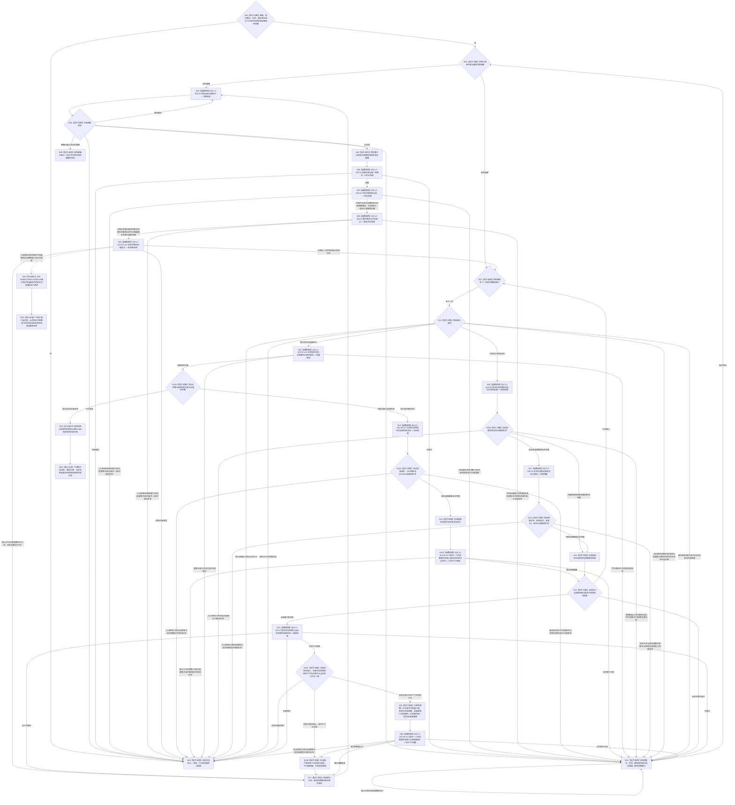

# BIZ-L1-T02 自我线程治理循环目标函数流程图 v0.7

更新时间：2026-08-28

## 依据

```text
0050 v1.9、4050、5090 v0.7、5160 v0.4、8100 v0.7、8110、8200 v0.7、8300 v0.6
用户已冻结业务口径：子任务只返回恰一正式上级调用；只有零上级调用的根任务轮次结算可进入self后继决议
规范同步边界：0050 v1.9已冻结上述边界；5090 v0.7、5160 v0.4、8100 v0.7、8200 v0.7、8300 v0.6仍有结果共用/争用、成员分配或批量核算残留
BIZ-L0-001 v0.4、BIZ-L1-T01 v0.5、BIZ-MAIN-001 v0.5
当前直接根：BIZ-L2-002-01—05、002-07—10、BIZ-L2-003-01/02
来源待冻结的有效目标图：BIZ-L2-002-06、003-04、004-01、004-06 v0.2
已发布代码事实：HEAD `07283c7b` 的海中鱼巣/线程/创建.自我线程.ixx；该源码自`4dff0bbc`后未变化
```

## 身份与边界

本图只冻结自我物理线程在治理运行门开放后的根循环。它是 BIZ-L0-02 中的一个并发运行模块：对象、邮箱、路由和线程由 T01 在 BIZ-L0-01 建立；BIZ-L2-001-08 在必要运行模块就绪后独立开门。T01是否还必须等待本函数达到某个运行成功点、该点位于越过门/函数体入口/运行前置通过/首个可消费点中的哪一个，现由BIZ-L3-001-08-03 v0.2登记为DRIFT；调用前预告不能称为本函数已经进入。T02只处理正式证明为零上级调用的根任务轮次结算定位；恰一上级调用的子任务结果必须留在T03并回到显式上级任务fresh重判，不得进入本线程self后继链。

自我线程负责读取、比较、编排和形成不可变治理意图，不拥有任务状态、方法选择、执行冻结、任务结果、需求结论、安全值、服务值、自我任务后继决议或现实执行授权的第二写入权。具体事实只由对应领域 owner 的公开入口发布和独立读回。

## 函数合同

```text
根函数：运行治理循环
归属模块 / 文件 / 目标分解深度：海中鱼巣.线程.创建.自我线程 / 海中鱼巣/线程/创建.自我线程.ixx / BIZ-L1
现有或待新增：现有线程根函数；本图冻结目标行为，当前代码符合度另由实现映射表分账
完整身份：海中鱼巣::自我线程::运行治理循环
完整签名：自我治理循环退出结果 自我线程::运行治理循环() noexcept
可见性：自我线程私有成员；只由同对象线程入口在治理运行门开放后调用
参数：无显式参数；消费构造时冻结的邮箱、批次路由、时间、事实版本和11个已闭合来源的具名BIZ-L2根服务借用
返回结果：结构化自我治理循环退出结果；线程入口随后保存该结果并形成物理退出见证
被调函数流程图：BIZ-L2-002-01—05、002-07—10、BIZ-L2-003-01/02，共11个已闭合来源的直接根；其中 BIZ-L2-002-08 v0.3 每次只提交一个具名任务管理输入。002-06、003-04、004-01、004-06仍有具名来源缺口，不得伪列为本函数已接线直接根；旧BIZ-L2-003-03全局调用边退出，当前003-03 v0.4已重挂T03 v0.6的执行冻结后、真实派发前路径
上级前置：T01已经持有阶段20停门见证及001-04—07同代次完整结果；001-08已提交治理运行门开放，线程入口发布治理循环进入见证后才调用本函数
上级后继：返回线程入口；T01在BIZ-L0-03等待线程结束
```

## 流程图



## 节点合同

| 节点 | 类型 | 参数 / 输入绑定 | 结果 / 输出绑定 | 事实读写 | 后继条件 | 验证 |
| --- | --- | --- | --- | --- | --- | --- |
| N01—N05 | 判断 / 函数调用 / 提交 | 构造依赖与邮箱批次 | 唯一私有处理槽 | 读取邮箱；只写线程私有槽 | 已冻结或结构化等待 / 终止 | 无处理槽时才取新批次 |
| N06—N08/N10 | 函数调用 | 冻结批次与共享G0 | 一致事实、安全 / 服务维护和有序路由 | 只经具名owner读写；线程无领域写权 | 全部完整后进入逐项路由 | 不在主需求选择前计算任务调度资格；全部实际来源截止互证 |
| N11—N18 | 选择 / 函数调用 / 判断 / 构造 | 下一项九类路由输入与类别 | 根任务结算绑定、根分类见证、self决议或现实授权结果 | 只经具名owner读写；self决议定位经002-08单项提交 | 当前项有结构化结果 | 只有正式零上级调用根分类可进入self决议；每个provider先验状态×载荷再构造后继；self决议和授权的来源G0/首次G1分账；提交成功不等于T03已消费 |
| N21/N24—N27 | 判断 / 函数调用 / 提交 | 当前批次已完成结果、可选停止锁存见证和新任务意图生产门 | 治理后继、下行意图或停产期间未下行结果 | 只经具名owner写入；线程只写私有游标 | 全批完成或具名重试 | 形成D意图后、分配任何新键前先复核本批停止见证再重读门；提交前门竞态关闭也转停产未下行并完成当前批次，不无限重试 |
| N28—N30 | 等待 / 返回 | 未完成槽或终止原因 | 结构化循环退出结果 | 只保留私有槽；无领域写入 | 条件满足重试或返回线程入口 | 停止不得丢弃已接管批次 |
| D01—D04 | 设计缺口 / 禁止补造 | 四个缺来源根、九类公开路由合同及根任务零上级证明 | 具名DRIFT；零伪调用 | 无 | 先冻结各调用来源、强类型材料和根分类读回矩阵 | 不新增消息类别，不把合法空组、消息自报或未找到单条调用当作生产来源/根证明 |

## 11个已闭合来源的直接 BIZ-L2 根与职责

| 根 | T02唯一职责 | 不能替代 |
| --- | --- | --- |
| 002-01 | 冻结或恢复唯一批次 | 后继业务处理 |
| 002-02 | 形成一个共享G0一致事实 | 安全/服务维护写入 |
| 002-03 v0.5 | 九类唯一分类与路由；结算分支只接受根任务定位 | 领域绑定、根分类补造与业务裁决 |
| 002-04 v0.5 | 按显式T/R/结算身份/G复核并独立读回任务轮次结算、已收束阶段和零上级调用证明 | 任务实际结果、当前实例、消息自报、需求父链或“未找到一条调用”猜测 |
| 002-05 | 生存控制与现实执行授权前置 | 调度资格、自我正向授权、技术许可或安全硬否决 |
| 002-07 v0.2 | 生存控制与当前具体需求承接后继 | 当前任务查询、执行许可、调度资格或单任务轮次后继决议 |
| 002-08 v0.3 | 每次异步提交一个具名任务管理输入：具体D承接意图或根任务self后继决议定位 | 通用消息组、子任务调用返回、任务状态写入或其它未冻结治理类型 |
| 002-09 v0.2 | 只为正式零上级调用根任务形成并读回self后继决议 | 子任务后继或现实执行授权 |
| 002-10 | 发布并读回一份自我现实执行授权 | 安全硬否决或技术许可 |
| 003-01 | 每批按合同维护分层安全 | 服务值维护 |
| 003-02 v0.2 | 每批按完整秒维护服务与生存安全；无完整秒合法继续，可恢复时间缺口发布新纪元 | 线程循环计数、纯值候选精确重复或分拆中间发布 |

## 路由来源设计缺口

`DRIFT-BIZ-L1-T02-SERVICE-AND-DEMAND-ROUTE-SOURCE-MISSING`：`002-03`只产生固定九类路由，已发布协议和路由代码也没有“人类服务需求准入”或“需求实际调度/筹办/继续/显式复核”类别。当前图没有其它正式输入端口能够形成下列四个根所需的完整强类型请求：

- `002-06`需要已经形成的显式需求独立核算结果组；本图没有先形成该结果的合法节点。
- `003-04`需要正式需求身份、首次提出事件、合同代次、正式读取键和版本组；九类消息没有该完整材料。
- `004-01`需要场景树、场景、宿主、目标合同、特征定义和比较请求身份；派生需求消息不能补齐这些字段。
- `004-06`需要显式需求、目标合同、实际使用触发、G0、结算幂等和规则版本；它应由具名需求实际使用入口调用，不能把任意治理消息改名为实际使用。

因此四根保留各自有效目标图，但在生产来源合同冻结前不计入T02直接根，不调用空壳、不用空组冒充完成，也不新增第十/十一类消息。后继必须分别冻结“人类服务需求正式准入完成后”的合同调用点、“目标候选正式形成后”的正差距调用点，以及调度/筹办/继续/显式复核中的需求实际使用调用点；`002-06`只在取得显式核算结果后调用。

## 停止与重试合同

- 停止请求不得抛弃已经从邮箱冻结并接管的治理批次。存在处理槽时必须保留原批次、阶段、幂等请求及已成功结果，直到完成交付或形成结构化不可恢复终止。
- BIZ-L2-001-12 冻结新任务承接意图生产门后，T02仍处理已接管批次、结算定位和 self 后继决议；但N24若裁决需要新的D承接，必须在分配N25键组前重读门。门已冻结时只形成“停产期间未下行”结果并完成当前批次，不得形成或提交新D意图。
- N24A检查后到N26锁内提交前若新D承接门竞态关闭，002-08返回停止中；该结果必须进入N24B形成停产未下行并完成当前批次，不得保槽等待一个不会重新开放的门。self后继决议定位不受001-12新D门阻断，只在最终共同静止屏障后出现时升级内部错误。
- 只有邮箱已停止且当前没有待完成处理槽时，根循环才返回 `邮箱已停止`。
- 纯停止批次也已经由 N05 接管，必须先经 N27 保存该批结构化完成见证、清空处理槽并推进批次游标，再由 N03/N04 重新观察邮箱停止并进入 N29；禁止从 N10 绕过处理槽守恒直接退出。
- 停止与普通输入共处一个冻结批次时，002-03必须返回原序普通路由组和停止锁存见证；本循环继续完成全部已接受路由并跨重试保留该见证。N24A只要看到本批停止见证就不得分配新键或形成新D承接意图，即使T01生产门冻结尚未被本线程观察到。
- 合法等待和资源失败只恢复首个未完成步骤，不重新读取邮箱、不改绑身份、不重复已成功写入。
- self后继决议、现实执行授权和父需求回流均必须先检查各自结构化状态与完整载荷；函数调用返回本身不等于事实已发布、已读回或可以构造下游定位。
- 根循环返回后，线程入口必须保存运行结果并发布物理退出见证；生命周期投影不能替代内部退出结果或业务终态。

## 已发布HEAD实现对照（`07283c7b`）

| 能力 | HEAD事实 | 判断 |
| --- | --- | --- |
| 运行门后进入根循环 | 线程入口在运行门开放后调用 `运行治理循环()` | 调用边已接线；当前未发布循环进入见证，且局部退出结果被丢弃，001-08不能证明进入闭合 |
| 批次冻结、路由和一致事实 | 已调用真实批次路由与一致事实骨架 | 部分实现；v3路由和完整provider仍未闭合 |
| 安全与服务维护 | 已调用骨架入口；服务骨架仍只接受`已结算完整秒`，把合法`无完整秒`导向终止 | 不能证明真实维护闭环；003-02 v0.2 的N=0、G0/G1、统一事务和完整矩阵均未实现，旧003-03全局权限调用边也不属于目标流程 |
| 根任务轮次结算窄路径 | HEAD仍按任务当前实例和执行轮次读取实际结果；没有按显式结算身份的002-04 v0.5组合，也没有零上级调用根分类正式证明 | 实现偏差；目标改为T/R/结算身份/G及根分类见证独立读回 |
| self后继决议 | HEAD没有正式provider、根任务分类读回或生产调用；未提交WIP不作为代码事实 | 未闭合 |
| 自我现实执行授权 | HEAD没有完整provider生产调用；未提交WIP不作为代码事实 | 未闭合 |
| 服务/需求四根生产来源 | 002-06/003-04/004-01/004-06目标根存在，但九类路由和其它T02入口均未交付完整请求 | 设计与实现双重缺口；不得按空组或消息别名接线 |
| T02到T03具名输入 | HEAD只有无载荷任务治理消息组骨架且固定入口拒绝；没有D承接或self决议定位真实队列 | 实现缺失；旧组骨架不是目标通道 |
| 停产意图门 | HEAD没有T02新任务承接意图生产门，N24形成D后继后也没有提交前线性化复核 | 实现缺失；停止期间仍可能形成新D承接意图 |
| 停止期间保槽 | 循环顶部和等待分支仍可能直接返回邮箱已停止 | 实现偏差 |
| 线程入口保存循环结果 | 当前仅形成局部退出结果/生命周期，完整内部完成材料未闭合 | 实现缺失 |

## 关键边界

- 正式任务结果只是执行发生和动作后状态/动态/归因引用，不是容量、分配物或需求满足结论。
- 002-06 只消费调用方已经形成的显式需求核算结果；空组合法只说明给定输入组无需回流，不能证明T02已经取得生产来源。任务结果、服务维护结果和其它路由结果不得扩张为受影响需求闭包。
- 子任务轮次收束后只按 0..1 正式发起调用返回唯一上级调用槽；恰一上级调用留在T03唤醒显式上级任务fresh重判，只有零上级调用根任务可进入本图N12—N15A；其它需求/任务在实际使用时 fresh 复核自身目标或条件。
- 优先级只决定任务和方法获得执行机会的次序，不决定需求满足、结果归属、自我授权或 self 后继。
- 002-07只从正式当前需求业务视图选择一个具体需求D并形成承接意图；T02为原处理槽一次分配输入键、来源关系承接键、准备键和六阶段键组，跨提交/重试原样传递，不从时间、代次、D/T身份、哈希或阶段结果派生。不得消费6150/6170调度资格。多候选主需求完整比较仍为 `DRIFT-BIZ-L3-002-07-02-CURRENT-MAIN-DEMAND-SELECTION-RULE-UNFROZEN`。
- 002-08 v0.3只接收一个强类型输入。当前穷尽D承接意图和根任务self后继决议定位；二者分别由T03按D或显式T/R/结算/决议/G独立读回，不形成通用消息组。子任务不得形成self后继决议定位。
- BIZ-L2-003-03不得在本线程每批全局计算；其 v0.4 父图已由 T03 v0.6 在执行冻结后、真实派发前调用，本图不以旧调用边或其结果占位。
- BIZ-L2-003-02 v0.2 的`无完整秒`是完成了时间边界裁决后的合法零写成功；只缺跨代次连续时长证明时必须发布新纪元/缺口/游标后按已维护继续。候选函数不得自行返回权威精确重复，只有统一发布入口按原幂等身份读回首次G1完整载荷。
- T02 是编排载体，不直达 ARCH-L1；所有写入均由具名 owner 正式入口发布并独立读回。
- BIZ-L2-001-08 的运行成功谓词与见证尚未冻结。未来无论选择哪一成功点，都不得把它扩张为当前邮箱为空、已有消息已处理或本函数任一BIZ-L2业务根成功；本函数仍按每批正式材料独立裁决。
- HEAD实现和本图目标仍有具名差异；本图校正不等于代码、构建、运行或自我治理闭环完成。

## 当前设计治理缺口

- `DRIFT-SPEC-5090-5160-8100-8200-8300-RESULT-CAPACITY-WITHDRAWAL-AND-DEFERRED-SETTLEMENT-NOT-PUBLISHED`：0050 v1.9已经冻结任务结果非容量、子任务只返回唯一正式上级调用、其它需求/任务实际使用时fresh复核；但5090 v0.7、5160 v0.4、8100 v0.7、8200 v0.7、8300 v0.6仍保留结果共用/争用、成员分配或结果后批量核算口径。不得用这些残留恢复T02批量结算或让子任务进入self后继。
- `DRIFT-BIZ-ROOT-TASK-SETTLEMENT-ZERO-PARENT-CALL-PROOF-AND-SELF-SUCCESSOR-INPUT-ABI-UNFROZEN`：T02只接受根任务结算定位的机器语义已明确，但002-04、002-09和004-14之间尚未冻结零上级调用证明的生产owner、请求/结果字段、同G读前后守卫、0/1/N矩阵、幂等和非成功收束。该缺口只阻断根任务self后继输入，不允许回退为消息自报或任意任务结算定位。

## 未闭合的上层停机接口

`DRIFT-BIZ-L1-T02-STOP-WITH-PERMANENT-PROVIDER-FAILURE-UNFROZEN`：已接管批次在停止时不得丢弃，但永久 provider 失败下的持久交接 owner、可恢复见证、允许终止条件和超时合同仍未冻结。N28 因此只能保槽等待，不能自行改成丢批次、假成功或裸超时退出。

## v0.7 校正记录

- 把任务轮次结算路由限定为零正式上级调用的根任务；恰一上级调用的子任务留在T03回到显式上级任务fresh重判，不再进入N12—N15A。
- 新增同G根分类证明门禁及禁止补造节点；现有002-04/002-09/004-14没有闭合该证明ABI，登记独立设计DRIFT而不扩大11个直接根。
- 正式依据回到HEAD已发布版本，并登记5090/5160/8100/8200/8300尚未同步0050 v1.9的结果容量撤回与延后结算残留。
- 实现对照固定到HEAD 4dff0bbc，不读取或承认异主未提交provider WIP为当前能力。

## v0.6 校正记录

- 撤销把002-06/003-04/004-01/004-06伪列为九类路由后直接根的旧接线；当前只保留11个来源已闭合的直接根，并登记`DRIFT-BIZ-L1-T02-SERVICE-AND-DEMAND-ROUTE-SOURCE-MISSING`。合法空组只属于子函数输入矩阵，不证明父图存在生产来源。
- `002-08`重基线为每次提交一个具名强类型输入；旧消息组及准备 / 确认 / 撤销组协议退出。
- self后继决议定位在形成后立即以同一 `002-08` 单项通道交付；具体需求D承接意图仍只在 `002-07` 成功后形成并提交。两类载荷不共享业务字段或消费函数。
- 提交暂不可用只保留同一处理槽、原载荷和原幂等身份重试；不重新形成决议 / D选择，也不把发送成功解释为T03已处理。
- T03上行输入只以根任务轮次结算定位进入002-04 v0.5；旧任务实际结果复核消息、子任务结算定位、当前实例读取和执行轮次反推退出self后继路径。

## v0.5 校正记录

- 002-07重基线为“生存控制 -> 当前具体需求D -> 任务承接意图”；删除主需求选择前的全局003-03权限计算、执行许可后继和自我侧当前任务裁决。直接BIZ-L2根由16项收敛为15项。
- 先按路由类别分流，再只让任务轮次结算定位调用002-04；现实执行授权请求直接进入002-05，不再被任务结果绑定函数阻断。
- 002-05收窄为生存控制与现实执行授权前置，不形成或消费旧通用执行令牌，不混入调度资格、技术许可或安全硬否决。
- 002-10只消费002-05形成的“需要授权”完整前置并发布唯一自我正向授权；内部治理和纯观察在002-05直接形成无需授权结果。

## v0.4 校正记录

- v0.4曾按当时设计逐项列出16个具名根；v0.5的002-07校正先退出旧003-03全局调用边，当时暂列15个；v0.6后续来源审计再撤下四个无正式生产来源的伪接线。
- 新增 002-09 self后继决议和 002-10 自我现实执行授权，二者分账。
- 004-06替换为需求实际使用时fresh独立核算；撤回任务结果容量、分配和任务完成后批量T→D结算。
- v0.4曾把003-03执行权限放入根循环；该位置已由v0.5校正退出。002-02一致事实和002-07具体需求承接后继继续保留明确位置；002-06与004-01因父级生产来源未冻结已从活动调用边撤下。
