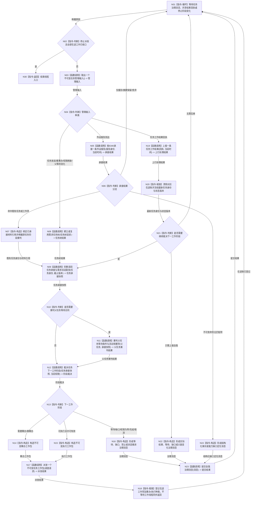

# BIZ-L1-T03 任务管理线程治理循环目标函数流程图 v0.1

更新时间：2026-08-03

## 依据

```text
5100—5330、6150、6170、6340、8100、8200
旧鱼巢参考：流程图/鱼巢流程/20260712_旧鱼巢需求与任务管理现状流程图_v0.1.md
旧鱼巢参考：流程图/鱼巢流程/20260712_旧鱼巢筹办方法与执行现状流程图_v0.1.md
吸收边界：保留需求活动路径、任务承接读回、父任务等待和重筹办回流；需求活动集仍只由自我线程触发需求领域重判
```

## 身份与边界

正式目标函数设计图。根函数只在任务管理线程运行，负责读取正式任务状态、裁决下一工作类型并异步派发给任务工作线程池；它不在本线程执行筹办或真实方法动作。

## 函数合同

```text
根函数：运行治理循环
归属模块 / 文件 / 层级：任务管理线程 / 海中鱼巣/线程/任务管理线程.ixx / L1
现有或待新增：适配扩展；现有线程壳、强类型队列和调度路由只覆盖部分路径
完整签名：void 任务管理线程::运行治理循环() noexcept
参数：无显式参数；对象在启动前已冻结自我下行队列、共享工作队列、共享结果队列、领域服务和停止阶段端口
返回结果：void；线程退出与故障通过生命周期消息和宿主收口结果表达
被调函数流程图：BIZ-L2-004-02、BIZ-L2-004-04、BIZ-L2-004-08—14
```

## 流程图



## 节点合同

| 节点 | 类型 | 输入绑定 | 输出绑定 | 事实读写 | 验证 |
| --- | --- | --- | --- | --- | --- |
| N03 | 函数调用 | 自我下行与共享结果队列 | 值式管理输入 | 锁内只取出 | 公平性、停止与空队列 |
| N05—N07/N24 | 函数调用 / 判断 / 构造 | 外设报告稳定身份、当前时间和任务匹配事实 | 已绑定既有任务材料、结构化缺口定位或正式舍弃结果 | 任务域唯一承接；不写世界事实 | 命中既有任务只唤醒原任务；无匹配报告不创建任务 |
| N08/N09 | 函数调用 | 意图、任务身份、事实版本 | 当前任务树与完整承接快照 | 由任务领域提交并独立读回 | 幂等、唯一任务树、来源需求和活动路径 |
| N11/N12 | 函数调用 | 父等待合同、任务正式状态、活动阻塞项和当前权限 | 父任务重判与下一工作阶段 | 只读后裁决；不在管理线程筹办或执行 | 筹办、执行、等待、收口互斥 |
| N14/N15 | 指令-构造 | 任务身份、工作阶段、轮次、截止版本及对应载荷 | 不可变筹办或执行工作包 | 无业务写入 | 类型完整、载荷互斥、同任务单在途 |
| N17/N18 | 函数调用 / 赋值 | 强类型工作包 | 派发结果和在途账 | 队列只承载工作包；任务事实由领域提交 | 筹办 / 执行统一排队、确认撤销和精确重复 |
| N19—N21 | 函数调用 / 赋值 / 判断 | 已移出共享结果队列的筹办或执行回执 | 上行处理结果、最新任务状态和后继裁决 | 锁外提交任务状态；不写需求活动集 | 回执种类匹配、跨代次、重发和连续阶段 |
| N23 | 函数调用 | 实际结果、等待/缺口或父链变化消息 | 提交结果 | 只上报自我，不写需求结论 | 满载、重试和消息幂等 |

## 关键边界

- 任务管理线程不直接写需求、世界、状态、动态、因果或价值事实；任务状态只经任务领域提交入口推进。
- 任务管理线程根据正式任务状态唯一裁决筹办、重筹办、执行、等待或收口；筹办和执行都通过 `派发一个不可变任务工作包` 交给线程池，不在管理线程同步运行。
- 筹办工作包不携带动作执行许可；执行工作包必须携带当前执行冻结和一次性许可。两类载荷互斥，不能靠空字段猜测种类。
- 任务工作线程池向共享结果队列发布回执；任务管理线程不逐个持有或轮询工作线程对象。
- 同一任务同一时刻最多一个在途工作包，筹办、重筹办和执行不得并发；不同任务可以由线程池并行推进。
- 任务创建或复用后必须完整读回来源需求、活动路径、目标、授权、状态和等待合同；半结构不得进入筹办。
- 子任务实际结果只形成父任务等待变化和重筹办材料；任务管理线程不得据此直接更新需求活动集、父需求满足或服务结算。
- 外设报告先经 6340 唯一承接；只有已绑定任务 / 工作项的材料引用才进入筹办或执行，外设队列项本身不成为世界事实。
- 不可舍弃但无匹配项的报告只向 T02 提交结构化缺口定位；T03 不得据此建立需求或任务。普通无命中、重复或过期报告按正式策略收束。
- 回执取出、独立回读、任务提交和自我邮箱提交之间不持有同一把队列锁。
- 停止阶段先禁止新派发，再等待全部在途回执处理完成，方可退出。
