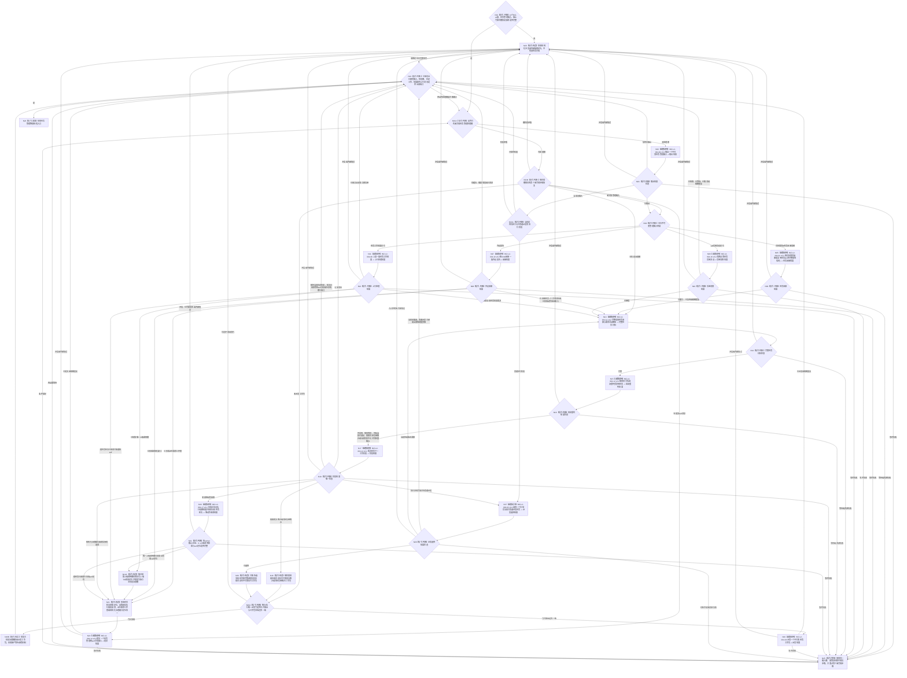

# BIZ-L1-T03 任务管理线程治理循环目标函数流程图 v0.5

更新时间：2026-08-27

## 依据

```text
0050、5100—5330、5230 v1.6、6150 v0.12、6170、6340、8100 v0.8、8200 v0.8
BIZ-L0-001 v0.4
BIZ-L1-T01 v0.4
BIZ-L1-T02 v0.6
BIZ-MAIN-001 v0.4
已发布代码基线：`3752fda8` 的海中鱼巣/线程/任务管理线程.ixx
```

## 身份与边界

本图只冻结任务管理物理线程在完整启动后的根治理循环。T01先使T04消费者池全部进入关闭接收门后的等待态，再由BIZ-L2-001-06启动T03候选；T03发布多源等待态进入见证后，001-06原子开放T04接收门并发布完整启动结果，随后本根循环才可派发。进入 BIZ-L0-03 后，T01 先禁止新派发，待 T04 收口已接受工作，再要求 T03 排空结果上行并连接线程。

任务管理线程是任务运行编排者，不是需求满足、方法动作、世界事实或 self 后继的事实 owner。它只接管不可变输入，在锁外调用正式领域入口，异步派发工作包，并在工作结果到达后独立读回权威事实。

## 函数合同

```text
当前根函数：运行结果上行循环
完整身份：海中鱼巣::任务管理线程::运行结果上行循环
归属模块 / 文件 / 目标分解深度：海中鱼巣.线程.任务管理线程 / 海中鱼巣/线程/任务管理线程.ixx / BIZ-L1
HEAD签名：void 运行结果上行循环() noexcept
可见性：任务管理线程私有成员；由启动()创建的物理线程入口调用
参数：无显式参数；消费构造时冻结的队列、任务领域服务、结果读回、上行桥和self目标
返回结果：void；只表示物理循环返回，不能证明任务、轮次、上级调用或需求完成
上级前置：目标上由BIZ-L2-001-06已发布T03进入见证和T04接收门开放见证；HEAD运行包尚未实现该握手
上级后继：返回物理线程入口；T01在BIZ-L0-03调用收口等待并检查收口结果
目标扩展边界：现有函数名虽为“结果上行”，本图要求它统一仲裁任务治理输入、阶段治理、工作结果和停止阶段；不得再建第二个任务管理根循环
被调函数流程图：BIZ-L2-003-03 v0.4、004-02、004-04、004-08—13、004-14 v0.2、004-16 v0.2、004-17，共12个直接根
```

## 流程图



## 输入与唯一后继

| 输入种类 | T03职责 | 唯一后继 | 禁止行为 |
| --- | --- | --- | --- |
| 具体需求D任务承接意图 | 独立复核D、G0、批次、选择见证及输入键/来源关系承接键/准备键/六阶段键组；正式读取D所属L，以L查询0..1当前任务后按原信封分型承接 | 当前任务及正式E/R1/来源关系材料完整后进入N14任务主阶段治理 | 不把消息发送成功当任务已建立；不从列表其它成员、旧任务缓存或事实变化推断D；不派生或替换幂等键 |
| self后继决议定位 | 按显式T/R/结算/决议/G独立读回，再交task owner消费 | 继续才建立新轮次；结束/等待/取消各自收口 | 不使用消息中的决议缓存，不因本轮目标未达成自动继续或重筹办 |
| 主阶段治理槽 | 调用唯一主阶段治理provider并按结构化状态路由；初次 / 同轮后继筹办形成相应工作包，执行冻结完成只进入正式待普通派发候选，筹办期目标已满足进入004-17零动作收束 | T04筹办工作包、003-03 v0.4普通派发选择、004-17零动作收束或T02定位消息 | 不在管理线程同步筹办、执行方法动作或从单个槽临场拼调度证据；不把零动作伪装成执行回执 |
| 任务工作结果定位 | 依次读完成消息、动作后权威结果、正式任务结果并收束本轮；存在唯一上级调用时，以已结算调用槽显式形成上级T/R回流定位并保留为另一个主阶段治理槽 | 子任务向T02的显式轮次收束定位，以及可选上级任务单项回流槽 | 不把定位、完成消息、方法成功或线程状态当正式结果；不从需求父链猜上级任务 |
| 外设材料 | 只消费6340 v0.2正式承接结果；区分任务 / 工作项材料、动作验证、派生需求三件套、结构化缺口和普通处置 | 前两类唤醒既有任务治理；派生需求三件套与结构化治理缺口定位分别按自身强类型交T02；普通处置收口 | 不从报告直接建立需求或任务；不得把派生需求改名包装为缺口，派生需求三件套仍只是self后继候选 |
| 停止阶段 | 拒绝新派发，排空已接受工作、阶段槽和结果上行 | 全部槽收口后物理返回 | 不丢弃已接管槽，不把join当业务完成 |

`BIZ-L2-004-02 v0.2` 已完成D-only粗合同校正：它不再创建需求或任务父子树；新任务按准备键/六阶段键组分owner建立正式E、T/R1和首态链，既有任务只按来源关系承接键新增或重复T→D。当前代码仍未实现该统一入口及正式公开面，因此本图不能宣称T03承接链已接线。

## 结果、结算与上级调用边界

- 任务结果是某次执行及其动作后事实的正式引用，不是可分配、可扣减或可独占领取的资源。
- T03只收束当前任务轮次，不同步遍历或结算全部 `T→D`；其它关联任务和需求在自己实际调度或使用时 fresh 读取目标与当前事实。
- 当前轮次有恰一条正式上级调用时，结果只返回该调用边并由 task owner 幂等结算对应槽；零条按根任务收口，多条属于引用冲突。
- 上级调用槽已返回只表示子任务结果可供该显式上级任务重新判断。T03必须把上级T/R和槽结算身份保存为独立主阶段治理槽，随后由004-11 v0.2与004-12 v0.2同G0重读；不得直接写上级目标、阶段或来源需求满足。
- 004-12 v0.2只形成不适用、保持等待、目标当前已满足、同轮后继筹办或当前阶段不允许同轮重筹办等值式治理输入。保持等待零写；同轮后继只形成5230强类型来源，实际选择/冻结和阶段写入仍由各自owner完成。
- 004-13 v0.2只解释正式ARCH-L2主阶段和004-11/004-12同G0材料。控制态与调度资格归003-03；目标当前已满足只在尚未执行的筹办阶段形成004-17零动作收束输入。
- 零动作不是方法执行结果。004-17必须发布并读回合法无执行短路结果，再完成当前轮次收束、0..1上级调用返回和self结算定位；不得从N18直接提交self消息。
- 任务轮次收束后，T03必须向T02交付显式任务、任务轮次、轮次结算身份和阶段正式读回截止G；不得携带结果、阶段或调用结算正文，是否继续只由T02形成的正式self后继决议裁决。
- 优先级只决定任务或方法获得执行机会的顺序，不决定需求满足、结果归属、调用返回或self后继。
- `003-03`只在执行冻结完成后、真实派发前读取完整候选、正式根调度、当前T→D/目标/B、安全/服务材料及由目标 / 方法 / 路径 / 冻结共同绑定的唯一共同作用场景；只有返回已选择才构造执行工作包。控制态关闭、全部零调度资格、共同场景不闭合、材料不足或漂移均不得退回队列到达顺序直接派发。
- `004-09 v0.3`只负责三来源公平取出，第三来源仅接受T04任务工作结果定位。T02来源每项恰含D承接意图或self后继决议定位；取出后先按类型接管到单一处理中槽，再调用对应正式读回链，不能在队列锁内处理业务。主阶段治理槽、未派发工作包和待提交self消息均为T03已经接管的内部处理槽，根循环必须先按已保存首个未完成步骤恢复；只有不存在内部槽时才能再次调用004-09，禁止把内部槽冒充第四外部来源。

## 停止与重试合同

- T01先调用BIZ-L2-001-12，先冻结T02新D承接意图，再冻结T03筹办/执行统一派发门并使T03进入只排空阶段；已经派发的工作包仍由T04完成或形成结构化故障定位。
- 当前无输入时，只有普通运行阶段才能进入N27选择新执行派发；只排空阶段直接检查N23。N19或N29形成工作包后、调用N20前必须再次读取统一派发门；门已冻结时保留阶段槽和未派发材料，不得入队。
- T04全部收口后，T01调用 `排空结果上行并停止()`；T03继续处理已经接受的主阶段治理槽和工作结果定位。
- 暂时未找到、合法等待、资源失败或已可能发布只重试同一槽的首个未完成步骤，不得重做方法动作或改换幂等身份。
- 只有已禁止新派发，且不存在待处理主阶段治理、工作结果定位、未完成工作槽和待提交self消息时，根循环才可返回。

## HEAD实现对照

| 能力 | HEAD事实 | 判断 |
| --- | --- | --- |
| 物理线程启动与T04联锁 | 无参`启动()`先把状态置为运行中，线程lambda置`已进入`后立即调用`运行结果上行循环()`；调用方不等进入，运行包随后才启动旧T04尾部线程 | 只有平台线程机械接线；目标T04关闭门先进入、T03等待、001-06开门握手均未实现 |
| 主阶段治理槽 | 已有`提交任务主阶段治理请求`、同截止材料组合、`治理当前任务阶段`和部分后继读回排队；HEAD未把上级调用槽结算形成显式上级T/R回流槽 | 部分实现 |
| 强类型工作队列 | 已有执行请求准备/确认/撤销/取出和`强类型请求停止锁存` | 部分实现；停止锁存只覆盖执行请求准备，尚未形成筹办/执行统一派发门、派发边界或只排空阶段 |
| 冻结后普通派发选择 | HEAD 只有字段不闭合且固定材料缺口的旧 `计算任务执行权限` 骨架；没有 task owner 当前候选全集读回、fresh 逐来源投影或 T03 生产调用 | 未实现；不得按现有队列到达顺序冒充调度 |
| 工作结果独立读回 | 已按执行幂等身份、运行代次和动作顺序读取完成消息，再读取动作后权威结果并调用上行桥形成正式结果 | 已接相邻链 |
| 任务轮次收束 | 构造函数持有旧命名结算provider，`处理一个工作定位`形成正式结果后立即把槽标为完成 | 实现缺失；provider未被调用 |
| 上级调用返回 | 当前循环未读取0..1正式发起调用，未发布调用返回或结算上级槽 | 未实现 |
| 单项回流重判 | HEAD旧`任务子目标回流重判提供者::重判父需求并准备筹办`从父需求/列表项查找或创建任务并直接递增旧筹办记录；T03未调用004-12 v0.2目标组合 | 实现偏差；不得恢复任务父子、任务虚拟存在或旧治理状态 |
| 阶段只读裁决 | HEAD没有004-13 v0.2组合；旧治理骨架仍把控制态/权限与阶段混合，manager按旧重筹办槽直接形成执行请求 | 未实现；调度门不得混入阶段权威 |
| 零动作结果与轮次收束 | HEAD没有合法无执行短路结果owner、004-17入口或T03生产调用 | 未实现；不得伪造完成消息、方法执行结果或直接通知self |
| self显式结算定位 | 已有私有消息构造helper，但当前主链未调用；self正式后继provider也只被持有 | 未接线 |
| T02具名任务管理输入 | HEAD没有D承接 / self决议定位的单项队列或统一取出入口；只有空载荷002-08骨架、执行请求队列和结果上行槽 | 未实现；旧通用消息组与执行队列均不能补位 |
| 外设承接输入 | 当前循环未接6340报告承接与三路分流 | 未实现 |
| 停止排空 | 已有停发、结果上行排空和队列空判断 | 部分实现；永久失败时的槽交接/终止仍未冻结 |

## 未闭合的上层停机接口

`DRIFT-BIZ-L1-T03-STOP-WITH-UNRESOLVED-GOVERNANCE-SLOT-UNFROZEN`：当前合同要求停止时不丢弃已接管的主阶段治理槽、工作结果定位或待交付self消息，但没有冻结永久provider失败下的持久交接owner、恢复见证、允许终止条件或有限时上交合同。现行代码对部分主阶段资源失败固定重试三次后直接丢槽，对部分工作结果永久非成功直接标记完成；这两种行为都不能证明业务收口。该缺口不阻断普通成功路径的L1校正，但在裁决前不能宣称BIZ-L0-03对该故障形状必然有限时结束。

## v0.5 校正记录

- 004-10后继校正：按6340补入活跃需求，并把承接产物分成任务 / 工作项材料引用、派生需求三件套、动作验证输入、结构化缺口和普通处置；派生需求与结构化缺口分账，经004-14各自强类型分支交self，不由T03建立需求或任务。
- 004-13后继校正：阶段裁决只消费正式E上的ARCH-L2阶段与004-11/12同G0材料；普通派发资格归003-03。新增004-17零动作收束根，修复“目标已满足直接发self消息”的越级路径。
- 2026-08-27补齐001-06启动联锁：T04先在关闭门后进入，T03入口发布多源等待态见证后由父级开放T04门；在开放见证形成前，本根循环不得派发。
- 004-12后继校正：任务工作结果若已结算唯一上级调用槽，T03只形成显式上级T/R回流治理槽；004-12 v0.2同G0重读后只返回值式治理输入，不自建父任务事务，不批量结算其它任务。
- 把 BIZ-L2-003-03 v0.4 与 BIZ-L2-004-17 v0.2 作为两个新增直接根接入任务管理线程，使原10根增为12根；旧 T02 每批全局权限调用边继续退出。
- 根循环先恢复未完成任务管理处理槽，无槽才调用004-09公平取新输入；主阶段治理槽、未派发工作包和待提交self消息不再伪装为004-09第四来源，等待与收口检查后也不得越过旧槽。
- 筹办 / 重筹办工作包仍按阶段结果派发；执行冻结完成只进入普通派发候选，必须经003-03 fresh读取和0..1选择后才形成执行工作包。
- 当前无候选、控制态关闭、全部零资格、材料不足和当前性 / 版本漂移分别路由，不得用队列到达顺序、旧快照或单个治理槽绕过调度。
- T03 与 L2 父级接线保持不变；003-03 v0.4及其07/10/L4读取叶已按6150 v0.12 / 5230 v1.6校正为共同作用场景正式互证。目标图不再保留旧场景DRIFT，也不恢复self位置、动作目标或公共祖先推导；当前代码仍须实现字段贯穿和同Gnow读回。

## v0.4 校正记录

- T02输入由模糊消息组改为每次一个具名强类型输入；当前只分流具体D承接意图与self后继决议定位。D承接意图携带原输入键、来源关系承接键、准备键和六阶段键组。
- 具体D分支删除“事实变化唤醒”混入；T03必须按D读取所属L并查询0..1当前任务。事实变化只唤醒已绑定任务的阶段重判，不能借本入口创建新任务。
- self决议定位按显式T/R/结算/决议/G调用004-16独立读回；消息正文和发送成功都不裁决继续 / 等待 / 结束 / 取消。
- 登记004-02旧子图的D-only后继校正，不在BIZ-L1临时重画其内部任务owner写入步骤。

## v0.3 校正记录

- 将根循环的直接调用严格收敛为10个具名BIZ-L2根，不再把完成消息读回、任务结果发布、轮次结算和调用返回等004-08内部步骤平铺到BIZ-L1。
- 补入已由5090、8100和现行SELF详细设计冻结的BIZ-L2-004-16“消费自我任务后继决议”；HEAD尚未实现该入口，禁止把未发布WIP当能力，也禁止把该写入职责藏入004-09取输入或004-13阶段只读裁决。
- 004-11 v0.2、004-12 v0.2、004-13 v0.2按正式T→E/当前轮次/ARCH-L2阶段、完整T→D逐需求材料、单项具名回流和阶段裁决分层串联；004-04只消费已冻结工作包，004-17收束零动作，004-14 v0.2只提交一项具名强类型self输入。旧任务目标副本、治理存在和治理状态不得进入N13。

## v0.2 校正记录

- 根函数改为当前工作区真实私有循环 `运行结果上行循环()`；`启动()`只负责创建物理线程。
- v0.2曾接入“管理线程先启动”的旧顺序；2026-08-27已由v0.5按T04关闭门先进入、T03后进入并由001-06开门校正。停机仍保持先停发、T04收口后再排空T03结果上行和连接。
- 删除任务结果后同步结算全部关联需求、结果分配和目标未达成自动重筹办。
- 增加任务轮次收束、0..1正式上级调用返回、显式结算身份交付及self后继决议回流。
- 明确同轮目标已满足可零动作收口；其它任务只在自身使用时fresh核算。
- 将当前代码已有主阶段槽、工作结果读回和停止排空与未实现的self下行、外设承接、轮次收束、上级调用返回逐项分账。
