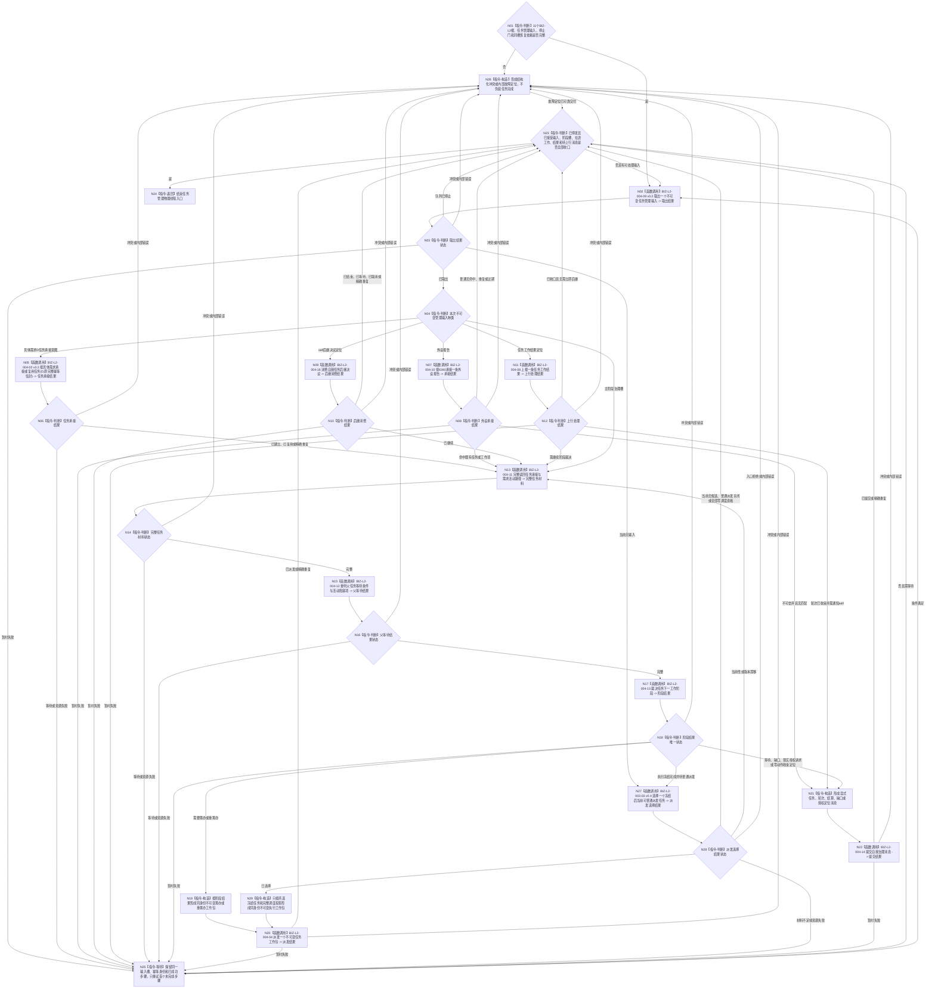

# BIZ-L1-T03 任务管理线程治理循环目标函数流程图 v0.5

更新时间：2026-08-27

## 依据

```text
0050、5100—5330、6150、6170、6340、8100 v0.8、8200 v0.8
BIZ-L0-001 v0.4
BIZ-L1-T01 v0.4
BIZ-L1-T02 v0.6
BIZ-MAIN-001 v0.3
当前工作区代码：海中鱼巣/线程/任务管理线程.ixx
```

## 身份与边界

本图只冻结任务管理物理线程在启动成功后的根治理循环。T01 通过任务结果生产运行包先启动任务管理线程、再启动任务工作线程；进入 BIZ-L0-03 后，T01 先禁止新派发，待 T04 收口已接受工作，再要求 T03 排空结果上行并连接线程。

任务管理线程是任务运行编排者，不是需求满足、方法动作、世界事实或 self 后继的事实 owner。它只接管不可变输入，在锁外调用正式领域入口，异步派发工作包，并在工作结果到达后独立读回权威事实。

## 函数合同

```text
当前根函数：运行结果上行循环
完整身份：海中鱼巣::任务管理线程::运行结果上行循环
归属模块 / 文件 / 目标分解深度：海中鱼巣.线程.任务管理线程 / 海中鱼巣/线程/任务管理线程.ixx / BIZ-L1
当前工作区签名：void 运行结果上行循环() noexcept
可见性：任务管理线程私有成员；由启动()创建的物理线程入口调用
参数：无显式参数；消费构造时冻结的队列、任务领域服务、结果读回、上行桥和self目标
返回结果：void；只表示物理循环返回，不能证明任务、轮次、上级调用或需求完成
上级前置：T01中的任务结果生产运行包::启动()已经成功启动任务管理线程
上级后继：返回物理线程入口；T01在BIZ-L0-03调用收口等待并检查收口结果
目标扩展边界：现有函数名虽为“结果上行”，本图要求它统一仲裁任务治理输入、阶段治理、工作结果和停止阶段；不得再建第二个任务管理根循环
被调函数流程图：BIZ-L2-003-03 v0.4、004-02、004-04、004-08—14、004-16，共11个直接根
```

## 流程图



## 输入与唯一后继

| 输入种类 | T03职责 | 唯一后继 | 禁止行为 |
| --- | --- | --- | --- |
| 具体需求D任务承接意图 | 独立复核D、G0、批次、选择见证及输入键/来源关系承接键/准备键/六阶段键组；正式读取D所属L，以L查询0..1当前任务后按原信封分型承接 | 当前任务及正式E/R1/来源关系材料完整后进入N14任务主阶段治理 | 不把消息发送成功当任务已建立；不从列表其它成员、旧任务缓存或事实变化推断D；不派生或替换幂等键 |
| self后继决议定位 | 按显式T/R/结算/决议/G独立读回，再交task owner消费 | 继续才建立新轮次；结束/等待/取消各自收口 | 不使用消息中的决议缓存，不因本轮目标未达成自动继续或重筹办 |
| 主阶段治理槽 | 调用唯一主阶段治理provider并按结构化状态路由；筹办 / 重筹办可直接形成相应工作包，执行冻结完成只进入正式待普通派发候选 | T04筹办工作包、003-03 v0.4普通派发选择或T02定位消息 | 不在管理线程同步筹办、执行方法动作或从单个槽临场拼调度证据 |
| 任务工作结果定位 | 依次读完成消息、动作后权威结果、正式任务结果并收束本轮 | 上级调用返回和T02显式结算定位 | 不把定位、完成消息、方法成功或线程状态当正式结果 |
| 外设材料 | 只消费6340正式承接结果 | 唤醒既有任务，或向T02报告结构化缺口 | 不因无匹配报告建立需求或任务 |
| 停止阶段 | 拒绝新派发，排空已接受工作、阶段槽和结果上行 | 全部槽收口后物理返回 | 不丢弃已接管槽，不把join当业务完成 |

`BIZ-L2-004-02 v0.2` 已完成D-only粗合同校正：它不再创建需求或任务父子树；新任务按准备键/六阶段键组分owner建立正式E、T/R1和首态链，既有任务只按来源关系承接键新增或重复T→D。当前代码仍未实现该统一入口及正式公开面，因此本图不能宣称T03承接链已接线。

## 结果、结算与上级调用边界

- 任务结果是某次执行及其动作后事实的正式引用，不是可分配、可扣减或可独占领取的资源。
- T03只收束当前任务轮次，不同步遍历或结算全部 `T→D`；其它关联任务和需求在自己实际调度或使用时 fresh 读取目标与当前事实。
- 当前轮次有恰一条正式上级调用时，结果只返回该调用边并由 task owner 幂等结算对应槽；零条按根任务收口，多条属于引用冲突。
- 上级调用槽已返回只表示子任务结果可供上级重新判断，不等于上级目标或来源需求已经满足。
- 任务轮次收束后，T03必须向T02交付显式任务、任务轮次、轮次结算身份和G；是否继续只由T02形成的正式self后继决议裁决。
- 优先级只决定任务或方法获得执行机会的顺序，不决定需求满足、结果归属、调用返回或self后继。
- `003-03 v0.4`只在执行冻结完成后、真实派发前读取完整候选、正式根调度、当前T→D/目标/B及安全/服务材料；只有返回已选择才构造执行工作包。控制态关闭、全部零调度资格、调度场景来源未发布、材料不足或漂移均不得退回队列到达顺序直接派发。
- `004-09 v0.2`只负责三来源公平取出。T02来源每项恰含D承接意图或self后继决议定位；取出后先按类型接管到单一处理中槽，再调用对应正式读回链，不能在队列锁内处理业务。

## 停止与重试合同

- T01先调用 `请求停止新派发()`；已经确认的工作包仍由T04完成或形成结构化故障定位。
- T04全部收口后，T01调用 `排空结果上行并停止()`；T03继续处理已经接受的主阶段治理槽和工作结果定位。
- 暂时未找到、合法等待、资源失败或已可能发布只重试同一槽的首个未完成步骤，不得重做方法动作或改换幂等身份。
- 只有已禁止新派发，且不存在待处理主阶段治理、工作结果定位、未完成工作槽和待提交self消息时，根循环才可返回。

## 当前工作区实现对照

| 能力 | 当前工作区事实 | 判断 |
| --- | --- | --- |
| 物理线程启动 | `启动()`创建线程，并在结果链依赖齐全时调用`运行结果上行循环()` | 已接线 |
| 主阶段治理槽 | 已有`提交任务主阶段治理请求`、同截止材料组合、`治理当前任务阶段`和部分后继读回排队 | 部分实现 |
| 强类型工作队列 | 已有执行请求准备/确认/撤销/取出和停止锁存 | 部分实现；尚未形成统一筹办/执行工作包路由 |
| 冻结后普通派发选择 | HEAD 只有字段不闭合且固定材料缺口的旧 `计算任务执行权限` 骨架；没有 task owner 当前候选全集读回、fresh 逐来源投影或 T03 生产调用 | 未实现；不得按现有队列到达顺序冒充调度 |
| 工作结果独立读回 | 已按执行幂等身份、运行代次和动作顺序读取完成消息，再读取动作后权威结果并调用上行桥形成正式结果 | 已接相邻链 |
| 任务轮次收束 | 构造函数持有旧命名结算provider，`处理一个工作定位`形成正式结果后立即把槽标为完成 | 实现缺失；provider未被调用 |
| 上级调用返回 | 当前循环未读取0..1正式发起调用，未发布调用返回或结算上级槽 | 未实现 |
| self显式结算定位 | 已有私有消息构造helper，但当前主链未调用；self正式后继provider也只被持有 | 未接线 |
| T02具名任务管理输入 | HEAD没有D承接 / self决议定位的单项队列或统一取出入口；只有空载荷002-08骨架、执行请求队列和结果上行槽 | 未实现；旧通用消息组与执行队列均不能补位 |
| 外设承接输入 | 当前循环未接6340报告承接与三路分流 | 未实现 |
| 停止排空 | 已有停发、结果上行排空和队列空判断 | 部分实现；永久失败时的槽交接/终止仍未冻结 |

## 未闭合的上层停机接口

`DRIFT-BIZ-L1-T03-STOP-WITH-UNRESOLVED-GOVERNANCE-SLOT-UNFROZEN`：当前合同要求停止时不丢弃已接管的主阶段治理槽、工作结果定位或待交付self消息，但没有冻结永久provider失败下的持久交接owner、恢复见证、允许终止条件或有限时上交合同。现行代码对部分主阶段资源失败固定重试三次后直接丢槽，对部分工作结果永久非成功直接标记完成；这两种行为都不能证明业务收口。该缺口不阻断普通成功路径的L1校正，但在裁决前不能宣称BIZ-L0-03对该故障形状必然有限时结束。

## v0.5 校正记录

- 把 BIZ-L2-003-03 v0.4 作为第11个直接根接入任务管理线程；旧 T02 每批全局权限调用边继续退出。
- 筹办 / 重筹办工作包仍按阶段结果派发；执行冻结完成只进入普通派发候选，必须经003-03 fresh读取和0..1选择后才形成执行工作包。
- 当前无候选、控制态关闭、全部零资格、材料不足和当前性 / 版本漂移分别路由，不得用队列到达顺序、旧快照或单个治理槽绕过调度。
- T03 与 L2 父级接线保持不变；003-03 v0.4 已继续闭合根调度复用、基础优先级和安全来源调度读取叶，并保留调度场景正式来源具名DRIFT。

## v0.4 校正记录

- T02输入由模糊消息组改为每次一个具名强类型输入；当前只分流具体D承接意图与self后继决议定位。D承接意图携带原输入键、来源关系承接键、准备键和六阶段键组。
- 具体D分支删除“事实变化唤醒”混入；T03必须按D读取所属L并查询0..1当前任务。事实变化只唤醒已绑定任务的阶段重判，不能借本入口创建新任务。
- self决议定位按显式T/R/结算/决议/G调用004-16独立读回；消息正文和发送成功都不裁决继续 / 等待 / 结束 / 取消。
- 登记004-02旧子图的D-only后继校正，不在BIZ-L1临时重画其内部任务owner写入步骤。

## v0.3 校正记录

- 将根循环的直接调用严格收敛为10个具名BIZ-L2根，不再把完成消息读回、任务结果发布、轮次结算和调用返回等004-08内部步骤平铺到BIZ-L1。
- 补入已由5090、8100和现行SELF详细设计冻结、且当前工作区已有同名入口的BIZ-L2-004-16“消费自我任务后继决议”；禁止把该写入职责藏入004-09取输入或004-13阶段只读裁决。
- 004-11、004-12、004-13按完整任务材料、父等待重判和阶段裁决分层串联；004-04只消费已冻结工作包，004-14只提交值式self消息。

## v0.2 校正记录

- 根函数改为当前工作区真实私有循环 `运行结果上行循环()`；`启动()`只负责创建物理线程。
- 接入T01 v0.2的管理线程先启动、停发、T04收口后排空结果上行和连接顺序。
- 删除任务结果后同步结算全部关联需求、结果分配和目标未达成自动重筹办。
- 增加任务轮次收束、0..1正式上级调用返回、显式结算身份交付及self后继决议回流。
- 明确同轮目标已满足可零动作收口；其它任务只在自身使用时fresh核算。
- 将当前代码已有主阶段槽、工作结果读回和停止排空与未实现的self下行、外设承接、轮次收束、上级调用返回逐项分账。
