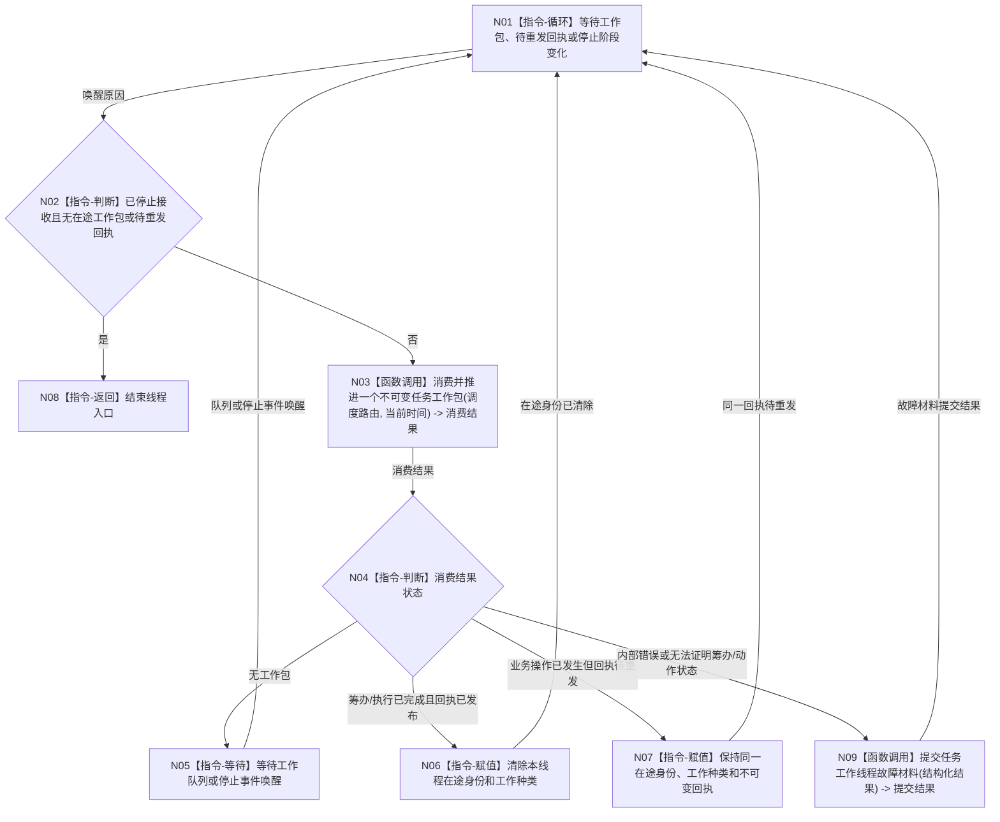

# BIZ-L1-T04 任务工作线程工作包循环目标函数流程图 v0.1

更新时间：2026-08-03

## 依据

```text
8100、8200；BIZ-L2-004-07
旧鱼巢筹办 / 执行链由 BIZ-L2-004-07 吸收：筹办反推与冻结，或执行前复核 -> 具体方法动作 -> 状态/动态 -> 独立结果读回 -> 回执
```

## 身份与边界

正式目标函数设计图。每个任务工作线程实例执行同一根函数；多个实例组成可配置线程池，不形成多个任务事实所有者。

## 函数合同

```text
根函数：运行工作循环
归属模块 / 文件 / 层级：任务工作线程 / 海中鱼巣/线程/任务工作线程.ixx / L1
现有或待新增：适配扩展
完整签名：void 任务工作线程::运行工作循环() noexcept
参数：无显式参数；对象在启动前已冻结共享工作队列、任务筹办端口、方法执行端口、共享结果队列和停止阶段端口
返回结果：void；单个筹办或执行工作包的结果通过不可变回执发布到共享结果队列
被调函数流程图：BIZ-L2-004-07、BIZ-L2-004-15
```

## 流程图



## 节点合同

| 节点 | 类型 | 输入绑定 | 输出绑定 | 事实读写 | 验证 |
| --- | --- | --- | --- | --- | --- |
| N03 | 函数调用 | 共享工作队列、筹办 / 执行端口、共享结果队列 | 单工作包完整消费结果 | L2 按强类型种类在锁外筹办或执行并发布回执 | 单赢家、类型匹配和全部具名结果 |
| N05 | 指令-等待 | 队列/停止事件 | 唤醒 | 无业务写入 | 无忙等和丢失唤醒 |
| N06/N07 | 指令-赋值 | 消费结果 | 线程局部在途状态 | 只属恢复材料，不是任务状态 | 重发不重做动作 |
| N09 | 函数调用 | 结构化故障 | 线程故障材料 | 不裁决任务失败 | 异常退出与恢复 |

## 关键边界

- 工作线程每次只推进一个不可变筹办或执行工作包；同一任务仍由任务管理合同保证筹办 / 执行互斥和单在途权。
- BIZ-L2-004-07 已负责工作包取出、按种类调用筹办或执行链、回执构造与发布，本 L1 不复制第二套路由或回执逻辑。
- 旧鱼巢的筹办反推、动作、动态、结果场景和写后读回不放在线程循环壳中；它们落到 BIZ-L2-004-03、BIZ-L2-004-07 及下层领域函数。
- 工作线程可以调用任务筹办服务，但不决定“当前应筹办还是执行”；该决定属于任务管理线程。工作线程也不选择主需求、不裁决需求满足或服务结算。
- 方法动作已经执行后，回执失败只能重发同一回执，绝不能再次执行动作。
- 线程池大小只影响吞吐，不得改变任务权限、价值、安全值或业务排序规则。
