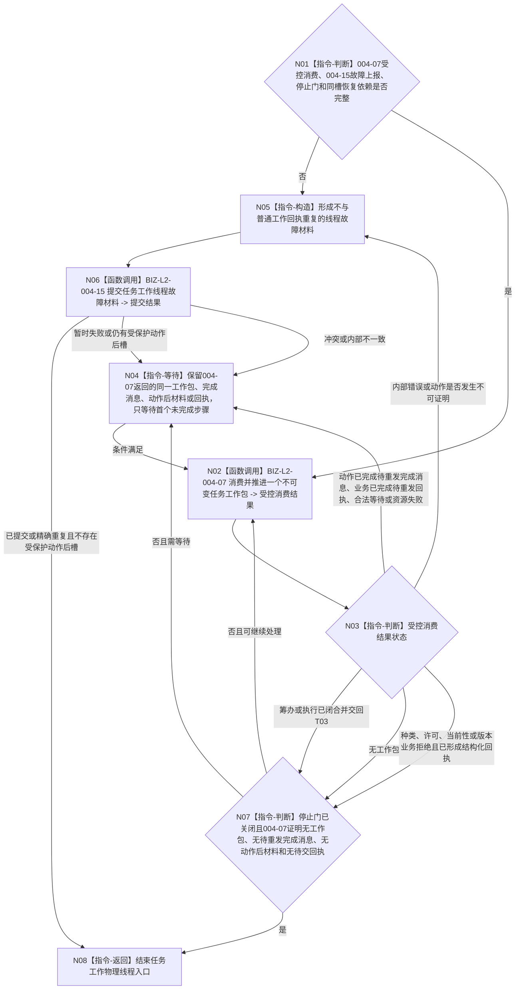

# BIZ-L1-T04 任务工作线程工作包循环目标函数流程图 v0.3

更新时间：2026-08-26

## 依据

```text
0050、3200、4190、5090、5230、5250、5300、6340、8100 v0.8、8200 v0.8
BIZ-L0-001 v0.4
BIZ-L1-T01 v0.4
BIZ-L1-T03 v0.3
BIZ-MAIN-001 v0.2
当前工作区代码：海中鱼巣/线程/任务工作线程.ixx
```

## 身份与边界

本图只冻结一个任务工作物理线程在启动成功后的根循环。当前普通应用运行包只构造一个 `任务工作线程` 对象；本图不把未来可能的线程池配置写成已经存在的事实。若以后增加多个同构实例，它们仍消费同一任务管理工作队列，不能形成多个任务、方法或世界事实 owner。

工作线程每次只推进一个已经由 T03 裁决种类、冻结身份和确认入队的不可变工作包。它可以调用任务筹办或已冻结实例方法执行链，但不决定当前应筹办还是执行，不提交任务轮次结算，不形成需求满足或 self 后继决议。

## 函数合同

```text
当前根函数：运行强类型执行循环
完整身份：海中鱼巣::任务工作线程::运行强类型执行循环
归属模块 / 文件 / 目标分解深度：海中鱼巣.线程.任务工作线程 / 海中鱼巣/线程/任务工作线程.ixx / BIZ-L1
当前工作区签名：void 运行强类型执行循环() noexcept
可见性：任务工作线程私有成员；只由启动()创建的物理线程入口调用
参数：无显式参数；消费构造时冻结的T03请求来源、最终当前性复核、实例方法执行和动作结果收束provider
返回结果：void；每个已接管工作包的业务结果必须通过结构化工作结果定位交回T03，物理返回本身不证明任务成功或失败
上级前置：T01中的任务结果生产运行包已经先启动T03，再成功调用任务工作线程::启动()
上级后继：返回物理线程入口；T01在BIZ-L0-03先停发，再等待本线程排空，随后才允许T03排空结果上行
目标扩展边界：现有函数名和队列只覆盖强类型执行请求；本图要求在同一根循环内扩展为互斥的筹办/执行工作包，不新增第二任务工作根循环
被调函数流程图：BIZ-L2-004-07、BIZ-L2-004-15，共2个直接根；筹办、最终复核、实例执行和动作后收束均属于004-07内部展开
```

## 流程图



## 两类工作包边界

| 工作包 | 工作线程允许做什么 | 必须交回T03的结果 | 禁止行为 |
| --- | --- | --- | --- |
| 筹办 | 取得并验证任务筹办执行权，读取正式任务/需求/路径/方法/条件和当前事实，调用任务筹办闭合入口 | 可执行冻结、合法等待、目标已完成、子目标、能力缺口或结构化非成功的定位 | 不建立独立持久化筹办回执；不请求现实执行授权；不执行普通方法动作 |
| 执行 | 先做最终当前性/FRESH/许可/授权/安全复核，再执行冻结内实例方法并收束动作后材料 | 完整工作结果定位，或动作未发生前形成的结构化拒绝/等待/漂移定位 | 不重新筹办；不改变冻结；不把方法返回、完成消息或线程状态当正式结果 |

## 动作后不可逆边界

- 一旦实例方法可能已经产生现实副作用，就不得重新调用实例方法来修复完成消息、读回、校准、收束或定位提交失败。
- 工作线程必须保留同一执行幂等身份、运行代次、动作顺序和不可变待验证材料；后续只重新调用004-07恢复同一内部步骤，不在BIZ-L1复制其收束算法。
- 动作完成消息、预计动态和方法返回都不是正式状态。正式状态、动态和结果只由对应权威 owner 的读取、校准和发布入口形成。
- 实际状态已经变化但归因不足时必须保留真实状态并返回结构化归因缺口；不得丢弃请求、重做动作或冒充任务轮次收束。
- T04只交付工作结果定位。任务实际结果独立读回、任务轮次结算、0..1上级调用返回和self定位均属于T03。

## 停止与排空合同

- T01/T03先锁存停止新派发；T04不再接受新的工作包，但已经取出的工作包、动作后槽和待交定位必须继续收口。
- 队列已停止且没有本线程在途槽时，根循环才可返回。线程返回、`join`或状态变成`已停止`都不代表任务完成。
- 暂时失败只恢复同一工作包的首个未完成步骤；动作前允许重试时必须证明动作尚未发生，动作后只允许重试收束或定位交付。
- 内部线程故障材料是支持和恢复定位，不是任务失败结论；已接管工作包仍须形成业务结构化结果或进入正式恢复合同。

## 当前工作区实现对照

| 能力 | 当前工作区事实 | 判断 |
| --- | --- | --- |
| 物理线程启动 | `启动()`要求T03运行中并创建线程调用`运行强类型执行循环()` | 已接线 |
| 工作包种类 | 只从T03取出`任务强类型执行请求` | 仅执行分支；筹办工作包未接入 |
| 最终当前性复核 | 已调用`复核即将执行的强类型请求` | 已接线 |
| 实例方法执行 | 已调用`执行已冻结实例方法`并接收待验证材料 | 已接线 |
| 动作后收束 | 以单个`收束槽_`反复调用`收束待验证任务动作结果`，成功后向T03提交定位 | 已接线相邻链；槽仅在线程内存中 |
| 执行前非成功 | 最终复核非成功时只增加取出/拒绝计数后继续 | 实现偏差；没有结构化结果交回T03 |
| 执行非成功 | 未形成待验证材料时只增加拒绝计数后继续 | 实现偏差；没有证明动作未发生，也没有结构化结果交回T03 |
| 等待 | 无工作时固定`sleep_for(1ms)`轮询 | 实现偏差；不是事件等待 |
| 停止排空 | `停止接收并排空()`锁存T03停止新派发，循环在队列停止且无槽时退出 | 部分实现；永久收束/定位失败可无限滞留 |
| 线程数量 | 当前运行包只持有一个`任务工作线程`对象 | 单线程事实；旧图“可配置线程池”无当前代码依据 |

## 未闭合的上层停机接口

`DRIFT-BIZ-L1-T04-STOP-WITH-UNDELIVERED-ACTION-RESULT-UNFROZEN`：动作已经发生后，现行合同禁止重做动作并要求保护同一待验证材料，但没有冻结永久收束provider失败、T03永久拒绝定位或进程停止时的持久交接owner、恢复见证和合法终止条件。现行内存 `收束槽_` 只能无限重试，既不能安全丢弃，也不能证明有限时收口。该缺口不影响普通成功路径和动作前结构化拒绝的代码纠偏，但在裁决前不能宣称BIZ-L0-03对这一故障形状必然完成。

## v0.3 校正记录

- 将BIZ-L1直接调用严格收敛为004-07受控消费与004-15线程故障上报两个BIZ-L2根；筹办、最终复核、实例执行、完成消息、权威读回、收束和回执交付全部留在004-07内部展开。
- 根循环只保存004-07返回的不可变恢复材料并重新调用同一根，不复制其业务分支，也不以线程等待或退出替代工作包收口。
- 普通业务拒绝必须由004-07形成结构化回执；只有无法由普通回执表达的线程故障才进入004-15。

## v0.2 校正记录

- 根函数改为当前工作区真实 `运行强类型执行循环()`，并把 `启动()`、停止和连接留在T01生命周期接口。
- 撤回“当前已经是可配置线程池”的错误描述；当前普通运行包只有一个工作线程对象。
- 保留目标上的筹办/执行互斥工作包，同时明确当前代码只实现执行请求分支。
- 增加执行前复核、动作是否发生边界、动作后待验证槽、同定位重交和结构化非成功回路。
- 明确所有已接管工作包都必须向T03返回结构化定位，禁止以拒绝计数代替结果。
- 停止只排空已接受工作和待交结果；线程退出不承担任务轮次结算或需求满足语义。
