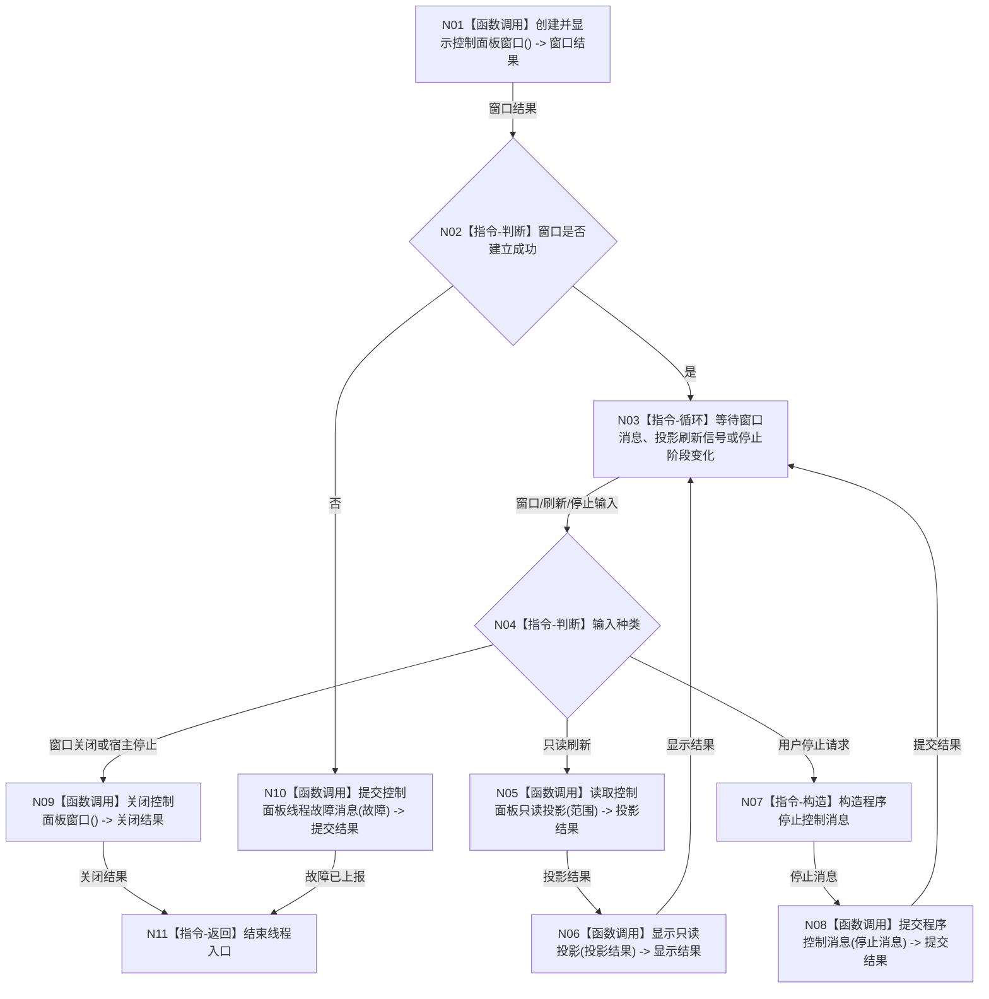

# BIZ-L1-T05 控制面板线程只读消息循环目标函数流程图 v0.1

更新时间：2026-08-03

## 依据

```text
4050、8110、8120
旧鱼巢参考：流程图/鱼巢流程/20260712_旧鱼巢外设持久化与显示现状流程图_v0.1.md
吸收边界：只吸收“已发布业务事实到人读显示”的旁路；旧 SQL/WebView2 实现和显示反向裁决明确排除
```

## 身份与边界

正式目标函数设计图。程序运行宿主拥有控制面板线程的创建、停止和收口责任，控制面板线程只拥有窗口消息循环、只读投影显示和正式程序控制请求发送；当前代码仍可能由主线程同步运行窗口，本图不宣称现状已完成拆分。

## 函数合同

```text
根函数：运行只读消息循环
归属模块 / 文件 / 层级：控制面板线程 / 海中鱼巣/线程/控制面板线程.ixx / L1
现有或待新增：待新增；复用现有窗口运行和只读投影能力
完整签名：void 控制面板线程::运行只读消息循环() noexcept
参数：无显式参数；对象在启动前已冻结窗口端口、只读投影端口和程序控制消息端口
返回结果：void；窗口退出原因通过线程生命周期消息和程序控制消息表达
被调函数流程图：BIZ-L2-005-01—06
```

## 流程图



## 节点合同

| 节点 | 类型 | 输入绑定 | 输出绑定 | 事实读写 | 验证 |
| --- | --- | --- | --- | --- | --- |
| N05 | 函数调用 | 只读范围和截止版本 | 值式投影 | 只读；不得持仓库可写引用 | 投影缺失和并发刷新 |
| N06 | 函数调用 | 值式投影 | 显示结果 | 人读显示，不反写事实 | UI 不可用隔离 |
| N07/N08 | 指令/函数调用 | 用户意图 | 程序控制消息 | 只请求宿主停止 | 重复停止幂等 |
| N10 | 函数调用 | 结构化故障 | 生命周期消息 | 不映射为任务或需求状态 | 故障上报 |

## 关键边界

- 控制面板线程只读业务投影，不直接调用领域写服务、仓库写入或任务调度入口。
- 页面内容、投影缓存、显示状态和窗口状态不得反写业务事实；用户操作只能被转换为正式请求，经对应业务入口重新执行准入、权限、版本和事务裁决。
- UI 文本、窗口状态和显示成功不构成机器事实。
- 控制面板只消费已经发布的业务事实、线程生命周期和审计投影；投影与权威事实矛盾时返回投影故障，不得由 UI 或 SQL 修正业务事实。
- 用户操作若需要业务动作，必须转换为正式业务请求并沿对应业务入口进入；本图只冻结程序停止控制。
- 无窗口模式不创建本线程，但其它核心业务线程仍独立运行。
