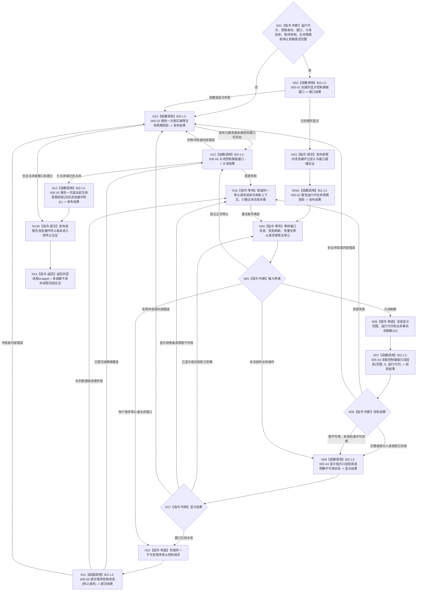

# BIZ-L1-T05 控制面板线程只读消息循环目标函数流程图 v0.4

更新时间：2026-08-28

## 依据

```text
0050、4050、8100 v0.8、8110 v0.3、8120 v0.10
BIZ-L0-001 v0.4
BIZ-L1-T01 v0.4
BIZ-MAIN-001 v0.4
HEAD 46f1cefc：海中鱼巣/启动.应用程序.ixx、海中鱼巣/启动.程序运行宿主.ixx、海中鱼巣/线程/投影.线程生命周期.ixx
```

## 身份与边界

本图只冻结普通控制面板模式下唯一控制面板物理线程的根消息循环，不包含调用它的外层线程wrapper。T01在支持、任务管理、任务工作、外设和自我治理运行门全部就绪后才启动T05；无窗口常驻模式合法跳过T05，不得创建隐藏窗口或伪造消息循环进入见证。

控制面板只读取已经发布的业务投影、线程生命周期投影和审计材料，并把它们转换为人读显示。业务事实投影保留各自正式事实截止，线程生命周期投影保留运行代次和当前消息身份；两类证据只能在人读页面并列展示，不得伪造成跨 owner 同截止机器快照。窗口、页面、缓存、文本、SQL、显示成功或显示失败均不取得业务事实权威。当前BIZ-L1只冻结一种向主链产生影响的用户操作：形成正式程序停止控制请求并异步交给T01宿主。

## 函数合同

```text
目标根函数：运行只读消息循环
完整身份：海中鱼巣::控制面板线程::运行只读消息循环
归属模块 / 文件 / 目标分解深度：海中鱼巣.线程.控制面板线程 / 海中鱼巣/线程/控制面板线程.ixx / BIZ-L1
目标签名：void 运行只读消息循环() noexcept
当前HEAD：类、模块和根函数均不存在；只有启动.应用程序.ixx中的bool按模式启动控制面板线程(启动模式)成功空壳
可见性：目标为控制面板线程私有入口；只由唯一候选租约拥有的物理线程调用
参数：无显式参数；对象在启动前冻结运行代次、逻辑线程身份、窗口端口、具名业务只读投影端口、线程生命周期读写端口、程序控制消息桥、内部消息循环进入/终止见证和宿主停止令牌
返回结果：void；物理返回只表示消息循环已经结束，不表示外层物理线程已经完成；窗口故障和退出原因通过结构化线程生命周期材料表达
上级前置：T01已选择普通控制面板模式、创建唯一候选并启动物理线程；只有本函数N03发布进程内真实消息循环进入及窗口就绪见证后，T01才可把T05启动判为成功；8110生命周期投影不能替代该内部见证
上级后继：用户停止请求成功提交后由T01统一停止其它模块；宿主停止时本函数关闭窗口、报告一次退出前生命周期事件、发布内部消息循环终止见证并返回；外层线程wrapper只在本函数返回后报告物理已退出事件并发布线程完成见证
被调函数流程图：BIZ-L2-005-01—06
```

## 流程图



## 输入与输出边界

| 输入 | T05允许行为 | 输出 | 禁止行为 |
| --- | --- | --- | --- |
| 具名业务投影刷新 | 按明确显示范围和业务事实截止G重新读取值式投影 | 带各来源事实截止的人读页面材料 | 不持有仓库可写引用；不从旧缓存补造“当前”事实 |
| 8110线程生命周期投影 | 按运行代次读取当前线程投影组，保留每项当前消息身份 | 带独立观察证据的线程信息显示 | 不伪造L1事实截止；不把线程等待、退出或故障解释为任务等待、完成或失败 |
| 审计/SQL投影 | 最佳努力读取与显示 | 非权威审计材料 | 不作为初始化、业务提交、验收或退出成功依据 |
| 用户停止/关闭窗口 | 形成一个不可变停止请求并提交程序控制消息桥 | T01可独立消费的程序停止控制消息 | 不直接停止T02/T03/T04/T06，不调用进程退出，不把窗口关闭当系统结束 |
| 宿主停止 | 停止新刷新、关闭本线程窗口，报告一次退出前生命周期事件并返回 | 8110退出前投影和内部消息循环终止见证 | 不在本根内报告物理线程已退出或发布线程完成见证；不改写任何业务事实 |
| 其它用户业务操作 | 只显示当前未冻结/不支持状态 | 无业务请求 | 不直连领域写服务、任务调度或自我治理邮箱 |

## 只读当前性合同

- 每次刷新只消费具名公开只读provider返回的值式结果；页面不得持有业务对象、事务、锁、可写服务或owner内部指针。
- 已读取业务投影必须保留来源身份、版本和事实截止；线程投影必须保留运行代次、线程逻辑身份和当前消息身份。不同证据域或不同截止的页面区域可以分开显示，但不得拼成一份伪同截止机器快照。
- 线程投影只调用已发布 `读取当前线程投影组`；不得另建原始消息视图、消息截止分页或第二次生命周期归并算法。
- 暂不可用、未找到、许可拒绝和资源失败必须显示为对应不可用状态；旧缓存可以标记为历史显示，但不得改标为当前。
- 显示排序、折叠、文本、颜色、列宽和刷新频率只属人机界面，不取得机器语义。
- 投影与用户预期不一致时只能重新读取或报告投影故障，不能由UI、SQL或缓存反写权威事实。

## 停止与窗口关闭合同

- 用户点击停止或关闭窗口时，T05先形成并可靠提交同一程序停止请求。只有T01宿主有权按BIZ-L0-03顺序停止其它模块。
- 停止请求队列暂满或资源失败时保留同一请求和幂等身份重试，不重复生成不同停止事件。
- 宿主已经正式进入停止阶段时，T05不再另造用户停止请求，只停止刷新、关闭当前窗口并退出。
- 窗口关闭、消息循环终止见证、外层wrapper线程完成见证或T05线程退出都不等于其它线程已连接、业务已完成或系统已经结束。
- BIZ-L2-005-02一次调用只能报告一个已发生事件。本根在返回前最多报告一次“退出前”生命周期事件，并另行发布消息循环终止见证；“物理线程已退出”只能由外层wrapper在本根返回后另行报告，且线程完成见证也只由该wrapper发布。

## 当前工作区实现对照

| 能力 | 当前工作区事实 | 判断 |
| --- | --- | --- |
| 控制面板线程模块 | `海中鱼巣/线程/控制面板线程.ixx`不存在 | 未实现 |
| 按模式启动 | `按模式启动控制面板线程(启动模式)`对无窗口返回true，对普通模式也只返回true | 生命周期空壳；未创建线程或窗口 |
| 普通模式宿主 | 普通控制面板模式与无窗口模式当前都调用`运行无窗口宿主`等待进程信号 | 实现偏差；没有窗口消息循环或程序控制停止来源提交端 |
| 窗口端口 | 当前生产源码没有控制面板窗口创建、显示、刷新和关闭实现 | 未实现 |
| 业务只读投影组合 | 当前没有`控制面板投影服务::读取控制面板只读投影`生产实现 | 未实现；不得把异证据域硬拼为同截止机器快照 |
| 线程生命周期投影 | `线程生命周期投影服务`已提供当前单项/组读取并支持控制面板线程类别 | 可复用基础能力；尚未接T05 |
| 程序停止控制消息 | 当前只有进程信号租约；没有T05到T01的程序控制消息桥 | 未实现 |
| 停止与连接 | T01当前没有真实控制面板线程租约、窗口关闭投递、消息循环终止/线程完成双见证或连接动作 | 未实现 |

## 关键边界

- 本图是目标函数图，不把空壳返回true、线程生命周期投影服务或现有领域只读接口误报为控制面板线程已经实现。
- 无窗口模式不需要T05；这不是功能失败，也不能靠创建隐藏窗口统一两种模式。
- 控制面板不可用不改变已经成立的业务事实，但普通控制面板模式的窗口创建失败属于该运行模式的结构化启动/运行失败，必须由T01收口。
- BIZ-L2-005-01—06已经冻结目标职责；当前校正退出第二生命周期消息队列和跨证据域同截止假设。后继仍属于代码实现与装配缺口。

## v0.4 校正记录

- 把005-02改为所有真实T05生命周期事件共用的一次正式投影发布适配，不再只为故障建立第二消息桥。
- T01启动成功只依赖进程内进入/窗口就绪见证；8110投影发布结果只用于可见性和诊断。
- 业务投影事实截止与线程投影当前消息身份分账，只在人读页面并列展示；退出原始消息视图、消息截止分页和第二归并算法。
- 明确HEAD没有任何窗口/WebView/UI实现，全部窗口、页面和程序控制能力均为待新增目标。
- 与001-09回收链对齐：N02失败或N03见证形成前的故障必须发布内部“未进入即终止”材料；消息循环返回后必须先发布循环终止，再由外层wrapper发布线程完成，候选回收依次消费两见证后join。
- 005-02保持单事件合同：N13只报告一次退出前生命周期事件；N13A只发布内部消息循环终止见证。物理已退出投影和线程完成见证都后移到根函数返回后的外层wrapper。

## v0.3 校正记录

- 将六个直接函数调用逐项标为BIZ-L2-005-01—06，机械证明L1没有隐藏的窗口、投影、显示、停止桥、关闭或故障上报函数。
- 保持生命周期进入/退出见证为本根循环的本地线程状态提交，不把它误算成第七个控制面板业务根。

## v0.2 校正记录

- 接入T01 v0.2：T05只在普通控制面板模式、其它必需模块和自我治理运行门就绪后启动；无窗口模式明确跳过。
- 明确当前代码没有控制面板线程、窗口或程序控制消息桥，普通模式实际仍复用无窗口等待空壳。
- 把用户关闭窗口改为先可靠提交正式程序停止请求，再由T01统一收口；窗口关闭不再冒充系统结束。
- 补入显式显示范围/截止、历史缓存标记、不可用分账及8110线程投影隔离。
- 其它业务按钮继续零直写；只有后继正式合同才能增加相应业务请求。
