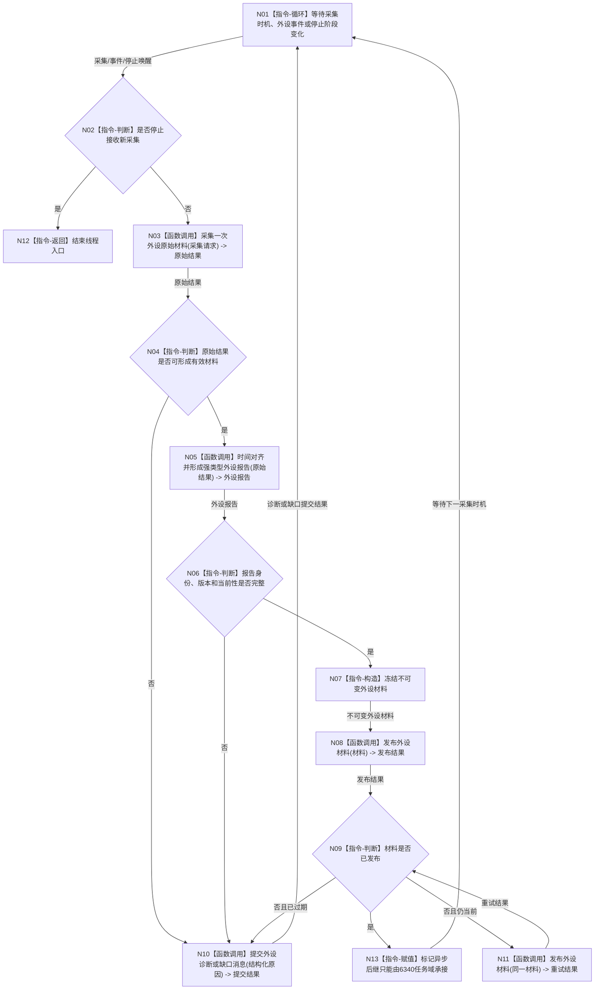

# BIZ-L1-T06 外设线程采集与材料发布循环目标函数流程图 v0.1

更新时间：2026-08-03

## 依据

```text
6320、6340、6350、6360、8100
旧鱼巢参考：流程图/鱼巢流程/20260712_旧鱼巢外设持久化与显示现状流程图_v0.1.md
吸收边界：保留采集、强类型报告和异步承接阶段；旧 D455 私有实现、报告直达自我和报告直接写世界事实不迁移
```

## 身份与边界

正式目标函数设计图。每个外设或采集管线可以拥有一个实例；外设线程只形成原始或强类型外设材料，不直接写世界树。

## 函数合同

```text
根函数：运行采集循环
归属模块 / 文件 / 层级：外设线程 / 海中鱼巣/线程/外设线程.ixx / L1
现有或待新增：待新增统一目标入口；现有外设采样材料线程只覆盖部分材料消费壳
完整签名：void 外设线程::运行采集循环() noexcept
参数：无显式参数；对象在启动前已冻结外设驱动端口、时间源、材料发布队列和停止阶段端口
返回结果：void；采集材料通过不可变外设材料发布，故障通过线程生命周期消息上报
被调函数流程图：BIZ-L2-006-01—04
```

## 流程图



## 节点合同

| 节点 | 类型 | 输入绑定 | 输出绑定 | 事实读写 | 验证 |
| --- | --- | --- | --- | --- | --- |
| N03 | 函数调用 | 驱动、采集参数、时间 | 原始材料或具名失败 | 外设域材料 | 超时、断开和部分帧 |
| N05 | 函数调用 | 原始材料和时间基准 | 强类型报告 | 只解释材料，不写世界事实 | 时间漂移和版本 |
| N07/N08 | 指令/函数调用 | 强类型报告 | 不可变材料/发布结果 | 只写外设材料队列 | 队列满与重试 |
| N10 | 函数调用 | 结构化原因 | 诊断或能力缺口消息 | 不生成任务、需求或世界事实 | 故障隔离 |
| N13 | 指令-赋值 | 已发布报告稳定身份 | 6340 异步承接后继约束 | 不消费报告、不写世界事实 | 单报告跨任务 / 窗口 / 代次至多一次正式承接 |

## 关键边界

- 外设线程是线程组概念，不固定为一个物理线程；每个实例仍只拥有自己的驱动和采集管线。
- 外设材料到达不等于观察完成，也不等于世界事实已发布；必须由 6340 的正式承接与后续领域处理完成。
- 目标主链固定为“外设报告发布 -> 6340 任务域唯一承接 -> 绑定任务 / 工作项材料 -> 具名观察或世界领域服务提交”；不得恢复旧鱼巢“外设队列 -> 自我直接读取”的捷径。
- 队列锁内只发布不可变材料，解释、比较和世界事实提交均在锁外的正式业务路径完成。
- 采集频率、材料数量和线程数量不得直接改变安全值、服务值、需求或任务权限。
