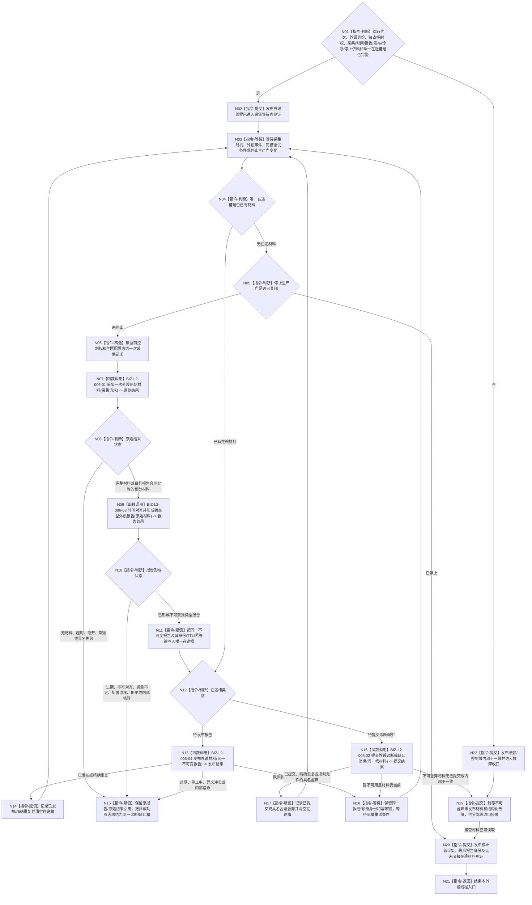

# BIZ-L1-T06 外设线程采集与材料发布循环目标函数流程图 v0.3

更新时间：2026-08-26

## 依据

```text
0050、4050、6320、6340 v0.6、6350、6360、8100 v0.8、8110、8120 v0.10
BIZ-L0-001 v0.4
BIZ-L1-T01 v0.4
BIZ-L2-001-13、BIZ-L2-006-01—04
当前工作区代码：海中鱼巣/启动.应用程序.ixx、海中鱼巣/线程/外设采样材料线程.ixx、
海中鱼巣/适配/协议.D455采样材料.ixx、海中鱼巣/适配/采集器.D455相机.ixx、
海中鱼巣/线程/缓存.D455帧材料.ixx、海中鱼巣/线程/上行桥.D455采样材料.ixx
```

## 身份与边界

本图冻结一个物理外设实例的独立控制域所运行的采集与材料发布根循环。T06在BIZ-L1中是线程组：高实时、高带宽或连续状态复杂的实例独占物理线程；低频实例可以共享线程池，但每个实例仍独占外设身份、驱动句柄、串行控制权、状态机、在途槽和物理报告队列。

T06只负责外设侧“采集、解释为强类型报告、发布”。已发布报告的唯一正式消费者是6340任务域承接；外设线程不得把报告直接发送给self、不得匹配或创建需求/任务、不得写世界事实，也不得把采集成功解释为观察成立、任务完成或需求满足。

## 函数合同

```text
目标根函数：运行采集循环
完整身份：海中鱼巣::外设线程::运行采集循环
归属模块 / 文件 / 目标分解深度：海中鱼巣.线程.外设线程 / 海中鱼巣/线程/外设线程.ixx / BIZ-L1
目标签名：void 运行采集循环() noexcept
当前工作区：目标类、模块和根函数不存在；启动.应用程序.ixx中的bool启动外设线程组()和void收口并连接外设线程组()均为空壳
可见性：外设控制域私有线程入口；同一物理外设只能有一个当前控制域调用
参数：无显式参数；对象在启动前冻结运行代次、外设稳定身份、独占驱动/采集端口、时间源、主题报告形成服务、唯一物理报告发布桥、诊断端口、停止生产门、唯一在途槽和生命周期端口
返回结果：void；物理返回只表示本线程入口结束，最后报告身份、未发布材料、退出原因和故障由结构化生命周期/收口材料表达
上级前置：T01经BIZ-L2-001-07创建候选并证明线程已进入采集等待态，才可把本实例启动判为成功
上级后继：已发布报告异步进入BIZ-L2-004-10的6340唯一承接；停止时由BIZ-L2-001-13冻结生产门、接管未发布材料并连接线程
被调函数流程图：BIZ-L2-006-01—04
```

## 流程图



## 唯一在途槽合同

- 每个外设控制域至多存在一个当前在途槽；槽状态只允许“空、原始结果待分类、不可变报告待发布、诊断/缺口待提交、已封存待收口接管”。从报告发布转入诊断/缺口时必须保留原报告及来源材料引用，不能用原因字段覆盖原材料。
- 采集成功后先占用在途槽。报告发布或诊断提交未终结前不得开始下一次采集，防止用新采样覆盖旧材料或用重新采集冒充发布重试。
- 队列暂不可用、诊断端口暂不可用或资源失败只允许保留同一报告/诊断身份、内容、TTL和幂等键重试；不得重新计算身份、改变产品分类或重新采样。
- 过期、质量不足、配置漂移、普通无命中等材料只有在6340/6350规则明确允许且形成强类型原因时才能舍弃。安全事件、当前任务所需回执、状态跃迁、目标丢失、外设错误和影响目标判断的缺口不得静默舍弃。
- 异义冲突、半发布、候选读回矛盾或前置有效后出现的内部不一致均进入追根因和故障收口，不能降级成普通采集失败。

## 停止与收口合同

- T01关闭生产门后，本线程不再冻结新的采集请求；已经进入采集器的调用由停止令牌返回取消、合法部分材料或完整材料，后两者仍按同一在途槽处理。
- 停止不删除已经发布的报告，也不等待6340把所有报告消费完。T06只需证明新采集已停止、最后报告身份已冻结、在途槽为空或已被BIZ-L2-001-13的剩余材料接管路径可靠读取。
- 不可舍弃材料在发布端停止或故障时必须封存为具名接管材料；线程join、析构、日志或队列内存仍存在均不能替代可恢复接管见证。
- 只有“在途槽已清空”或“剩余材料已封存且可由收口接管”后才允许发布退出见证并返回。连接成功只证明线程资源已回收，不证明报告已承接或世界事实已形成。

## 当前工作区实现对照

| 能力 | 当前工作区事实 | 判断 |
| --- | --- | --- |
| T01外设启动/收口接线 | `启动外设线程组()`恒返回true，`收口并连接外设线程组()`为空函数 | 生命周期空壳；未创建、停止或连接任何外设线程 |
| 通用T06根循环 | `海中鱼巣/线程/外设线程.ixx`不存在 | 未实现 |
| `外设采样材料线程` | 能创建一个只自旋等待停止的线程，并对调用方提交的标量`运行消息`做入队/出队；文件规则明确禁止接真实外设、D455和外设动作 | 只可复用少量线程/队列机制；不是T06实现 |
| D455真实采集适配器 | `采集器.D455相机.ixx`具备打开、同步帧采样、停止和状态快照；工程默认关闭RealSense编译，且生产启动链没有构造调用 | 特定外设采集基础存在但未接线 |
| D455材料缓存与上行桥 | 能准备候选、读回、确认发布、普通读回，并构造目标为任务管理的标量消息；上行桥明确不入队、不调用领域服务 | 进程内材料传递基础；不是6340物理报告发布或任务域承接 |
| 强类型外设报告 | 当前D455协议只承载同步帧、设备/标定/时间和流材料；没有6350四类产品、成熟度、质量、适用范围和报告稳定身份的统一生产合同 | 未实现 |
| 6340唯一报告队列和承接 | 当前没有T06发布到唯一物理强类型报告队列的生产接线，也没有T03按6340正式承接 | 未实现 |
| 唯一在途槽与停止接管 | 当前采样线程没有报告在途槽；停止直接结束自旋，启动空壳也没有BIZ-L2-001-13接管端口 | 未实现；现状不能证明停产前材料守恒 |

## 关键边界

- T06是按外设实例形成的控制域集合，不是一条进程级“大外设线程”；共享线程池也不改变每实例独占控制权和唯一在途槽。
- D455相机适配器、帧缓存和上行桥是可复用下层材料能力，但没有生产构造、强类型报告、物理队列和6340承接接线时，不能宣称外设业务闭环已经实现。
- 已发布外设报告只表示任务域可以承接。T06不等待需求满足，也不从任务、self或当前世界状态反向裁决报告内容。
- 本轮没有新增机器语义DRIFT；后继需要实现通用控制域、强类型报告/队列、生产装配和停止接管，并以真实外设材料、任务域唯一承接及领域正式提交分别验收。

## v0.3 校正记录

- 将四个唯一直接函数调用逐项标为BIZ-L2-006-01—04；发布暂时失败通过N18回到同一006-04调用节点，不建立第五个“重试发布”根。
- 保持控制域、唯一在途槽、停产见证和剩余材料封存为本根循环的本地状态机指令，不把6340任务域承接越级画入T06。

## v0.2 校正记录

- 接入BIZ-L0 v0.4和T01 v0.2的启动、停止生产、剩余材料接管和连接顺序。
- 把“收到停止即返回”改为“停止新采集，已取得材料发布或封存后退出”，保证停产前材料守恒。
- 冻结每外设唯一在途槽；发布/诊断暂不可用只重试同一材料，禁止重新采样冒充重试。
- 区分具名合法舍弃、不可舍弃报告和内部不一致，诊断提交失败不再无条件回到正常采集循环。
- 按当前工作区确认通用T06尚未实现；D455采集、缓存和上行桥只是未接生产主链的特定基础能力。
