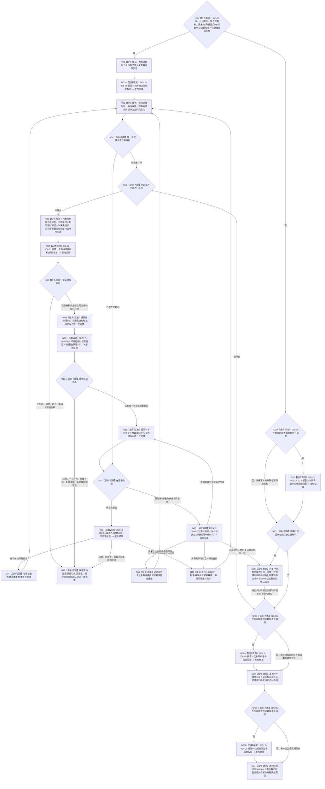

# BIZ-L1-T06 外设线程采集与材料发布循环目标函数流程图 v0.5

更新时间：2026-08-28

## 依据

```text
0050、4050、6320、6340 v0.6、6350 v0.6、6360、8100 v0.7、8110 v0.3、8120 v0.10
BIZ-L0-001 v0.4
BIZ-L1-T01 v0.5
BIZ-L2-001-13、BIZ-L2-006-01—05
已发布源码证据：启动 `3d9049fe`、模拟/空材料线程 `bd7421b9`、D455协议 `f110508f`、
D455采集器`9009c0c8`、D455缓存`ec93dd07`、D455上行桥`6ae1d941`、线程生命周期数据`71bd6068`、投影服务`9f74b91c`
```

## 身份与边界

本图冻结一个物理外设实例的独立控制域所运行的采集与材料发布根循环，不包含调用它的外层线程wrapper。T06在BIZ-L1中是线程组：高实时、高带宽或连续状态复杂的实例独占物理线程；低频实例可以共享线程池，但每个实例仍独占外设身份、驱动句柄、串行控制权、状态机、在途槽和物理报告队列。

T06只负责外设侧“采集、解释为强类型报告、发布”。已发布报告的唯一正式消费者是6340任务域承接；外设线程不得把报告直接发送给self、不得匹配或创建需求/任务、不得写世界事实，也不得把采集成功解释为观察成立、任务完成或需求满足。

线程生命周期与外设业务材料严格分账。创建、运行、等待、停止、退出和故障等真实物理线程事件只经8110唯一发布端口形成线程投影；采集超时、外设断开、质量不足和观察缺口不是线程生命周期事件。可舍弃外设非成功只形成强类型舍弃/摘要结果；不可舍弃错误或缺口必须形成强类型外设报告并进入同一物理外设报告队列，不得建立第二诊断消息队列。

## 函数合同

```text
目标根函数：运行采集循环
目标职责身份：BIZ-L1-T06 运行采集循环；物理C++类名、模块名和函数身份尚未冻结
归属模块 / 文件 / 目标分解深度：每物理外设实例控制域的线程模块 / 具体模块与文件待T06详细设计 / BIZ-L1
候选签名：void 运行采集循环() noexcept；只表达根职责形状，不是ABI冻结
当前发布源码：生产T06类、模块和根函数不存在；启动.应用程序.ixx中的bool启动外设线程组()和void收口并连接外设线程组()均为空壳
可见性：外设控制域私有线程入口；同一物理外设只能有一个当前控制域调用
参数：无显式参数；对象在启动前冻结运行代次、外设稳定身份、独占驱动/采集端口、时间源、主题报告形成服务、唯一物理报告发布桥、诊断端口、停止生产门、唯一在途槽和生命周期端口
返回结果：void；物理返回只表示采集循环已经结束，不表示外层物理线程已经完成；最后报告身份、未发布材料、退出原因和故障由结构化生命周期/收口材料表达
上级前置：T01经BIZ-L2-001-07创建候选并证明线程已进入采集等待态，才可把本实例启动判为成功
上级后继：已发布报告异步进入BIZ-L2-004-10 v0.2的6340唯一承接；停止时由BIZ-L2-001-13冻结生产门，等待门前轮次发布完成或把唯一在途槽移交外设owner合法封存；本根只报告退出前并返回，外层线程wrapper在返回后报告物理已退出并发布线程完成见证，再由T01连接具备资格的线程
被调函数流程图：BIZ-L2-006-01—05
```

## 流程图



## 唯一在途槽合同

- 每个外设控制域至多存在一个当前在途槽；槽状态只允许“空、原始材料待形成、非成功材料待收束、不可变报告待发布、已封存待收口接管”。从报告发布失败转入非成功收束时必须保留原报告及来源材料引用，不能用原因字段覆盖原材料。
- 采集成功后先占用在途槽。报告发布或诊断提交未终结前不得开始下一次采集，防止用新采样覆盖旧材料或用重新采集冒充发布重试。
- 队列暂不可用或资源失败只允许保留同一报告/收束身份、内容、TTL和幂等键重试；不得重新计算身份、改变产品分类或重新采样。
- 过期、质量不足、配置漂移、普通无命中等材料只有在6340/6350规则明确允许且形成强类型原因时才能舍弃。安全事件、当前任务所需回执、状态跃迁、目标丢失、外设错误和影响目标判断的缺口不得静默舍弃。
- 异义冲突、半发布、候选读回矛盾或前置有效后出现的内部不一致均进入追根因和故障收口，不能降级成普通采集失败。

## 采样触发边界

- 外设控制域可以按主题内部采样计划、物理外设事件或具名控制类命令发起一次采样。双目相机是持续供料外设，不要求每帧先取得任务等待项或订阅项。
- 等待项和订阅项约束6350产品调度、报告命中与6340任务域承接；它们不能被复制成每次原始采样的控制权见证。
- 具体适配器由001-07创建控制域时绑定。006-01只调用当前实例已经绑定的适配器，不在每轮采样时运行时发现、按名称猜测或重新签发控制权。

## 停止与收口合同

- T01关闭生产门后，本线程不再冻结新的采集请求；已经进入适配器的调用按该主题现有停止机制返回已停止/无材料、合法部分材料或完整材料，后两者仍按同一在途槽处理。不得为了统一T06而补造公共取消令牌ABI。
- 停止不删除已经发布的报告，也不等待6340把所有报告消费完。T06必须在生产门冻结后继续收束门前已经取得的轮次，并由控制域收尾见证给出最终报告截止、空槽或外设owner合法封存结果。
- 不可舍弃材料在发布端停止或故障时必须由外设owner封存；线程join、析构、日志、队列内存或通用接管适配器均不能替代外设owner的可恢复见证。
- 只有“在途槽已清空”，或“原唯一在途槽所有权已经移交到仍由控制域租约持有、可供外设owner正式封存的收口状态”后，本根才允许发布退出前投影并返回。待正式封存不等于封存成功；BIZ-L2-001-13仍须取得owner正式封存读回和外层wrapper线程完成见证后才能连接并释放租约。连接成功只证明线程资源已回收，不证明报告已承接或世界事实已形成。
- BIZ-L2-006-05一次调用只能报告一个已发生物理线程事件。本根可以报告等待、收尾中、退出前或仍可继续收尾的故障；已退出只由外层wrapper在本根返回后报告，异常退出只由wrapper或具名管理者依据真实异常终止结果报告。终态形成后不得再发布收尾事件。
- 根依赖不完整时先锁存本地故障和现有资源/在途槽所有权。只有006-05生命周期发布依赖本身可调用时才尝试故障投影；缺失的恰是该依赖时零调用，直接进入在途材料交接与收尾裁决。

## 已发布源码实现对照（上述当前树 blob）

| 能力 | 发布源码事实 | 判断 |
| --- | --- | --- |
| T01外设启动/收口接线 | `启动外设线程组()`恒返回true，`收口并连接外设线程组()`为空函数 | 生命周期空壳；未创建、停止或连接任何外设线程 |
| 001-07完整组启动 | 发布源码无请求/结果DTO、进程内主题适配器表、独占控制域候选租约、内部进入见证或失败租约转交 | 未实现；0项应合法无需启动，N项只有全部进入后才发布完整组，半失败材料/租约必须守恒 |
| 通用T06根循环 | 发布源码不存在生产T06类、模块或根函数；物理文件尚未由详细设计选择 | 未实现；目标图不预造文件路径 |
| `外设采样材料线程` | 能创建一个只自旋等待停止的线程，并对调用方提交的标量`运行消息`做入队/出队；文件规则明确禁止接真实外设、D455和外设动作 | 只可复用少量线程/队列机制；不是T06实现 |
| D455真实采集适配器 | `采集器.D455相机.ixx`具备打开、同步帧采样、停止和状态快照；工程默认关闭RealSense编译，且生产启动链没有构造调用 | 特定外设采集基础存在但未接线 |
| D455材料缓存与上行桥 | 能准备候选、读回、确认发布、普通读回，并构造目标为任务管理的标量消息；上行桥明确不入队、不调用领域服务 | 进程内材料传递基础；不是6340物理报告发布或任务域承接 |
| 强类型外设报告 | 当前D455协议只承载同步帧、设备/标定/时间和流材料；没有6350四类产品、成熟度、质量、适用范围和报告稳定身份的统一生产合同 | 未实现 |
| 6340唯一报告队列和承接 | 当前没有T06发布到唯一物理强类型报告队列的生产接线，也没有T03按6340正式承接 | 未实现 |
| 8110生命周期发布 | 唯一发布端口已经实现，但外设线程和启动空壳均未接线 | provider可复用；006-05适配待新增，外设诊断不得冒充线程事件 |
| 不可舍弃报告恢复材料 | 6340要求先形成可跨重启恢复的报告或承接事实；发布源码无外设报告恢复owner和生产调用 | 目标006-04新增恢复材料形成/正式读回前置，不把运行期队列当持久权威 |
| 唯一在途槽与停产收尾 | 当前采样线程没有报告在途槽；停止直接结束自旋，启动空壳也没有BIZ-L2-001-13收尾端口、控制域槽移交或外层wrapper完成见证 | 未实现；现状不能证明停产前材料守恒或物理线程完成边界 |

## 关键边界

- T06是按外设实例形成的控制域集合，不是一条进程级“大外设线程”；共享线程池也不改变每实例独占控制权和唯一在途槽。
- D455相机适配器、帧缓存和上行桥是可复用下层材料能力，但没有生产构造、强类型报告、物理队列和6340承接接线时，不能宣称外设业务闭环已经实现。
- 已发布外设报告只表示任务域可以承接。T06不等待需求满足，也不从任务、self或当前世界状态反向裁决报告内容。
- 正式规范已足以纠正传递和职责边界；后继仍需为不可舍弃报告恢复owner冻结持久物理ABI与消费收束接线。流程图只冻结必要提供者职责，不把运行期队列、D455缓存或线程投影伪装成该持久权威。
- BIZ-L2-001-07只建立0..N个T06控制域并取得内部采集等待见证；它不要求先产生报告。完整组发布前的候选若已经形成不可舍弃在途材料，必须把原材料见证和唯一租约交BIZ-L2-001-13，由外设owner完成发布或合法封存后再连接，不能等待报告消费或把候选析构当作回收。

## v0.5 校正记录

- 修正入口依赖失败后仍无条件调用006-05的不可执行分支：故障、收尾中和退出前投影都分别先判断生命周期端口，可用才投影；不可用则保留本地故障、资源和在途材料，完成本地收尾见证后返回。
- 同步006-05 v0.2公开载荷矩阵；容量已满等状态不再被父图误解为空载荷成功或失败依据。

## v0.4 校正记录

- 直接BIZ-L2根由四项增为五项：006-05只报告真实外设线程生命周期事件，8110投影不替代启动/完成内部见证。
- 006-02退出线程生命周期消息队列和第二诊断传递路径；合法舍弃只形成强类型收束结果，不可舍弃错误/缺口仍形成报告并回到006-04唯一物理队列。
- 原始材料取得后立即进入唯一在途槽；报告形成、发布、收束和停止接管不得丢失来源引用或重新采样冒充重试。
- 006-04增加6340不可舍弃报告恢复材料前置；运行期物理队列和产品索引继续不是持久权威。
- 发布暂时失败通过N18回到同一006-04调用节点，不建立“重试发布”第二权威函数。
- 保持控制域、唯一在途槽、停产见证和剩余材料封存为本根循环的本地状态机指令，不把6340任务域承接越级画入T06。
- 006-05保持单事件合同：等待、收尾中、退出前和故障各次调用分立；本根不发布已退出/异常退出终态或线程完成见证，二者由根返回后的外层wrapper或具名管理者按真实终止结果形成。

## v0.2 校正记录

- 接入BIZ-L0 v0.4和T01 v0.2的启动、停止生产、剩余材料接管和连接顺序。
- 把“收到停止即返回”改为“停止新采集，已取得材料发布或封存后退出”，保证停产前材料守恒。
- 冻结每外设唯一在途槽；发布/诊断暂不可用只重试同一材料，禁止重新采样冒充重试。
- 区分具名合法舍弃、不可舍弃报告和内部不一致，诊断提交失败不再无条件回到正常采集循环。
- 按发布源码确认通用T06尚未实现；D455采集、缓存和上行桥只是未接生产主链的特定基础能力。
