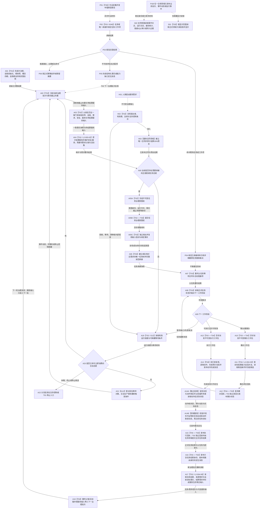

# BIZ-MAIN-001 自我治理到需求任务方法结果结算目标业务流程图 v0.1

更新时间：2026-08-03

## 依据

```text
现行规范：4190、4220、5090、5220、5230、5250、6340、8100、8120
当前目标函数图：BIZ-L1-T01—T06、BIZ-L2-002-01—08、BIZ-L2-003-01—04、BIZ-L2-004-01—15
旧鱼巢参考：流程图/鱼巢流程/20260712_旧鱼巢运行主链与两条旁路总览现状流程图_v0.1.md
旧鱼巢参考：流程图/鱼巢流程/20260712_旧鱼巢自我治理循环现状流程图_v0.1.md
旧鱼巢参考：流程图/鱼巢流程/20260712_旧鱼巢需求与任务管理现状流程图_v0.1.md
旧鱼巢参考：流程图/鱼巢流程/20260712_旧鱼巢筹办方法与执行现状流程图_v0.1.md
旧鱼巢参考：流程图/鱼巢流程/20260712_旧鱼巢动态因果结果与结算现状流程图_v0.1.md
旧鱼巢参考：流程图/鱼巢流程/20260712_旧鱼巢外设持久化与显示现状流程图_v0.1.md
```

## 身份与边界

正式目标业务闭环图。本图把旧鱼巢已经证明有业务价值的主链阶段映射到当前多线程、强类型服务和事实所有权合同；它不是单函数施工图，也不证明任何目标函数已经实现。

```text
业务输入：当前世界 / 自我事实、完整单调秒、人类提出的服务需求、已承接外设材料、上一轮正式任务结果定位和控制请求
业务输出：需求与任务正式结论、方法执行冻结、实际结果与因果证据引用、结算结果和下一治理批次
前置条件：8120 初始化完整；各邮箱 / 队列和运行代次有效；领域服务引用已冻结
完成条件：一轮治理从一致事实出发，经需求—任务—方法—实际结果—结算回到下一轮一致治理输入；所有写入均能由权威读回证明
非目标：复制旧线程写事实、旧因果模板、旧 D455 / SQL / WebView2 实现或主链镜像
```

## 流程图



## 阶段到目标函数映射

| 阶段 | 连接类型 | 当前目标函数 / 合同 | 事实读写 |
| --- | --- | --- | --- |
| A01 | 直接函数调用 | `运行普通多线程宿主`及 8120 初始化子函数 | 各初始化服务提交，宿主只编排 |
| A02—A05 | 自我线程内直接调用 | `自我线程::运行治理循环`、L2-003、L2-004-01 | 只读一致事实；A04 由 L2-003-02 消费上批服务输入，并把合同终态、70%余款或准备补回、当秒衰减和安全根回归同事务发布 |
| A05A—A05C | 异步消息后继 | L2-002-08、L2-004-09、L2-002-04 | T02 只发布不可变治理意图；T03 独立取出、复核后才进入任务树入口 |
| A06—A09 | 任务管理线程内直接调用 | L2-004-02、父任务等待重判、裁决任务下一工作阶段 | 任务管理只读正式状态并决定筹办 / 执行 / 等待 / 收口 |
| A10—A12 | 异步工作包 + 工作线程直接调用 + 异步回执 | L2-004-04、L2-004-03、L2-004-08 | 工作线程调用筹办服务并发布筹办闭合；任务管理独立读回后再决定下一阶段 |
| A13 | 异步消息后继 | L2-004-04 | 只发布不可变执行工作包 |
| A14—A14B | 工作线程内调用 + 独立验真 + 领域发布 | L2-004-07 及其动作完成验真、实际状态读取和动态发布下层 | 预计动态和完成消息非权威；只有权威回读与校准后才能发布可证明动态 |
| A15—A16 | 异步回执 + 任务领域提交 + 定位消息 | L2-004-08、L2-004-05、L2-004-14 | T03 独立回读并提交任务结果；上行只携带任务结果定位，不判断需求满足 |
| A17—A18 | 自我线程内直接调用 | L2-004-06、需求父链与活动集重判 | T02 重读任务结果、来源需求和当前事实后由需求域结算；服务只形成下一轮聚合输入 |
| H01—H03 | 人类需求输入 + 服务合同事务 | L2-002-04、L2-003-04 | 同来源有效期内唯一合同与30%预支原子发布；预支不因后续失败追回 |
| P01—P06 | 异步外设材料 | T06 -> 6340 任务域唯一承接 | 只命中既有任务；无匹配报告不得由 T03 自行创建需求或任务 |
| PUB/S01/S02 | 发布后只读投影 / 支持旁路 | T05、日志 / SQL / 持久证据适配 | 面向全部合规发布点；不反写机器事实，不改变主链结果 |

## 验证点

1. 初始化未完整时 A02 不得开始；显示、日志或 SQL 成功不能补足 A01。
2. A02 冻结读取前事实截止向量；A03 只有在读取后同范围向量与读取前向量、各子快照来源见证完全一致时才形成快照。任一所有者见证变化都使本批返回版本漂移，迟到材料进入下一批。
3. A06 后必须读回唯一任务树、来源需求、活动路径、授权和等待合同。
4. A08 只能根据正式任务状态裁决工作类型；实际筹办由 A11 的任务工作线程调用，不能留在任务管理线程同步运行。
5. A11 必须先按任务目标结果能力召回方法，再读取每个候选方法的条件并绑定当前事实；零候选不得先凭因果材料构造条件。
6. A14—A14B 必须保持“动作 -> 预计动态 -> 完成消息 -> 独立验真 -> 权威实际状态 -> 校准发布”的顺序；方法返回和完成消息均不能替代实际结果。
7. A12 / A15 回执、工作线程退出和任务完成都不能直接写需求满足；A16 上行不得携带需求满足结论。
8. P01 报告在跨任务、窗口和代次中至多一次正式承接；无匹配报告不得连接 A06。
9. A18 产生的只是下一轮不可变治理输入，不是第二份需求 / 任务 / 世界事实；该输入只能沿 A18 -> A02 -> A03 进入 A04 / L2-003-02，不能由 004-06 或消息桥直接结算服务值。
10. PUB 只表示适用于每个合规领域发布点的旁路规则；写前持久证据仍是对应业务事务内部门禁，不属于普通 S02 发布后旁路。

## 关键边界

- 本图借鉴的是旧鱼巢的业务阶段和闭环方向，不借鉴其类型、存储、线程写权或具体实现体。
- 旧“主链镜像”和“运行控制同步”被当前已发布代次、值式快照和线程生命周期投影取代，不再建立第二主链。
- 旧“动态类 / 因果模板”改写为 4190 / 4220 允许的状态迁移、动作动态和因果证据引用。
- 业务主链跨 T02、T03、T04 异步推进；图上的阶段相邻不表示同步调用或共同持锁。
- 第39项确认已收紧 8100 中“任务管理上报需求满足证据”的旧表述：目标设计只允许上报任务结果定位；正式规范仍须同步修订后，本图相关节点才能作为施工合同消费。
