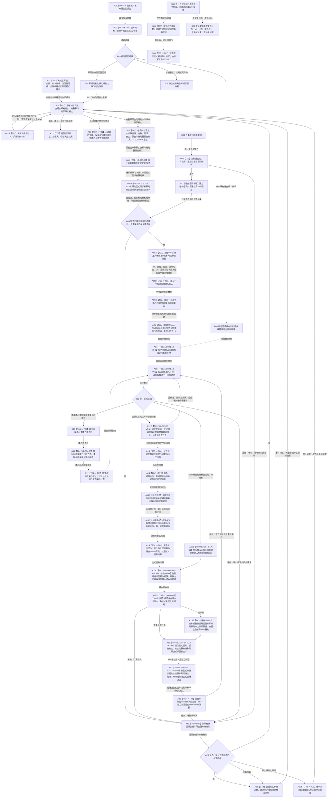

# BIZ-MAIN-001 自我治理到需求任务方法结果结算目标业务流程图 v0.3

更新时间：2026-08-27

## 依据

```text
现行规范：4190、4220、5090、5220、5230、5250、6340、8100、8120
当前目标函数图：BIZ-L1-T01 v0.4、BIZ-L1-T02 v0.6、BIZ-L1-T03 v0.5、BIZ-L1-T04 v0.3、BIZ-L1-T05 v0.3、BIZ-L1-T06 v0.3、BIZ-L2-002-01—10、BIZ-L2-003-01—04、BIZ-L2-004-01—17（其中002-03/04当前为v0.4，003-03当前为v0.4，004-17当前为v0.2，002-05/07/08/10、004-02/06/08/09/11/12/13/14当前为v0.2）
旧鱼巢参考：流程图/鱼巢流程/20260712_旧鱼巢运行主链与两条旁路总览现状流程图_v0.1.md
旧鱼巢参考：流程图/鱼巢流程/20260712_旧鱼巢自我治理循环现状流程图_v0.1.md
旧鱼巢参考：流程图/鱼巢流程/20260712_旧鱼巢需求与任务管理现状流程图_v0.1.md
旧鱼巢参考：流程图/鱼巢流程/20260712_旧鱼巢筹办方法与执行现状流程图_v0.1.md
旧鱼巢参考：流程图/鱼巢流程/20260712_旧鱼巢动态因果结果与结算现状流程图_v0.1.md
旧鱼巢参考：流程图/鱼巢流程/20260712_旧鱼巢外设持久化与显示现状流程图_v0.1.md
```

## 身份与边界

正式目标业务闭环图。本图把旧鱼巢已经证明有业务价值的主链阶段映射到当前多线程、强类型服务和事实所有权合同；它不是单函数施工图，也不证明任何目标函数已经实现。

```text
业务输入：当前世界 / 自我事实、完整单调秒、人类提出的服务需求、已承接外设材料、显式任务轮次结算定位和控制请求
业务输出：需求与任务正式结论、方法执行冻结、实际结果与因果证据引用、结算结果和下一治理批次
前置条件：8120 初始化完整；各邮箱 / 队列和运行代次有效；领域服务引用已冻结
完成条件：一轮治理从一致事实出发，经需求—任务—方法—实际结果—结算回到下一轮一致治理输入；所有写入均能由权威读回证明
非目标：复制旧线程写事实、旧因果模板、旧 D455 / SQL / WebView2 实现或主链镜像
```

## 流程图



## 阶段到目标函数映射

| 阶段 | 连接类型 | 当前目标函数 / 合同 | 事实读写 |
| --- | --- | --- | --- |
| A01 | 直接函数调用 | `运行普通程序`及 8120 初始化子函数 | 各初始化服务提交，普通模式宿主只编排 |
| A02—A05 | 自我线程内直接调用 | `自我线程::运行治理循环` v0.5、BIZ-L2-002-01 v0.2、L2-003-02、L2-002-06 v0.2、L2-004-01 | A02 守恒消息并组合完整秒与共享截止；A03 同截止读回；A04 只维护服务/安全；A04A 只消费显式需求核算结果并逐级 fresh 复核当前父需求，零任务结果扫描或活动集事务 |
| A05A—A05C | 单项异步消息后继 | L2-002-08 v0.2、L2-004-09 v0.2 | T02一次只发布一个具体D承接意图及原完整幂等信封；T03一次只取出一个具名输入并按D独立复核后进入004-02 v0.2；无消息组、无当前任务缓存、无临场派生键 |
| A06—A09 | 任务管理线程内直接调用 | L2-004-02 v0.2、004-11 v0.2、004-12 v0.2、004-13 v0.2 | 任务管理同G0读取正式T→E/E、当前轮次、ARCH-L2阶段和T→D，按单项回流形成值式重判，再只决定筹办 / 待派发 / 等待 / 零动作 / 保持当前阶段；不读取调度资格 |
| A10—A12 | 异步工作包 + 工作线程直接调用 + 结构化定位 | L2-004-04、L2-004-03、L2-004-08 | 工作线程调用筹办服务并返回闭合定位，不建立独立持久化筹办回执；任务管理独立读回后再决定下一阶段 |
| A12C—A13 | 任务管理线程内fresh选择 + 异步消息后继 | L2-003-03 v0.4、L2-004-04 | 执行冻结完成后读取完整候选、正式A/L/H根配额、当前T→D/目标/B和安全/服务材料并选择0..1项；调度场景正式来源缺失时零派发，只有已选择才发布不可变执行工作包 |
| A14—A14B | 工作线程内调用 + 独立验真 + 领域发布 | L2-004-07 及其动作完成验真、实际状态读取和动态发布下层 | 预计动态和完成消息非权威；只有权威回读与校准后才能发布可证明动态 |
| A15—A15E | 异步回执或零动作治理输入 + 任务领域提交/读回 + 当前轮次收束 + 0..1上级调用返回 | L2-004-08 v0.2、L2-004-17 v0.2、L2-004-05及任务owner正式轮次/调用入口 | 执行路径形成正式任务实际结果；零动作路径形成不同的合法无执行短路结果。两者随后复用当前轮次收束和上级调用边；共同来源G0与各owner正式读回截止分账，不遍历或分配全部T→D |
| A16—A18 | T03到T02具名输入 + T02正式读回/决议 + T02到T03单项具名输入 + T03消费 | L2-004-14 v0.2、002-03 v0.4、002-04 v0.4、002-09、002-08 v0.2、004-09 v0.2 | 上行结算定位只携带T/R/结算身份/G；self按显式身份读回后形成决议。下行决议定位与D承接意图同用另一单项队列但保持不同强类型载荷和消费函数；只有self继续决议可建立新轮次 |
| H01—H03 | 人类需求输入 + 服务合同事务 | L2-003-04 | 同来源有效期内唯一合同与30%预支原子发布；预支不因后续失败追回；任务轮次结算读取002-04不参与本旁路 |
| P01—P06 | 异步外设材料 | T06 -> 6340 任务域唯一承接 | 只命中既有任务；无匹配报告不得由 T03 自行创建需求或任务 |
| PUB/S01/S02/S03 | 发布后只读投影 / 支持旁路 / 程序控制消息 | T05、日志/SQL/持久证据适配、T01宿主 | 投影和旁路不反写机器事实；T05只可提交程序停止请求，具体停止顺序仍由BIZ-L0-03/T01执行 |

## 验证点

1. 初始化未完整时 A02 不得开始；显示、日志或 SQL 成功不能补足 A01。
2. A02 只接受 BIZ-L2-002-01 v0.2 的结构化结果。时间或共享截止失败必须保留同一待完成批次和见证，重试零再次读取邮箱；停止只来自邮箱正式 `已停止`，不携带停止阶段版本。
3. A03 只在读取前后共享截止 `G0 == G1` 且全部子快照来源截止均等于 `G0` 时形成一致快照；版本漂移保留本批值式材料并重新正式读取，不恢复旧事实截止向量。
4. A20 的停止候选只能请求 T01 关闭新输入和停止邮箱，再回到 A02 排空；只有 A02 正式返回 `已停止`才进入 A22 正常完成。A23 是失败收口，不得冒充正常停止。
5. A05B成功只证明一个具名输入进入T03边界；A05C必须按D正式读取所属L，A06再按L查询0..1当前任务并读回T→D、当前轮次和后继材料。消息、列表其它成员和旧任务缓存都不能补位。
6. A08 只能根据正式任务状态裁决工作类型；实际筹办由 A11 的任务工作线程调用，不能留在任务管理线程同步运行。
6.1 A08不得读取控制态或调度资格；这些只在A12C决定普通派发。A15Z不得伪造动作完成消息或执行结果，也不得在合法无执行短路结果和轮次收束前直接通知self。
7. A11 必须先按任务目标结果能力召回方法，再读取每个候选方法的条件并绑定当前事实；零候选不得先凭因果材料构造条件。
8. A14—A14B 必须保持“动作 -> 预计动态 -> 完成消息 -> 独立验真 -> 权威实际状态 -> 校准发布”的顺序；方法返回和完成消息均不能替代实际结果。
8.1 A12C 只决定尚未派发执行冻结的普通执行机会；不得参与需求选择、任务承接、筹办或执行冻结，也不得用队列到达顺序、旧权限快照或单个槽绕过零资格 / 漂移结果。
9. A12 / A15 工作结果定位、工作线程退出、轮次结算和上级调用返回都不能直接写需求满足；T04所有已接管工作包必须结构化返回T03。A16只携带显式任务、轮次、结算身份和G，不发送任务实际结果正文，也不让T02按当前实例反推执行轮次。
10. P01 报告在跨任务、窗口和代次中至多一次正式承接；无匹配报告不得连接 A06。
11. A18取出的是self后继决议定位，不是决议正文或第二份需求/任务/世界事实；必须按显式T/R/结算/决议/G独立读回。只有“继续”可由task owner建立新轮次。其它关联任务和需求只能在自身实际调度或使用时fresh读取当前状态，不能由A15—A18批量结算。
12. PUB 只表示适用于每个合规领域发布点的旁路规则；写前持久证据仍是对应业务事务内部门禁，不属于普通 S02 发布后旁路。

## 关键边界

- 本图借鉴的是旧鱼巢的业务阶段和闭环方向，不借鉴其类型、存储、线程写权或具体实现体。
- 旧“主链镜像”和“运行控制同步”被当前已发布代次、值式快照和线程生命周期投影取代，不再建立第二主链。
- 旧“动态类 / 因果模板”改写为 4190 / 4220 允许的状态迁移、动作动态和因果证据引用。
- 业务主链跨 T02、T03、T04 异步推进；图上的阶段相邻不表示同步调用或共同持锁。
- 任务结果不是容量或分配物；T03只完成当前任务轮次收束和唯一上级调用边返回，需求满足、价值、预算、服务与归因继续由各自owner独立裁决。

## v0.3 校正记录

- A05A—A06从模糊任务治理意图组收窄为“一个具体需求D及原完整幂等信封 -> 单项具名输入 -> T03按D读取L并查询0..1当前任务 -> 新建六阶段链或既有任务T→D承接”。
- A17—A18的self后继决议定位使用同一单项队列，但保持独立强类型载荷、显式T/R/结算/决议/G和004-16 v0.2消费，不与D承接合并业务语义；等待只返回状态/指令且零task写、零阶段调用。
- 旧准备 / 确认 / 撤销消息组事务退出；消息发送和取出都不证明任务或self决议已经被owner消费。
