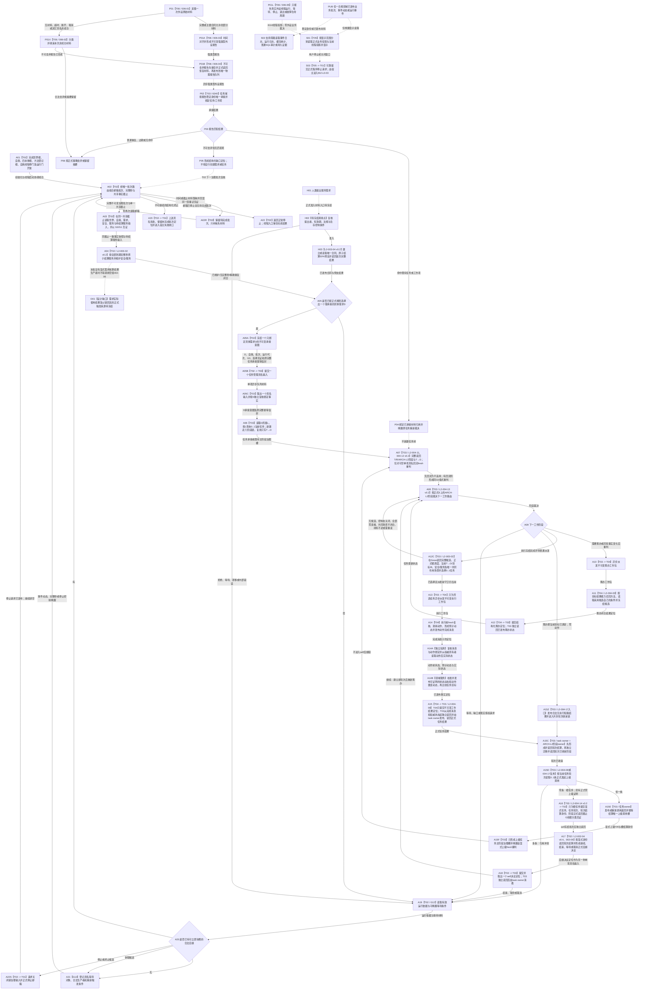

# BIZ-MAIN-001 自我治理到需求任务方法结果结算目标业务流程图 v0.5

更新时间：2026-08-28

## 依据

```text
现行规范：0050 v1.9、4190、4220、5090 v0.7、5160 v0.4、5220 v0.2、5230 v1.2、5250 v0.9、6150 v0.7、6340、8100 v0.7、8120
用户已冻结业务口径：任务结果不是容量或成员分配对象；子任务只向恰一正式上级调用返回并唤醒该上级fresh重判；只有零上级调用的根任务进入self后继决议
规范同步边界：0050 v1.9已冻结上述上级边界；5090 v0.7、5160 v0.4、8100 v0.7、8200 v0.7、8300 v0.6仍残留结果共用/争用、成员分配或任务结果后批量核算文字，不能作为本图该段的完整施工依据
当前目标函数图：BIZ-L1-T01 v0.5、BIZ-L1-T02 v0.7、BIZ-L1-T03 v0.6、BIZ-L1-T04 v0.4、BIZ-L1-T05 v0.5、BIZ-L1-T06 v0.5、BIZ-L2-002-01—10、BIZ-L2-003-01—04、BIZ-L2-004-01—17（其中002-03/04当前为v0.4，003-01当前为v0.2，003-03当前为v0.5，004-06/08/14/16/17当前为v0.3，002-05/07/08/10、004-02/09/11/12/13当前为v0.2）
当前代码事实：HEAD 4dff0bbc；T01已有部分启动/收口和T02/T03/T04物理线程，T05/T06仍为空壳或未实现，目标业务闭环尚未接线
旧鱼巢参考：流程图/鱼巢流程/20260712_旧鱼巢运行主链与两条旁路总览现状流程图_v0.1.md
旧鱼巢参考：流程图/鱼巢流程/20260712_旧鱼巢自我治理循环现状流程图_v0.1.md
旧鱼巢参考：流程图/鱼巢流程/20260712_旧鱼巢需求与任务管理现状流程图_v0.1.md
旧鱼巢参考：流程图/鱼巢流程/20260712_旧鱼巢筹办方法与执行现状流程图_v0.1.md
旧鱼巢参考：流程图/鱼巢流程/20260712_旧鱼巢动态因果结果与结算现状流程图_v0.1.md
旧鱼巢参考：流程图/鱼巢流程/20260712_旧鱼巢外设持久化与显示现状流程图_v0.1.md
```

## 身份与边界

正式目标业务闭环图。本图把旧鱼巢已经证明有业务价值的主链阶段映射到当前多线程、强类型服务和事实所有权合同；它不是单函数施工图，也不证明任何目标函数已经实现。

```text
业务输入：当前世界 / 自我事实、完整单调秒、人类提出的服务需求、强类型外设报告、显式任务轮次结算定位和程序控制请求
业务输出：需求与任务正式结论、方法执行冻结、实际结果与因果证据引用、唯一上级调用返回、self后继决议和下一治理批次
前置条件：8120 初始化完整；各邮箱 / 队列和运行代次有效；领域服务引用已冻结；现实执行共同作用场景可由路径和冻结正式读回
完成条件：一轮治理从一致事实出发，经需求—任务—方法—实际结果—本轮收束；有恰一正式上级调用时只返回并唤醒该上级fresh重判，零上级调用的根任务才进入self后继并回到下一轮一致治理输入；所有写入均能由权威读回证明
非目标：复制旧线程写事实、旧因果模板、旧 D455 / SQL / WebView2 实现、结果容量 / 分配或主链镜像
```

## 流程图



## 阶段到目标函数映射

| 阶段 | 连接类型 | 当前目标函数 / 合同 | 事实读写 |
| --- | --- | --- | --- |
| A01 | 直接函数调用 | `运行普通程序`及 8120 初始化子函数 | 各初始化服务提交，普通模式宿主只编排 |
| A02—A05 | 自我线程内直接调用 | `自我线程::运行治理循环` v0.6、BIZ-L2-002-01 v0.2、L2-003-02 v0.2 | A02 守恒消息并组合完整秒与共享截止；A03 同截止读回；A04 一次处理全部到期秒并只在最后统一发布，N=0合法继续；002-06/004-01只有取得各自正式强类型来源后才可从具名入口调用，当前不伪列为T02直接根 |
| A05A—A05C | 单项异步消息后继 | L2-002-08 v0.2、L2-004-09 v0.3 | T02一次只发布一个具体D承接意图及原完整幂等信封；T03一次只取出一个具名输入并按D独立复核后进入004-02 v0.2；无消息组、无当前任务缓存、无临场派生键 |
| A06—A09 | 任务管理线程内直接调用 | L2-004-02 v0.2、004-11 v0.2、004-12 v0.2、004-13 v0.2 | 任务管理先完整读回正式T→E/E、当前轮次、ARCH-L2阶段和T→D；004-12只消费可空单项具名回流，无回流时返回不适用，有回流时fresh形成值式重判；004-13只决定筹办 / 待派发 / 等待 / 零动作 / 保持当前阶段 |
| A10—A12 | 异步工作包 + 工作线程直接调用 + 结构化定位 | L2-004-04、L2-004-03、L2-004-08 | 工作线程调用筹办服务并返回闭合定位，不建立独立持久化筹办回执；任务管理独立读回后再决定下一阶段 |
| A12C—A13 | 任务管理线程内fresh选择 + 异步消息后继 | L2-003-03、L2-004-04；HEAD正式6150 v0.7/5230 v1.2尚待同步目标子图合同 | 目标要求执行冻结后读取完整候选、正式A/L/H根配额、当前T→D/目标/B、安全/服务材料及由目标 / 方法 / 路径 / 冻结共同绑定的唯一共同作用场景并选择0..1项；只有已选择才发布不可变执行工作包 |
| A14—A14B | 工作线程内调用 + 独立验真 + 领域发布 | L2-004-07 及其动作完成验真、实际状态读取和动态发布下层 | 预计动态和完成消息非权威；只有权威回读与校准后才能发布可证明动态 |
| A15—A15F | 工作结果定位 + 任务领域提交/读回 + 当前轮次收束 + 0..1上级调用返回 | L2-004-08 v0.2、L2-004-17 v0.2及任务owner正式结果/轮次/调用入口 | T04只交定位；T03从完成消息和动作后权威事实开始独立形成正式结果。恰一上级调用只形成显式上级T/R治理槽并回到A07 fresh重判；共同来源G0与各owner正式读回截止分账，不遍历或分配全部T→D |
| A16—A18 | 仅根任务的T03到T02具名输入 + T02正式读回/决议 + T02到T03单项具名输入 + T03消费 | L2-004-14 v0.2、002-03 v0.4、002-04 v0.4、002-09、002-08 v0.2、004-09 v0.3 | 只有正式证明零上级调用的根任务可上送T/R/结算身份/G和根分类见证；self按显式身份及同G根分类独立读回后形成决议。下行决议定位与D承接意图同用另一单项队列但保持不同强类型载荷和消费函数；只有self继续决议可建立新轮次 |
| H01—H03 | 人类需求输入 + 服务合同事务 | L2-003-04 v0.2；准入完成到服务合同请求的父级调用点待冻结 | 同来源有效期内唯一合同与30%预支原子发布；同义重放读取首次G1完整结果，A=1准入不等于派发授权；H02不得借T02九类消息补造完整请求 |
| P01—P06/P01L | 外设业务材料 + 独立线程生命周期投影 | T06 v0.4、006-01—05、6340 任务域唯一承接 | 006-01/02/03/04形成或收束强类型报告；不可舍弃报告先经恢复owner读回再进唯一队列；6340只命中既有任务或形成结构化缺口。006-05只投影真实线程事件，零业务分流 |
| PUB/S01/S02/S03 | 发布后只读投影 / 支持旁路 / 程序控制消息 | T05 v0.4、日志/SQL/持久证据适配、T01宿主 | 业务与线程证据分别读取并只在人读页面并列；投影和旁路不反写机器事实；T05只可提交程序停止请求，具体停止顺序仍由BIZ-L0-03/T01执行 |

## 验证点

1. 初始化未完整时 A02 不得开始；显示、日志或 SQL 成功不能补足 A01。
2. A02 只接受 BIZ-L2-002-01 v0.2 的结构化结果。时间或共享截止失败必须保留同一待完成批次和见证，重试零再次读取邮箱；停止只来自邮箱正式 `已停止`，不携带停止阶段版本。
3. A03 只在读取前后共享截止 `G0 == G1` 且全部子快照来源截止均等于 `G0` 时形成一致快照；版本漂移保留本批值式材料并重新正式读取，不恢复旧事实截止向量。
3A. A04 的来源事实截止 `G0` 与首次发布/正式读回 `G1` 分账；`N=0`且无新纪元候选为合法零写继续，只有新纪元候选时即使`N=0`也必须发布纪元/缺口/游标。全部确定性段只形成候选，最后一次统一事务发布；精确重复读回首次`G1`完整载荷。
3B. `002-06`的合法空结果组只证明“给定空组无需父链回流”，不能证明A04之后存在显式需求核算生产者；H01也不能仅凭“不可变治理输入”直接进入T02。两条来源在`DRIFT-BIZ-L1-T02-SERVICE-AND-DEMAND-ROUTE-SOURCE-MISSING`闭合前均保持设计缺口。
4. A20 的停止候选只能请求 T01 关闭新输入和停止邮箱，再回到 A02 排空；只有 A02 正式返回 `已停止`才进入 A22 正常完成。A23 是失败收口，不得冒充正常停止。
5. A05B成功只证明一个具名输入进入T03边界；A05C必须按D正式读取所属L，A06再按L查询0..1当前任务并读回T→D、当前轮次和后继材料。消息、列表其它成员和旧任务缓存都不能补位。
6. A07必须先以004-11完整读回当前任务材料；004-12只有在存在正式单项回流时才重判，无回流返回不适用。不得把任务承接、调用返回或任意事实变化重复解释为两个回流入口。
7. A08 只能根据正式任务状态裁决工作类型；实际筹办由 A11 的任务工作线程调用，不能留在任务管理线程同步运行。A08不得读取控制态或调度资格；这些只在A12C决定普通派发。A15Z不得伪造动作完成消息或执行结果，也不得在合法无执行短路结果和轮次收束前直接通知self。
8. A11 必须先按任务目标结果能力召回方法，再读取实际采用候选的方法自身条件并绑定当前事实；零候选不得先凭因果材料构造条件。
9. A12C 的共同作用场景只能来自目标合同、方法条件 / 动作适用合同、当前路径选择和执行绑定冻结材料在Gnow的正式互证；它不是self位置、动作主体、间接结果主体、观察范围或公共祖先。共同场景不闭合时零选择、零派发。
10. A14—A14B 必须保持“动作 -> 预计动态 -> 完成消息 -> 独立验真 -> 权威实际状态 -> 校准发布”的顺序；方法返回和完成消息均不能替代实际结果。
11. A12 / A15 工作结果定位、工作线程退出、轮次结算和上级调用返回都不能直接写需求满足；T04所有已接管工作包必须结构化返回T03。恰一上级调用只能进入A15F，不得进入A16。A16只接受正式零上级证明下的根任务定位，不发送任务实际结果正文，也不让T02按当前实例、消息自报或需求父链反推根分类和执行轮次。
12. P01B报告在跨任务、窗口和代次中至多一次正式承接；不可舍弃报告在队列可见前必须有可恢复材料及正式读回。无匹配报告不得连接 A06；006-05生命周期投影不能代替006-02业务收束或006-04报告发布。
13. A18取出的是根任务self后继决议定位，不是决议正文或第二份需求/任务/世界事实；必须按显式T/R/结算/决议/G和根分类见证独立读回。只有根任务“继续”可由task owner建立新轮次。子任务返回只进入A15F；其它关联任务和需求只能在自身实际调度或使用时fresh读取当前状态，不能由A15—A18批量结算。
14. PUB 只表示适用于每个合规领域发布点的旁路规则；写前持久证据仍是对应业务事务内部门禁，不属于普通 S02 发布后旁路。业务事实截止和线程当前消息身份不得拼成伪同截止机器快照。

## 当前 HEAD 接线差异

| 范围 | HEAD 4dff0bbc 事实 | 对本图的结论 |
| --- | --- | --- |
| T01 | 已内联初始化六叶、创建T02并由运行包启动T03/T04；只等待进程信号；T05/T06和支持收口仍为空壳 | 只能证明部分物理骨架，不能证明A01、P01或S01完整 |
| T02 | HEAD已有根循环和部分批次 / 维护骨架；003-02仍只接受`已结算完整秒`且无真实provider/事务/读回，具体D与self决议的单项下行队列、根任务分类证明、显式轮次结算读回和停止保槽未闭合 | A02—A05、仅根任务的A16—A18未完成生产接线 |
| T03 | 已有旧重筹办槽、执行请求队列和动作后正式结果读回；没有003-03现行fresh选择、004-08轮次收束/调用返回、6340承接或三来源单项输入 | A06—A18仍是目标合同，不是当前实现事实 |
| T04 | 只运行旧已形成结果尾部；没有筹办/执行强类型工作包根循环和动作后保护槽 | A10—A15未接线 |
| T05/T06 | 控制面板与通用外设线程均不存在；启动/收口函数为空壳，D455材料能力未接6340 | S01—S03和P01—P06未实现 |
| 普通派发下层 | 目标子图已表达共同作用场景互证；HEAD正式6150 v0.7/5230 v1.2及代码尚未同步后继合同 | 目标方向与正式规范/代码分账；不得把目标图闭合写成规范已同步或代码完成 |

## 关键边界

- 本图借鉴的是旧鱼巢的业务阶段和闭环方向，不借鉴其类型、存储、线程写权或具体实现体。
- 旧“主链镜像”和“运行控制同步”被当前已发布代次、值式快照和线程生命周期投影取代，不再建立第二主链。
- 旧“动态类 / 因果模板”改写为 4190 / 4220 允许的状态迁移、动作动态和因果证据引用。
- 业务主链跨 T02、T03、T04 异步推进；图上的阶段相邻不表示同步调用或共同持锁。
- 任务结果不是容量或分配物；T03只完成当前任务轮次收束和唯一上级调用边返回，需求满足、价值、预算、服务与归因继续由各自owner独立裁决。
- 安全调度场景不是自我当前位置，也不是把控制室、车间、设备、自我拆成多个场景；它是本次观察分辨率下由目标、方法、路径和冻结共同绑定的唯一共同作用场景，直接作用主体与间接结果主体都是其中的成员存在。

## 当前设计治理缺口

- `DRIFT-SPEC-5090-5160-8100-8200-8300-RESULT-CAPACITY-WITHDRAWAL-AND-DEFERRED-SETTLEMENT-NOT-PUBLISHED`：0050 v1.9已经冻结任务结果非容量、子任务只返回唯一正式上级调用、其它需求/任务实际使用时fresh复核；但5090 v0.7、5160 v0.4、8100 v0.7、8200 v0.7、8300 v0.6仍保留结果共用/争用、成员分配或结果后批量核算口径。受影响规范同步前，本图只承接用户和0050的上级业务边界，不把从属规范残留写成可施工依据。
- `DRIFT-BIZ-ROOT-TASK-SETTLEMENT-ZERO-PARENT-CALL-PROOF-AND-SELF-SUCCESSOR-INPUT-ABI-UNFROZEN`：业务上只有零正式上级调用的根任务可进入A16—A18，但现有002-04/004-14目标合同没有冻结T03如何形成、T02如何同G独立验证“零上级调用”的强类型见证、状态矩阵和失败收束。闭合前不得信任消息自报、需求父链、当前实例或“未找到一条调用”冒充合法根分类。

## v0.5 校正记录

- 修正子任务与根任务分流：恰一正式上级调用只结算该调用槽、形成显式上级T/R治理槽并回到A07 fresh重判；不得再进入T02/self后继链。
- A16—A18限定为零上级调用的根任务，增加根分类同G正式证明边界；现有根分类输入/读回ABI未冻结，登记独立设计DRIFT。
- 依据版本全部回到HEAD已发布事实；删除此前误写的未发布从属规范版本，并登记从属规范尚未同步0050 v1.9的残留。
- 当前代码事实重基线为HEAD 4dff0bbc；目标图校正不改变T02/T03生产闭环仍未实现的判断。

## v0.4 校正记录

- 当前L1引用切换为T05/T06 v0.4；外设旁路展开为006-01采集、006-02非成功收束、006-03报告形成、006-04恢复前置发布和006-05独立生命周期投影。
- A07改为004-11完整读回后只对可空单项具名回流调用004-12；无回流返回不适用，避免把任务承接和正式调用返回重复成两套回流语义。
- A15改为T04只提交不可变工作结果定位，T03从完成消息和权威状态起执行004-08正式结果、轮次收束、0..1上级调用与self定位链；删除旧“执行回执正文”表达。
- 先前目标子图曾删除独立“安全调度场景producer”旧口径并改为共同作用场景互证；本版已把该目标与HEAD正式6150/5230及代码实现状态重新分账。
- 增加HEAD接线差异表，明确本图只冻结目标业务闭环，不把T01部分骨架、T05/T06空壳或D455材料能力写成已经实现。
