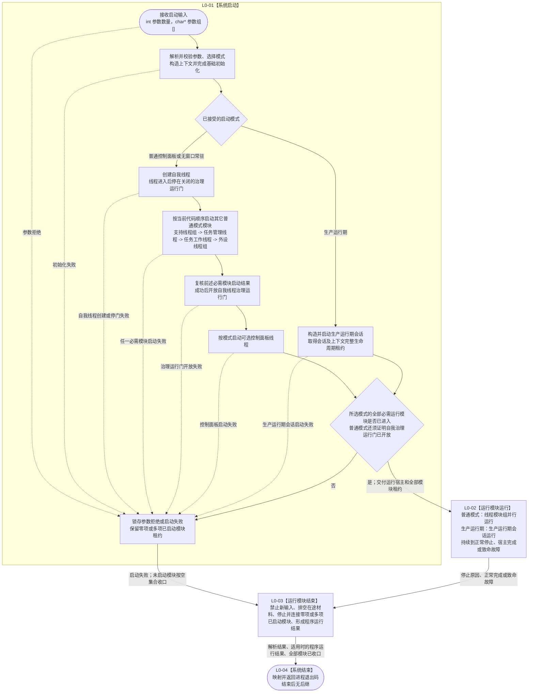

# BIZ-L0-001 项目总体业务生命周期目标业务流程图 v0.4

更新时间：2026-08-26

## 依据

```text
0050、0600、6340、6360、8100、8110、8120、8200、8300、8310、8320
当前代码入口：海中鱼巣/入口.cpp
当前启动解析与退出码映射：海中鱼巣/启动.程序入口.ixx
当前运行宿主路由：海中鱼巣/启动.应用程序.ixx
业务主链承接：BIZ-MAIN-001_自我治理到需求任务方法结果结算_目标业务流程图_v0.3.md
```

## 身份与边界

本图是项目最粗粒度的正式目标业务生命周期图，不是 `运行海中鱼巣` 单函数流程图，也不以函数调用深度或线程数量定义 `BIZ-L0`。它从操作系统进入 `main` 开始，到进程返回退出码结束，只冻结“系统启动、运行模块运行、运行模块结束、系统结束”四个阶段及其交接材料。

模式判断、系统初始化、线程或会话的建立和运行均由下级流程承接。L0 不展开自我、需求、任务、方法、外设、控制面板或支持旁路的内部步骤，也不把目标流程图存在解释为当前代码已经实现。

## 业务合同

```text
启动输入：
  int 参数数量
  char* 参数组[]

正式启动参数：
  无模式参数        -> 普通控制面板
  --headless        -> 无窗口常驻
  --runtime-context -> 生产运行期

运行期结束来源：
  正常停止请求、所选运行宿主正常完成、启动失败或运行期致命故障

业务输出：
  启动选项解析结果
  适用时的一份程序运行结果
  进程退出码 0 / 1 / 2

完成条件：
  已启动的运行模块按零项或多项完整收口；
  不再存在应连接而未连接的运行模块；
  结构化结果已经映射为进程退出码；
  系统结束后没有后继判断或业务操作。
```

## 流程图



## 阶段合同与当前代码锚点

| 阶段 | L0 能力 | 输入 | 输出 | 当前代码锚点 | 当前实现判断 |
| --- | --- | --- | --- | --- | --- |
| L0-01 系统启动 | 接收原始参数，完成解析、模式选择、上下文与所选运行宿主初始化，并启动该模式所需运行模块 | `参数数量`、`参数组` | 解析结果；模式；运行宿主；零项或多项已启动模块租约；启动失败材料 | `入口.cpp:8-14`、`启动.程序入口.ixx:12-63`、`启动.应用程序.ixx:30-169, 203-214, 241-253` | 部分实现；三种模式参数和路由已接，普通路径已有实际初始化，生产运行期仍为固定失败占位 |
| L0-02 运行模块运行 | 让所选运行宿主持续运行，直到出现合法结束来源 | 模式、运行宿主、已启动模块租约 | 正常停止、宿主完成或致命故障及在途材料 | `启动.应用程序.ixx:170-179, 204-206` | 部分实现；无窗口宿主已有等待入口，生产运行期尚未运行 |
| L0-03 运行模块结束 | 对零项或多项已启动模块执行停止、排空、保存和连接，汇总程序运行结果 | 启动失败材料或运行结束材料、已启动模块租约 | 全部模块收口见证、程序运行结果 | `启动.应用程序.ixx:181-198, 211-224` | 部分实现；任务结果运行包已有收口调用，支持和外设收口仍有空实现 |
| L0-04 系统结束 | 按解析与运行结果映射退出码并从进程入口返回 | 解析结果、可选程序运行结果 | `0 / 1 / 2` | `入口.cpp:25-29`、`启动.程序入口.ixx:54-63` | 已有实现；返回退出码后无后继 |

## 线程模块启动时序与运行准入门

线程对象被构造、物理线程已经进入入口和线程获准处理业务不是同一个时刻。L0-01 必须把三者分账，并以“全部必需模块已进入且自我治理运行门已经开放”作为进入 L0-02 的唯一边界。

当前普通模式代码的实际顺序为：

```text
完成世界根、自我、四本体根和方法登记根初始化
-> 创建自我线程
-> 自我线程真实进入，但停在关闭的治理运行门
-> 构造任务结果生产运行包
-> 安装程序停止信号
-> 调用启动支持线程组（当前为空壳）
-> 任务结果生产运行包先启动任务管理线程
-> 同一运行包再启动任务工作线程
-> 调用启动外设线程组（当前为空壳）
-> 复核前述启动结果
-> 开放自我线程治理运行门
-> 按模式启动控制面板线程（当前普通控制面板路径尚未进入这里）
-> 全部必需模块成功后进入 L0-02
```

| 线程或模块 | 当前启动位置 | 何时取得业务运行资格 | 当前实现边界 |
| --- | --- | --- | --- |
| 自我线程 | `启动.应用程序.ixx:102-125` | `启动.应用程序.ixx:162-167` 开放治理运行门后 | 先创建、先停门，不能把物理线程进入当作治理已经运行 |
| 支持线程组 | `启动.应用程序.ixx:158` | 应由启动结果证明全部必需支持模块已进入 | 当前 `启动支持线程组()` 固定返回成功，没有真实线程 |
| 任务管理线程 | `线程/运行包.任务结果生产.ixx:99-103` | `管理线程_.启动()` 成功后 | 当前运行包实际先于工作线程启动管理线程 |
| 任务工作线程 | `线程/运行包.任务结果生产.ixx:104-111` | `工作线程_.启动()` 成功且运行包进入运行中后 | 启动失败会先停止并收口已启动的管理线程 |
| 外设线程组 | `启动.应用程序.ixx:161` | 应由外设启动结果证明全部必需采集线程已进入 | 当前 `启动外设线程组()` 固定返回成功，没有真实线程 |
| 控制面板线程 | `启动.应用程序.ixx:166` | 控制面板线程入口和窗口准备结果成功后 | 当前调用可在前置初始化成功后到达，但函数只返回模式判断结果，没有创建线程或窗口 |

`BIZ-L1-T01 v0.4`已把当前“任务管理线程先于任务工作线程”的顺序接纳为普通模式目标顺序，并要求逐模块真实进入见证；旧“工作线程先启动”口径退出。L0只冻结共同门禁：任一必需模块未进入、启动结果失败或自我治理门未开放，都不得进入L0-02。

## L0 到 L1 的接线边界

```text
L0-01 系统启动
-> L1 系统启动流程组

L0-02 运行模块运行
-> L1 普通模式线程模块运行流程组
   或 L1 生产运行期会话运行流程

L0-03 运行模块结束
-> L1 运行模块停止、排空与连接流程组

L0-04 系统结束
-> 终止节点；不再拆出业务后继
```

`BIZ-L1-T01 v0.4`已明确以唯一根函数`运行普通程序(启动模式)`分别承接普通模式的L0-01、L0-02和L0-03；`BIZ-L1-T02—T06`是L0-02中获准并发运行的线程入口，不是六个并列的L0子节点。支持线程组是T01下的旁路启动/收口子能力，不构造一个虚假的统一业务根循环。L0-04是终止接口，不再拆分。

生产运行期仍需独立的BIZ-L1会话生命周期图。当前8120只冻结会话启动入口和租约寿命，尚未冻结启动成功后的等待、停止、收口和结果矩阵，因此具名为`DRIFT-BIZ-L1-PRODUCTION-RUNTIME-SESSION-LIFECYCLE-UNFROZEN`；在该合同补齐前不能把当前固定失败函数或普通线程拓扑冒充生产运行期完整下层图。

## 当前代码偏差边界

1. `入口.cpp`当前只调用正式参数解析、顶层运行函数和退出码映射；旧测试旁路已退出。`启动.程序入口.ixx`已接受无参数、`--headless`和`--runtime-context`三种正式模式，参数入口不再是L0偏差。
2. `运行生产运行期`当前仍固定返回`内部不一致`，没有构造`生产运行期会话`，也没有形成等待、停止和收口生命周期。参数可达不等于该模式已实现。
3. 普通模式的支持线程、外设线程和控制面板仍为占位/空实现；当前停止只显式覆盖T03停发、T06空壳及T04/T03运行包收口，T02依赖析构停止且没有T05真实租约。
4. T02、T03、T04各自登记的永久失败/未交付材料停机DRIFT尚未闭合；因此当前只能证明普通成功路径的粗层顺序，不能宣称L0-03在全部故障形状下必然有限时结束。

## 关键边界

- 系统启动不是单纯函数入口；只有参数准入、模式选择、所选宿主初始化和所需运行模块启动完成后，才进入 L0-02。
- 自我线程的物理创建发生在其它普通运行模块之前，但只停在关闭门；支持、任务管理、任务工作和外设等必需模块就绪并完成启动复核后，才允许开放自我治理运行门并进入 L0-02。
- 启动失败也必须进入 L0-03；没有启动任何模块时按空集合收口，已经启动部分模块时必须按已取得租约收口，禁止直接遗失资源。
- “运行模块”在普通模式表示线程模块组，在生产运行期表示生产运行期会话；不得预设生产运行期一定复用普通线程拓扑。
- 线程启动、消息入队、日志、UI 显示或某个线程退出均不证明整个运行阶段已经完成。
- L0-03 完成只证明全部应收口运行模块已经结束并形成结构化程序结果，不证明任一需求、任务或结算成功。
- L0-04 返回退出码后系统结束；结束节点没有后继，不再执行模式、业务、状态或结果判断。
