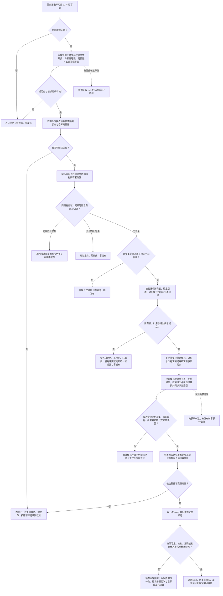

# BIZ-L1-BASE-001 提交L1事实写集目标函数流程图 v0.1

状态：目标业务流程图；当前复用发布源码中的
`L1中性写入结果 L1事实基座服务::提交中性写集(const L1中性写集请求& 请求)`，冻结其业务中性原子提交闭环。

正式依据：当前发布规范 4015；冻结发布提交 `047859f555afd45c70182929403dee78b6506bc4`。

发布源码证据：

- `海中鱼巣/核心/服务.L1事实基座.ixx`，blob `bc28af783286708afedaa0fed79b44c24912b9fe`：公开服务先校验合同版本，再调用同实例仓库。
- `海中鱼巣/核心/仓库.L1事实基座.ixx`，blob `651b314ae8fd7d63c3bbc20a82d9518d54f087b9`：规范化、幂等、候选、最后发布、发布后读回与隔离的唯一实现。

输入：期望事实代次、幂等键、节点 / 关系 / 值新建项、属性槽变更和退出项。

输出：结构化 `L1中性写入结果`。成功返回新发布事实代次及本地键—稳定编码映射；精确重复回显首次结果且不再次发布；其它状态不交付部分候选。发布后精确读回矛盾是唯一“已经发布但返回内部不一致”的形状，并使仓库进入隔离。

节点约束：`L—P` 只操作候选副本；运行期当前事实只能在 `Q` 后可见。幂等裁决固定早于事实代次漂移。关系引用节点；普通属性只通过节点属性槽引用值；节点关系成员不得复制进属性槽或子节点表。所有请求可归因拒绝、资源失败和交换前内部错误都不发布半结构。

完成边界：该图证明发布源码已实现 v1 legacy 中性提交闭环，不证明上层结构可以绕过各自 DATA-L2 强类型 owner 直接使用 v1 写入，也不证明 owner-scoped v2、跨 owner 事务或任一业务闭环已经完成。
