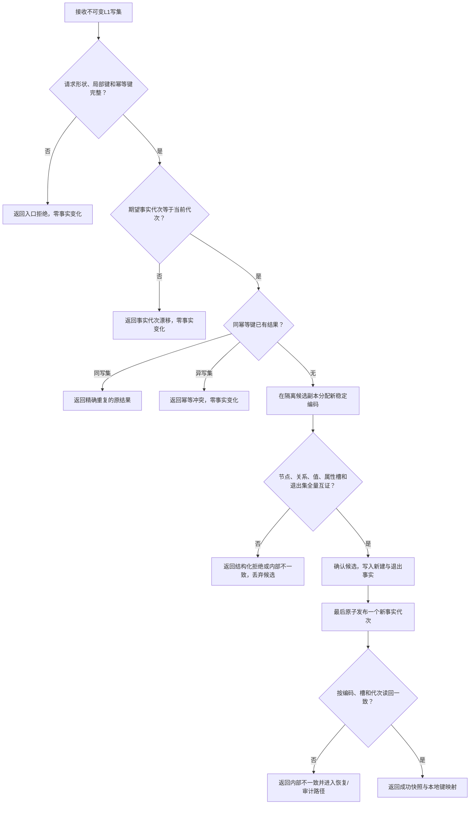

# BIZ-L1-BASE-001 提交L1事实写集

状态：目标业务流程图；冻结 `L1事实基座服务::提交写集` 的业务中性闭环，不证明代码已存在。

输入：期望事实代次、幂等键、节点 / 关系 / 值新建项、属性槽变更和退出项。

输出：成功或精确重复时的发布事实代次及本地键—稳定编码映射；其它结果不返回部分事实。

节点约束：`E—G` 仅操作候选副本；运行期当前事实只能在 `H` 可见。关系引用节点；普通属性只通过节点属性槽引用值；节点关系成员不得复制进属性槽或子节点表。

