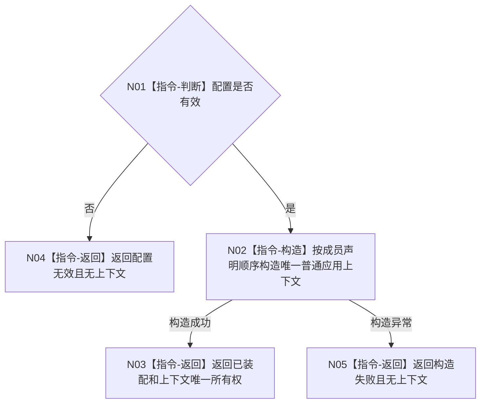

# BIZ-L2-001-01 构造普通应用上下文目标函数流程图 v0.1

更新时间：2026-08-03

## 依据

```text
0050、8120；BIZ-L1-T01；当前海中鱼巣/装配.普通应用.ixx
```

## 身份与边界

正式目标函数设计图。只构造唯一普通应用上下文和依赖所有权，不启动线程、不初始化业务事实。

## 函数合同

```text
根函数：构造普通应用上下文
归属模块 / 文件 / 层级：普通应用装配 / 海中鱼巣/装配.普通应用.ixx / L2
现有或待新增：当前复用；目标多线程成员按所有权顺序适配扩展
完整签名：普通应用装配结果 构造普通应用上下文(const 普通应用配置& 配置)
参数：配置为只读借用且仅在调用期间有效；无效稳定键或根需求参数必须拒绝
返回结果：普通应用装配结果；已装配时调用方唯一拥有上下文，另含配置无效或构造失败
被调函数流程图：无；成员构造函数是装配内部实现，不作为业务L3
```

## 流程图



## 节点合同

| 节点 | 类型 | 输入 | 输出 | 事实读写 | 验证 |
| --- | --- | --- | --- | --- | --- |
| N01 | 指令-判断 | 配置 | 有效性 | 无 | 全部无效字段 |
| N02 | 指令-构造 | 有效配置 | 唯一上下文 | 只建立对象所有权 | 构造和反向析构顺序 |
| N03—N05 | 指令-返回 | 构造结论 | 结构化装配结果 | 无业务事实 | 零半构造外泄 |

## 关键边界

上下文引用成员不得长于所有者；构造成功不证明初始化、线程启动或业务能力完成。
