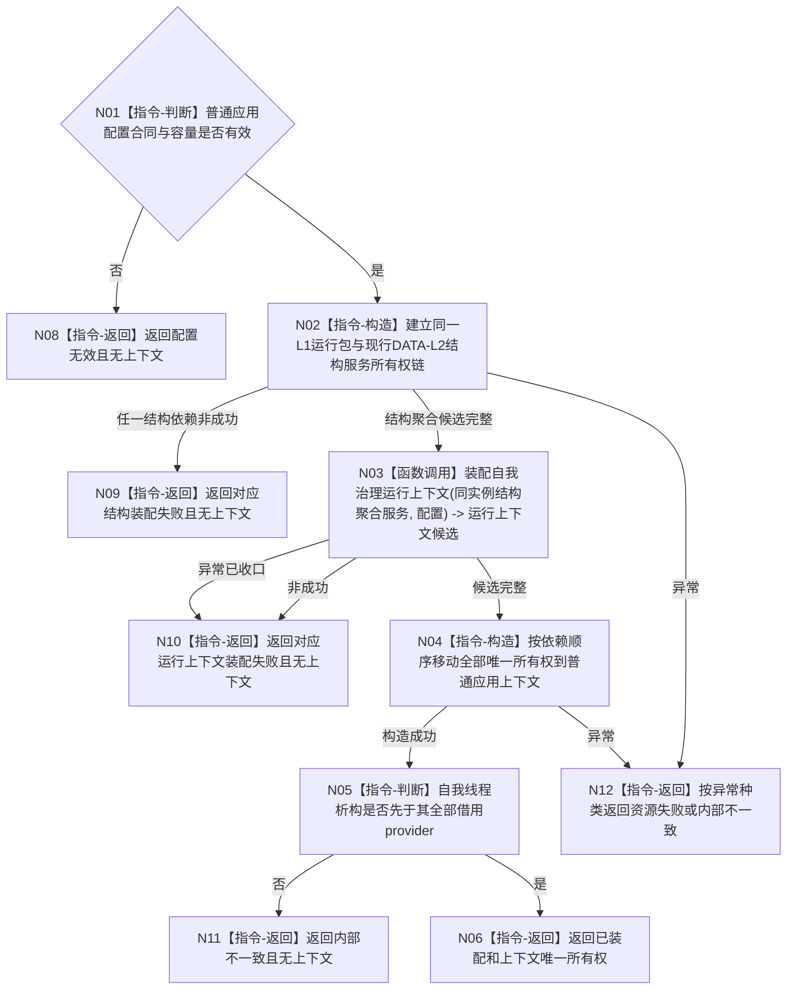

# BIZ-L2-001-01 构造普通应用上下文目标函数流程图 v0.2

更新时间：2026-08-15

## 依据

```text
0050、8100、8110、8120 v0.10
BIZ-L1-T01 v0.4、BIZ-L1-T02 v0.3
RUNTIME-GOVERNANCE-T02-PARENT-REBASELINE v0.1
当前海中鱼巣/装配.普通应用.ixx与自我线程、时间、共享事实截止provider正式合同
```

## 身份与边界

正式目标函数设计图。根函数在当前 L1 / DATA-L2 结构服务装配后，继续形成一个无模块环、无悬空借用的自我治理运行上下文候选；只有全部成员构造成功才一次交付普通应用上下文。它不启动物理线程、不读取治理邮箱、不读取或写入业务事实。

## 函数合同

```text
根函数：构造普通应用上下文
归属模块 / 文件 / 层级：普通应用装配 / 海中鱼巣/装配.普通应用.ixx / BIZ-L2
现有或待新增：适配扩展
完整签名：普通应用装配结果 构造普通应用上下文(const 普通应用配置& 配置)
参数：配置为调用期只读借用；只含运行基础设施容量与诊断预算，不携带运行身份、当前时间、事实截止或DATA能力
返回结果：普通应用装配结果；已装配时调用方唯一拥有完整上下文，其它状态上下文为空
被调函数流程图：BIZ-L3-001-01-01 装配自我治理运行上下文
```

## 流程图



## 节点合同

| 节点 | 类型 | 参数 / 输入绑定 | 结果 / 输出绑定 | 事实读写 | 后继条件 | 验证 |
| --- | --- | --- | --- | --- | --- | --- |
| N01 | 指令-判断 | 配置 | 有效 / 无效 | 无 | 仅有效进入构造 | 零字段、超上限和坏合同 |
| N02 | 指令-构造 | 有效配置 | L1运行包与同实例结构服务候选 | 只建立对象所有权；不读写业务事实 | 聚合完整才进入N03 | 现有逐服务失败分账与逆序释放 |
| N03 | 函数调用 | 同实例结构聚合服务、配置 | 自我治理运行上下文装配结果 | 零DATA读写 | 完整候选才进入N04 | 见BIZ-L3-001-01-01 |
| N04 | 指令-构造 | 两组完整候选 | 普通应用上下文 | 只移动唯一所有权 | 无异常进入N05 | 移动后地址稳定、零半结构外泄 |
| N05 | 指令-判断 | 成员声明顺序 | 生命周期结论 | 无 | 依赖覆盖才成功 | 反向析构顺序静态复核 |
| N06、N08—N12 | 指令-返回 | 结构化结论 | 装配结果 | 无业务事实 | 返回 | 非成功上下文必空 |

## 关键边界

1. 普通应用声明顺序必须使 `自我线程`先析构并完成 join，再析构事实版本服务、完整秒服务、单调时钟适配器、生命周期投影服务和被借用的结构聚合服务。
2. 运行身份由 BIZ 私有分配器形成，不来自 DATA、墙钟、地址、系统线程 ID、名称、日志或调用方固定值。
3. 自我世界树根消费 DTO 的完整传递闭包由共享合同模块唯一拥有；普通应用与自我线程都只 import，不重复 export include。
4. 成功只证明上下文对象链完整；物理自我线程创建、路由构造、运行门开放、T02 治理循环、失败批次停机见证和跨进程恢复均为后继。
