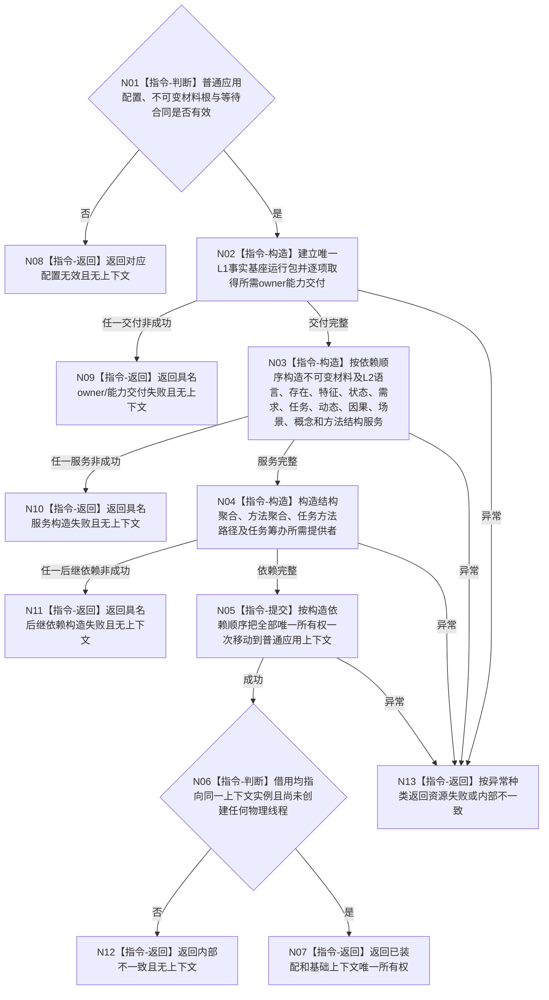

# BIZ-L2-001-01 构造普通应用上下文目标函数流程图 v0.2

更新时间：2026-08-28

## 依据

```text
0050、8100、8120 v0.10
BIZ-L1-T01 v0.5、BIZ-L2-001-03 v0.2
已发布代码基线 HEAD 的海中鱼巣/装配.普通应用.ixx与海中鱼巣/启动.应用程序.ixx
```

## 身份与边界

正式目标函数设计图。根函数只形成普通运行所需的 L1 事实基座、L2 结构服务、聚合服务和启动后继提供者的唯一所有权链；只有全部成员构造成功才一次交付普通应用上下文。装配会经正式基础服务建立或幂等取得 owner 范围，但不执行 I1、I2、SELF-FORM、本体根或方法根等业务初始化，不构造任何物理线程，也不读写业务领域事实。

普通应用上下文是阶段 20 自我线程租约的唯一最终所有者，但初始装配成功时尚不存在自我线程对象。实际创建并停门唯一属于 BIZ-L2-001-03 / BIZ-L3-001-03-11，不能由本函数提前完成。

## 函数合同

```text
根函数：构造普通应用上下文
归属模块 / 文件 / 层级：普通应用装配 / 海中鱼巣/装配.普通应用.ixx / BIZ-L2
现有或待新增：现有函数；按后继所有权需要适配扩展
完整签名：普通应用装配结果 构造普通应用上下文(const 普通应用配置& 配置)
参数：配置为调用期只读借用；只含运行基础设施容量与诊断预算，不携带运行身份、当前时间、事实截止或DATA能力
返回结果：普通应用装配结果；已装配时调用方唯一拥有完整基础上下文，其它状态上下文为空
被调函数流程图：无；本图已经是该装配根的当前必要展开
```

## 流程图



## 节点合同

| 节点 | 类型 | 参数 / 输入绑定 | 结果 / 输出绑定 | 事实读写 | 后继条件 | 验证 |
| --- | --- | --- | --- | --- | --- | --- |
| N01 | 指令-判断 | 配置、不可变材料根、等待合同 | 有效 / 具名无效 | 无 | 仅有效进入构造 | 零字段、相对路径、坏合同 |
| N02 | 指令-构造 | 有效配置 | L1运行包与全部所需能力交付候选 | 经正式基础服务建立或幂等取得owner范围；不写业务领域事实 | 交付完整才进入N03 | 逐owner失败分账、精确重复、逆序释放 |
| N03 | 指令-构造 | 同一运行包与能力交付 | L2结构服务候选 | 只建立服务对象；不调用业务写入入口 | 全部服务完整才进入N04 | 依赖顺序、异常、半结构不外泄 |
| N04 | 指令-构造 | 完整L2服务组与配置登记 | 聚合及启动后继提供者候选 | 只形成借用和运行期提供者 | 全部后继依赖完整才进入N05 | 同实例引用、构造失败分账 |
| N05—N06 | 指令-提交 / 判断 | 全部完整候选 | 普通应用基础上下文 | 只移动唯一所有权 | 同实例借用、零物理线程才成功 | 地址稳定、反向析构、零线程创建 |
| N07—N13 | 指令-返回 | 结构化结论 | 装配结果 | 无业务事实 | 返回 | 所有非成功上下文必空 |

## 关键边界

1. 本函数成功只证明基础上下文的服务所有权链完整；不得把生命周期投影消息、线程对象、治理邮箱、运行门或治理循环混入初始装配。
2. I1、I2、SELF-FORM、四本体根、方法登记根和阶段20必须由 BIZ-L2-001-03按8120固定顺序执行；任何前序非成功都不得创建自我线程。
3. 阶段20创建候选后，普通应用上下文必须成为唯一最终租约所有者；启动代码栈上局部对象、裸指针借用或生命周期投影均不能替代该所有权。为实现这一后继而增加的接纳边界属于001-03/03-11接线，不得反向构造线程。
4. 结构聚合、方法聚合和任务筹办提供者只能借用本上下文中寿命更长的同实例服务；成员声明顺序按构造依赖排列，析构顺序反向。
5. 当前HEAD已实现基础服务装配，但阶段20仍在`运行普通程序`栈上持有自我线程；这是一处001-03/03-11所有权接线偏差，不证明本函数需要恢复已退出的`装配自我治理运行上下文`第二根。
