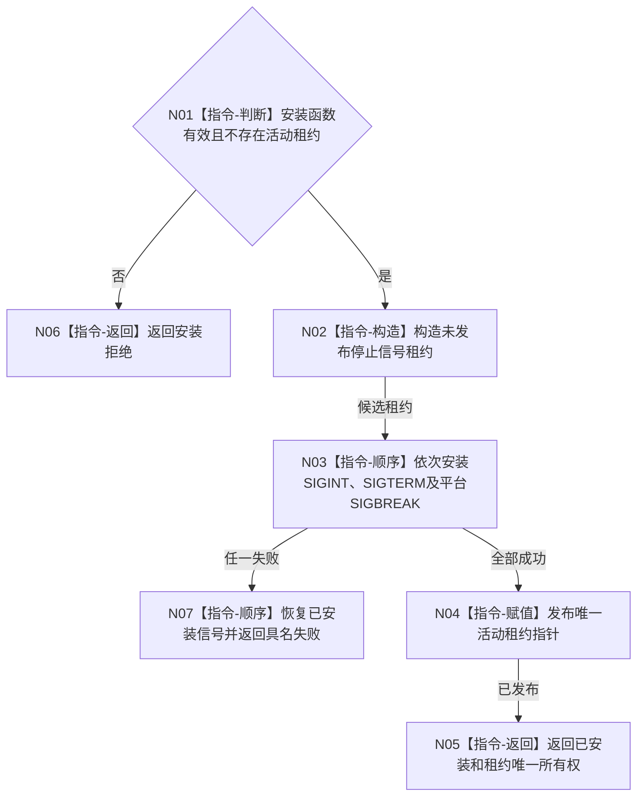

# BIZ-L2-001-02 安装程序停止信号目标函数流程图 v0.1

更新时间：2026-08-03

## 依据

```text
8120；BIZ-L1-T01；当前海中鱼巣/启动.程序运行宿主.ixx
```

## 身份与边界

正式目标函数设计图。只安装进程停止信号并返回唯一租约，不启动宿主、不直接停止任何线程。

## 函数合同

```text
根函数：安装程序停止信号
归属模块 / 文件 / 层级：程序运行宿主 / 海中鱼巣/启动.程序运行宿主.ixx / L2
现有或待新增：当前复用
完整签名：停止信号安装结果 安装程序停止信号(程序信号安装函数 安装函数 = 程序信号安装函数{&std::signal}) noexcept
参数：安装函数按值取得；必须可调用，测试覆盖可以注入；不得已有活动停止信号租约
返回结果：停止信号安装结果；成功时调用方唯一拥有停止信号租约，失败具名到信号阶段
被调函数流程图：无；平台信号安装是外部边界
```

## 流程图



## 节点合同

| 节点 | 类型 | 输入 | 输出 | 事实读写 | 验证 |
| --- | --- | --- | --- | --- | --- |
| N01 | 指令-判断 | 安装函数和活动租约 | 准入 | 无业务事实 | 空函数、重复安装 |
| N02—N04 | 指令 | 安装候选 | 活动租约 | 只改进程信号处理器 | 每一安装失败点 |
| N05—N07 | 指令-返回 | 安装结论 | 结构化结果 | 失败恢复已安装项 | 无悬空全局指针 |

## 关键边界

信号处理函数只锁存停止请求；日志、窗口或业务状态不能替代该租约。租约析构恢复原处理器。
