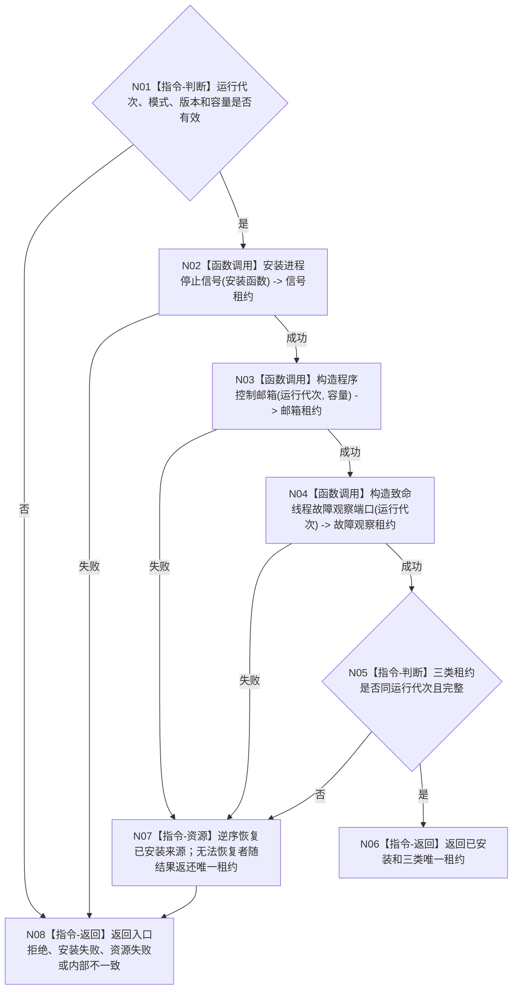

# BIZ-L2-001-02 安装程序停止来源目标函数流程图 v0.2

更新时间：2026-08-26

## 依据

```text
0050、8110、8120；BIZ-L1-T01 v0.4；BIZ-L2-001-10
```

## 身份与边界

正式目标函数设计图。根函数在任何运行线程启动前，一次形成当前运行代次的三类停止来源：进程停止信号租约、程序控制邮箱租约和致命线程故障观察租约。它只安装运行期控制基础设施，不等待停止、不停止线程、不写业务事实。

## 函数合同

```text
根函数：安装程序停止来源
归属模块 / 文件 / 目标分解深度：程序运行宿主 / 海中鱼巣/启动.程序运行宿主.ixx / BIZ-L2
现有或待新增：适配扩展；复用现有安装程序停止信号
完整签名：程序停止来源安装结果 安装程序停止来源(const 程序停止来源安装请求& 请求) noexcept
参数：请求为只读借用；含非零运行代次、启动模式、程序信号安装函数和各来源容量/版本
返回结果：程序停止来源安装结果；成功时唯一拥有三类来源租约，任一非成功时零半结构外泄并明确返还已恢复/仍持有资源
被调函数流程图：安装进程停止信号、构造程序控制邮箱、构造致命故障观察端口在下一层分别展开
```

## 流程图



## 节点合同

| 节点 | 类型 | 输入 | 输出 | 事实读写 | 验证 |
| --- | --- | --- | --- | --- | --- |
| N01 | 指令-判断 | 安装请求 | 准入 | 无 | 零代次、坏模式、坏版本、零容量 |
| N02—N04 | 函数调用 | 当前运行代次和各来源配置 | 三类唯一租约 | 只改变进程/线程控制基础设施 | 逐阶段失败、重复安装、资源失败 |
| N05—N08 | 指令 | 候选租约组 | 完整结果或结构化非成功 | 不写业务事实 | 同代次、逆序恢复、零悬空借用 |

## 关键边界

- 无窗口常驻仍必须构造程序控制邮箱和致命故障观察端口；“没有控制面板窗口”不等于程序控制来源不存在。
- 生命周期日志、窗口关闭标志、线程退出和普通工作失败不能绕过具名停止来源成为隐式程序停止原因。
- v0.1只安装进程信号，无法承接BIZ-L1-T01 v0.4的三来源等待，现退出当前有效集。
