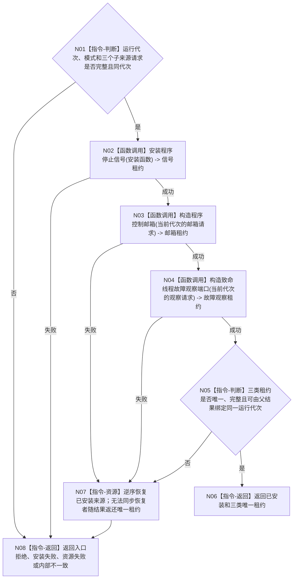

# BIZ-L2-001-02 安装程序停止来源目标函数流程图 v0.2

更新时间：2026-08-27

## 依据

```text
0050、8110、8120；BIZ-L1-T01 v0.4；BIZ-L2-001-10；确认稿第30项
HEAD 2138765a：海中鱼巣/启动.程序运行宿主.ixx
```

## 身份与边界

正式目标函数设计图。根函数在普通应用上下文和初始化结果已经形成后、开放自我治理运行门及启动其它运行模块前，一次形成当前运行代次的三类运行期停止来源：进程停止信号租约、程序控制邮箱租约和致命线程故障观察租约。初始化过程中已经创建但仍停在关闭治理门的自我线程候选不属于运行期停止来源；其创建失败继续由初始化阶段结果和候选回收合同收束。

本函数只安装运行期控制基础设施，不等待停止、不裁决普通线程故障是否致命、不停止线程、不写业务事实。三类来源的 DTO 字段顺序、枚举稳定值和专属版本仍须由详细设计冻结；本图只冻结所需能力、调用顺序、所有权和资源边界，不把容量或版本占位值冒充成已发布 ABI。

## 函数合同

```text
根函数：安装程序停止来源
归属模块 / 文件 / 目标分解深度：程序运行宿主 / 海中鱼巣/启动.程序运行宿主.ixx / BIZ-L2
现有或待新增：适配扩展；复用现有安装程序停止信号
完整签名：程序停止来源安装结果 安装程序停止来源(const 程序停止来源安装请求& 请求) noexcept
参数：请求为只读借用；绑定非零运行代次、已接受启动模式和三个子来源的安装/构造请求；逐字段 ABI 待详细设计冻结
返回结果：程序停止来源安装结果；成功时唯一拥有同运行代次的三类来源租约；任一非成功时明确区分已恢复资源和仍随结果返还的唯一租约
被调函数流程图：
  BIZ-L3-001-02-01 安装程序停止信号
  BIZ-L3-001-02-02 构造程序控制邮箱
  BIZ-L3-001-02-03 构造致命线程故障观察端口
```

## 流程图



## 节点合同

| 节点 | 类型 | 输入 | 输出 | 事实读写 | 验证 |
| --- | --- | --- | --- | --- | --- |
| N01 | 指令-判断 | 安装请求 | 准入 | 无 | 零代次、坏模式、缺子请求和错代 |
| N02 | 函数调用 | 平台信号安装函数 | 唯一信号租约 | 只改变进程信号处理基础设施 | 平台逐阶段失败、重复安装、恢复原处理器 |
| N03 | 函数调用 | 当前代次程序控制邮箱请求 | 唯一邮箱租约 | 只改变进程内宿主控制基础设施 | 有界构造、资源失败、无窗口模式仍存在 |
| N04 | 函数调用 | 当前代次致命故障观察请求 | 唯一观察租约 | 只改变进程内故障观察基础设施 | 不从8110投影反推致命性、资源失败 |
| N05—N08 | 指令 | 候选租约组 | 完整结果或结构化非成功 | 不写业务事实 | 唯一所有权、同代次包装、逆序恢复、零悬空借用 |

## 关键边界

- 无窗口常驻仍必须构造程序控制邮箱和致命故障观察端口；“没有控制面板窗口”不等于程序控制来源不存在。
- 8110生命周期投影、窗口关闭标志、线程普通退出、任务失败和日志错误不能绕过具名停止来源成为隐式程序停止原因。
- 致命故障观察端口只接收已经由外部具名分类合同确认的致命候选；分类生产者和完整 DTO 尚未冻结时，代码计划必须保持该入口待设计，不得从生命周期消息补造。
- 三类租约必须覆盖 `等待程序停止请求`、分阶段收口和最终停止材料汇总，最后才释放；安装成功不等于停止阶段已经锁存。
- HEAD 当前只有 `安装程序停止信号` 和 `停止信号租约`；程序控制邮箱、致命故障观察端口及三类租约组合结果均未实现。

## 2026-08-27 校正记录

- 把“任何物理线程启动前”收紧为“治理运行门开放及其它运行模块启动前”；初始化阶段停在关闭门的自我线程候选仍由初始化回收合同负责。
- 删除未被正式材料冻结的容量/版本硬编码，保留逐字段 ABI 待详细设计冻结边界。
- 补齐三个真实 BIZ-L3 直接子函数，不再用“下一层分别展开”替代实际分层产物。
