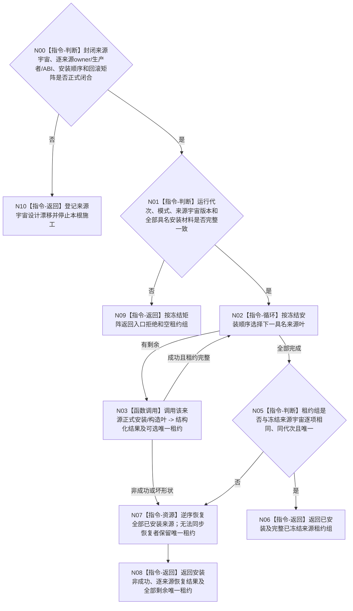

# BIZ-L2-001-02 安装程序停止来源目标函数流程图 v0.3

更新时间：2026-08-28

## 依据

```text
0050、8110、8120；BIZ-L1-T01 v0.5；BIZ-L2-001-10；确认稿第30项
当前发布源码证据：`海中鱼巣/启动.程序运行宿主.ixx` blob `5ff6df009d2a85c2e9be2da776259ce37f4a1a93`
```

## 身份与边界

正式目标治理图。根函数在普通应用上下文和初始化结果已经形成后、开放自我治理运行门及启动其它运行模块前，按正式闭合的来源宇宙安装当前运行代次全部具名停止来源。现行进程停止信号是已实现候选；程序控制停止来源和致命线程故障停止来源是目标候选职责，但正式规范尚未证明三者恰构成封闭全集，也未冻结后两者的 owner、生产者、生命周期与逐字段 ABI。初始化过程中已经创建但仍停在关闭治理门的自我线程候选不属于运行期停止来源；其创建失败继续由初始化阶段结果和候选回收合同收束。

本函数只安装运行期控制基础设施，不等待停止、不裁决普通线程故障是否致命、不停止线程、不写业务事实。三类来源的 DTO 字段顺序、枚举稳定值和专属版本仍须由详细设计冻结；本图只冻结所需能力、调用顺序、所有权和资源边界，不把容量或版本占位值冒充成已发布 ABI。

## 函数合同

```text
根函数：安装程序停止来源
归属模块 / 文件 / 目标分解深度：程序运行宿主 / 海中鱼巣/启动.程序运行宿主.ixx / BIZ-L2
现有或待新增：设计门禁；现行信号安装边界可复用，完整来源组组合根待新增
完整签名：未冻结；旧三来源固定请求/结果不构成 ABI
参数：未冻结；至少绑定非零运行代次、已接受启动模式和正式来源宇宙版本，不得由调用方临场拼接局部来源冒充全集
返回结果：未冻结；成功必须唯一拥有同运行代次全部已冻结来源租约；任一非成功明确区分已恢复资源和仍随结果返还的唯一租约
被调函数流程图：
  BIZ-L3-001-02-01 安装程序停止信号（现行真实候选）
  BIZ-L3-001-02-02 构造程序控制停止来源（候选职责，ABI待冻结）
  BIZ-L3-001-02-03 构造致命线程故障停止来源（候选职责，分类与ABI待冻结）
  最终直接叶集合须由来源宇宙裁决，当前三叶不证明完整性
```

## 流程图



## 节点合同

| 节点 | 类型 | 输入 | 输出 | 事实读写 | 验证 |
| --- | --- | --- | --- | --- | --- |
| N00/N10 | 指令-判断 / 返回 | 正式来源宇宙与逐来源合同 | 可施工或具名设计漂移 | 无 | 来源集合、owner、生产者、生命周期、安装顺序、回滚和完整性缺一即停止 |
| N01/N09 | 指令-判断 / 返回 | 冻结安装请求 | 准入或入口非成功 | 无 | 零代次、坏模式、错宇宙版本、缺具名材料和错代 |
| N02/N03 | 循环 / 函数调用 | 冻结来源顺序及各来源正式安装材料 | 逐来源结构化结果与可选唯一租约 | 只改变各来源自己的进程控制基础设施 | 已知信号候选、程序控制/致命候选及未来正式来源均须逐项有 owner 和完整叶合同 |
| N05—N08 | 指令 / 资源 / 返回 | 候选租约组 | 完整来源组或携带逐项恢复结果与剩余租约的非成功 | 不写业务事实 | 与来源宇宙逐项相同、同代次、唯一所有权、逆序恢复、零悬空借用 |

## 关键边界

- 无窗口常驻是否仍安装程序控制或致命故障来源，必须由正式来源宇宙和各来源生产者合同决定；“没有控制面板窗口”既不能删除一个已冻结宿主来源，也不能反向证明该来源必属全集。没有具名生产者时不得补造停止材料。
- 8110生命周期投影、窗口关闭标志、线程普通退出、任务失败和日志错误不能绕过具名停止来源成为隐式程序停止原因。
- 致命线程故障停止来源只接收已经由外部具名分类合同确认的致命材料；来源是一次锁存/首次记录，不是观察邮箱或历史队列。分类生产者和完整提交/读取 ABI 尚未冻结时，代码计划必须保持该入口待设计，不得从生命周期消息补造。
- 全部已冻结来源租约必须覆盖 `等待程序停止请求`、分阶段收口和最终停止材料汇总，最后才释放；安装成功不等于停止阶段已经锁存。
- 当前发布源码只有 `安装程序停止信号` 和 `停止信号租约`；其安装期存在新处理器已生效但当前租约指针尚未发布的丢失窗口，析构也不核对恢复结果。程序控制停止来源、致命线程故障停止来源及完整来源组组合结果均未实现。

## 2026-08-27 校正记录

- 把“任何物理线程启动前”收紧为“治理运行门开放及其它运行模块启动前”；初始化阶段停在关闭门的自我线程候选仍由初始化回收合同负责。
- 删除未被正式材料冻结的容量/版本硬编码，保留逐字段 ABI 待详细设计冻结边界。
- 补齐三个真实 BIZ-L3 直接子函数，不再用“下一层分别展开”替代实际分层产物。

## 2026-08-28 致命停止来源校正

- 001-02-03 从“观察端口”收紧为一次锁存的“致命线程故障停止来源”，不持有候选组、观察序号、业务事实截止或故障历史。
- `DRIFT-BIZ-HOST-FATAL-FAULT-CLASSIFIER-AND-SOURCE-ABI-UNFROZEN` 闭合前，父组合只保留目标依赖，不得进入完整代码施工。

## 2026-08-28 v0.3 来源宇宙校正

- 撤销当前三叶构成封闭停止来源全集的旧断言；三叶保留为候选，其中只有进程信号具有现行代码基础。
- 增加来源宇宙、逐来源 owner/生产者/生命周期/ABI、安装顺序、回滚与组完整性门禁；未闭合时父根零施工。
- 完整成功改为与冻结来源宇宙逐项相同的唯一租约组；任一回滚不完整显式返还逐来源结果和全部剩余租约。
