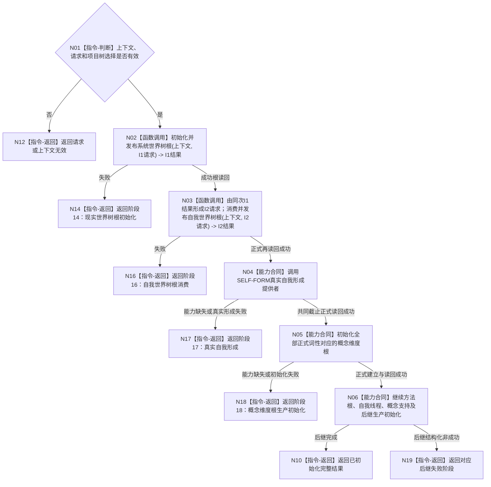

# BIZ-L2-001-03 初始化普通系统目标函数流程图 v0.1

更新时间：2026-08-13

## 依据

```text
0050、4190、4230 v0.7、4240、7130 v0.7、8120 v0.6；BIZ-L1-T01；SYSTEM-WORLD-TREE-ROOT-PUBLISH-I1 v0.6；SELF-WORLD-TREE-ROOT-CONSUME-I2 v0.2
```

## 身份与边界

正式目标函数设计图。`BIZ-L2` 只表示目标分解深度，不是数据服务 L2。唯一根函数按 8120 v0.6 聚合现行生产初始化门禁；它是 L5 之外业务编排，不取得 R1、六类世界、语言或概念结构的写入所有权。

## 函数合同

```text
根函数：初始化普通系统
归属模块 / 文件 / 目标分解深度：系统初始化编排 / 待详细设计绑定最终生产位置 / BIZ-L2
现有或待新增：目标替换；旧六步初始化不得复用为现行合同
完整签名：待后继总初始化详细设计冻结；本图只冻结步骤、输入材料、结果分账和调用方向
参数：同一普通应用上下文与版本化初始化请求；上下文必须持有同实例 A1/R1，项目树选择为非零不透明值；不得携带 owner、仓库、锁、SQL、缓存或旧自我快照
返回结果：结构化初始化结果；分别承载 I1、I2、真实自我和概念维度根结果及阶段 14/16/17/18，不以日志、线程或显示状态补足
被调函数流程图：BIZ-L3-001-03-00、BIZ-L3-001-03-07；SELF-FORM、概念维度根生产初始化仍是具名后继能力合同，待各自目标单函数图正式登记
```

## 流程图



## 节点合同

| 节点 | 类型 | 输入 | 输出 | 事实读写 | 验证 |
| --- | --- | --- | --- | --- | --- |
| N01 | 指令-判断 | 上下文、初始化请求、项目树选择 | 准入 | 无 | 缺服务、零选择和无效版本 |
| N02 | 函数调用 | 上下文 + I1 请求 | I1 结构化结果和已发布根材料 | 只经 A1 同实例 R1 建根；正式读回后才发布值式材料 | 首次、精确重复、异选择、漂移、读回失败 |
| N03 | 函数调用 | 同次 I1 成功结果逐字段形成的 I2 请求 | I2 根消费材料 | 每次经 A1 同实例 R1 读取登记与整树；I2 对 R1/A1 和业务事实零写 | 阶段 16、同请求重读、异请求冲突、坏成功形状和值式旧值守恒 |
| N04 | 能力合同 | I2 本轮根材料 + 固定真实自我请求 | 真实自我值式材料 | L5 外提供者组合存在角色、场景成员和宿主公开接口 | 五步幂等收敛、共同截止读回、阶段 17 |
| N05 | 能力合同 | 全部当前正式词性及概念结构公开服务 | 概念维度根初始化材料 | 业务调用方选择维度根请求；4240 服务只保存结构 | 全部词性覆盖、正式读回、阶段 18 |
| N06 | 能力合同 | I2、真实自我和概念维度根值式材料 | 后继初始化结果 | 不允许自我线程反向建立根、自我或概念维度根 | 阶段 18 解除后才可达 |
| N10/N12/N14/N16—N19 | 指令-返回 | 阶段结论 | 结构化初始化结果 | 不补造缺失材料 | 精确失败阶段与成功形状 |

## 关键边界

- I1 成功直接交 I2；阶段 15 永久缺号且数值不复用。I1 不得建立、选择或解释自我。
- I2 只消费并重新证明根材料；I2 成功不等于自我已经存在。SELF-FORM 完成前固定停在阶段 17。
- 4240 的概念 CRUD、计划、骨架或编译不能解除阶段 18；必须由独立生产初始化提供者覆盖全部当前正式词性并正式读回。
- 旧方法根、自我线程初始化快照、概念四根和存在根支持链全部退出本函数当前合同。运行门开放仍属于 BIZ-L2-001-08，不能由本函数提前完成。
