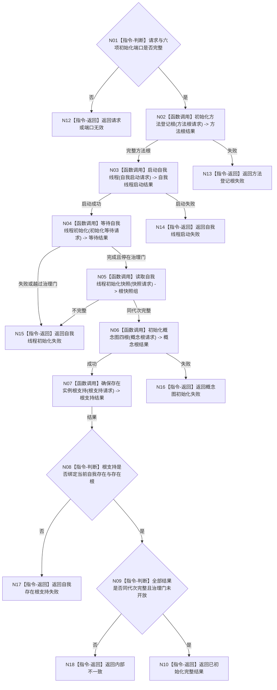

# BIZ-L2-001-03 初始化普通系统目标函数流程图 v0.1

更新时间：2026-08-03

## 依据

```text
0050、8120；BIZ-L1-T01；当前海中鱼巣/领域/初始化.系统.ixx与线程/自我线程.ixx
```

## 身份与边界

正式目标函数设计图。唯一聚合8120六步初始化；程序宿主不得越过本函数逐步调用领域初始化入口。目标版要求自我线程初始化完成后停在治理运行门。

## 函数合同

```text
根函数：初始化普通系统
归属模块 / 文件 / 层级：系统初始化编排 / 海中鱼巣/领域/初始化.系统.ixx / L2
现有或待新增：适配扩展；现行编排顺序可复用，六项子合同需按5300、7140和治理运行门升级
完整签名：系统初始化结果 初始化普通系统(const 系统初始化端口& 端口, const 系统初始化请求& 请求)
参数：端口和请求均为只读借用；端口必须完整，请求必须含运行代次、事实截止、方法根/自我/概念根/根支持规则版本、稳定幂等身份和有效根需求参数
返回结果：系统初始化结果；成功时含六项结构化子结果、同一运行代次与事实截止、方法根、概念四根、自我存在根支持及未开放治理运行门见证
被调函数流程图：BIZ-L3-001-03-01—06
```

## 流程图



## 节点合同

| 节点 | 类型 | 输入 | 输出 | 事实读写 | 验证 |
| --- | --- | --- | --- | --- | --- |
| N01 | 指令-判断 | 端口和请求 | 准入 | 无 | 缺端口与无效请求 |
| N02—N07 | 函数调用 | 同一初始化请求 | 六步结果 | 仅各领域服务拥有写权 | 每一步失败与重复初始化 |
| N08—N09 | 指令-判断 | 全部阶段结果 | 完整性结论 | 只读同代次结果 | 根互证、代次和运行门 |
| N10/N12—N18 | 指令-返回 | 阶段结论 | 系统初始化结果 | 不补造缺失材料 | 精确失败阶段 |

## 关键边界

当前方法根仍使用旧模板关系和共享抽象状态，当前概念根仍依赖运行期登记投影，当前自我线程会在初始化后直接进入治理循环；三者都不能按现状直接复用。运行门开放属于BIZ-L2-001-08，不能由本函数提前完成。
