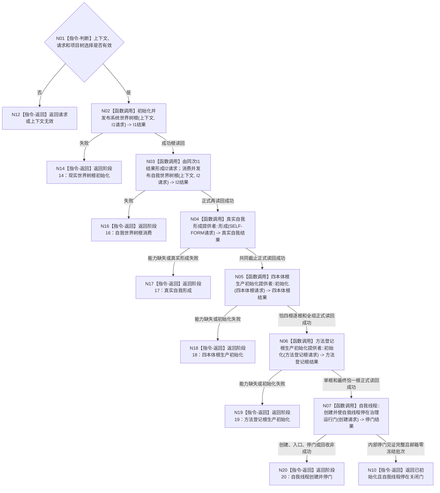

# BIZ-L2-001-03 初始化普通系统目标函数流程图 v0.2

更新时间：2026-08-27

## 依据

```text
0050、4190、4230 v0.7、4240、7130 v0.9、8100、8110、8120 v0.10；BIZ-L1-T01；SYSTEM-WORLD-TREE-ROOT-PUBLISH-I1 v0.6；SELF-WORLD-TREE-ROOT-CONSUME-I2 v0.2；SELF-FORM v0.2
```

## 身份与边界

正式目标函数设计图。`BIZ-L2` 只表示目标分解深度，不是 `DATA-L2`。唯一根函数按 8120 v0.10 聚合现行生产初始化门禁，并以唯一自我线程已停在关闭治理门作为本函数成功终点；它是 `DATA` 之外业务编排，不取得任何 DATA 结构写入所有权。

## 函数合同

```text
根函数：初始化普通系统
归属模块 / 文件 / 目标分解深度：系统初始化编排 / 待详细设计绑定最终生产位置 / BIZ-L2
现有或待新增：目标聚合根待新增；HEAD `dad75c43` 的 `运行普通程序` 已按本图顺序内联调用六个叶，但尚无本函数、请求 DTO 或结构化聚合结果；I1仍有重复截止与项目选择合同DRIFT
完整签名：系统初始化结果 初始化普通系统(普通应用上下文& 上下文, const 系统初始化请求& 请求) noexcept
参数：上下文为调用期独占可变借用并保持全部provider所有权；请求为只读借用，含合同版本、非零项目树选择、运行代次和各初始化幂等身份；不得携带 owner、仓库、锁、SQL、缓存或旧自我快照
返回结果：结构化初始化结果；分别承载 I1、I2、真实自我、四本体根、方法登记根和自我线程停门结果及阶段 14/16/17/18/19/20，不以日志或显示状态补足
被调函数流程图：BIZ-L3-001-03-00、BIZ-L3-001-03-07、BIZ-L3-001-03-08、BIZ-L3-001-03-09、BIZ-L3-001-03-10、BIZ-L3-001-03-11
```

## 流程图



## 节点合同

| 节点 | 类型 | 输入 | 输出 | 事实读写 | 验证 |
| --- | --- | --- | --- | --- | --- |
| N01 | 指令-判断 | 上下文、初始化请求、项目树选择 | 准入 | 无 | 缺服务、零选择和无效版本 |
| N02 | 函数调用 | 上下文 + I1 请求 | I1 结构化结果和已发布根材料 | 只经 A1 同实例 R1 建根；正式读回后才发布值式材料 | 首次、精确重复、异选择、漂移、读回失败 |
| N03 | 函数调用 | 同次 I1 成功结果逐字段形成的 I2 请求 | I2 根消费材料 | 每次经 A1 同实例 R1 读取登记与整树；I2 对 R1/A1 和业务事实零写 | 阶段 16、同请求重读、异请求冲突、坏成功形状和值式旧值守恒 |
| N04 | 函数调用 | I2 本轮根材料 + 五个固定幂等身份 | 真实自我值式材料 | 调用 BIZ-L3-001-03-08；只经 A1 同实例组合最终存在角色、场景树、成员和宿主公开接口 | 五步原请求收敛、共同截止读回、阶段 17 |
| N05 | 函数调用 | 普通应用唯一 provider、固定四角色和四个具名非零互异幂等身份 | 四项按固定角色排序的完整根材料和最终事实截止 | 调用 BIZ-L3-001-03-09；provider 只经 `L2概念结构聚合服务` 同实例 getter 消费 C1；DATA 每次至多建立一个根，BIZ 最后值式发布完整候选 | 恰四根、身份互异、角色正确、首次幂等 / 首次期望代次持久见证一致、永久当前、共享直接上位关系类型枚举为空、零额外根；阶段 18 |
| N06 | 函数调用 | 普通应用唯一 provider、一个具名非零方法登记根幂等身份；阶段18结果只作顺序门 | 唯一方法登记根材料和最终事实截止 | 只经 `L2方法结构聚合服务` 同实例 getter 消费方法结构服务；预读、缺失建立 / 原请求重放、单根和最终恰一根正式读回 | 阶段19、首次、精确重复、正常重复零写、发布未知原请求恢复 |
| N07 | 函数调用 | 业务材料只含本轮 I2 根消费材料和 SELF-FORM 真实自我材料；逻辑身份、运行代次、邮箱容量和等待预算为非业务运行配置 | 自我线程停门结果和值式见证 | 只创建运行期线程、关闭门与内部见证；不写 DATA、不消费治理邮箱 | 方法登记根成功后才可达；内部进入/停门、零冻结批次和上下文唯一租约共同证明成功；非成功阶段20 |
| N10/N12/N14/N16—N20 | 指令-返回 | 阶段结论 | 结构化初始化结果 | 不补造缺失材料 | 精确失败阶段与成功形状 |

## 关键边界

- I1 成功直接交 I2；阶段 15 永久缺号且数值不复用。I1 不得建立、选择或解释自我。
- I2 只消费并重新证明根材料；I2 成功不等于自我已经存在。SELF-FORM 完成前固定停在阶段 17。
- 4240 的概念 CRUD、计划、骨架或编译不能解除阶段 18；必须由独立生产初始化提供者经同一概念结构服务建立或幂等收敛存在、特征、动态、因果链四个语言无关空根，逐根正式读回并最终证明当前恰有四根。阶段 18 不读取或建立语言、词条、词性，不生成普通概念、二次特征或因果链概念。
- 阶段 18 成功后必须调用 `BIZ-L3-001-03-10`，经同一方法结构服务建立或幂等收敛唯一方法登记根、按角色正式读回并最终证明当前恰一根；任一非成功映射阶段 19。成功后调用 `BIZ-L3-001-03-11`，创建唯一自我线程并使其停在关闭治理门；任一非成功映射阶段20。
- 旧方法根、自我线程初始化快照、概念四根和存在根支持链全部退出本函数当前合同；旧 `03-01—06` 不得改名、改父图或作为 `03-10` 的 L4 复活。运行门开放仍属于 BIZ-L2-001-08，不能由本函数提前完成。
- `BIZ-L2-001-03` 当前直接子图为 `03-00、03-07、03-08、03-09、03-10、03-11`。本函数成功只证明自我线程已创建并停在关闭门；BIZ-L2-001-08 的运行门开放、治理邮箱消费和自我内部循环仍不可达。阶段20不得复用旧阶段4/5或退役阶段15。

## 当前代码对应（HEAD `dad75c43`）

- `海中鱼巣/启动.应用程序.ixx` 已按 `I1 -> I2 -> SELF-FORM -> 四本体根 -> 方法登记根 -> 自我线程创建并停门` 顺序直接调用六个叶，并分别映射阶段 `14 / 16 / 17 / 18 / 19 / 20`；阶段 15 仍缺号。I1 已发布重复路径仍有本轮截止推进反例，因此六叶顺序可达不等于 I1 完整实现。
- `初始化普通系统`、`系统初始化请求`、`系统初始化结果`及目标生产文件 `海中鱼巣/启动.系统初始化.ixx` 均不存在，因此父聚合根仍为实现漂移，不能用“内联顺序相同”宣称分层一致。
- I1 与 I2 已由普通应用上下文持有发布槽；SELF-FORM、四本体根和方法登记根 provider 当前由 `运行普通程序` 栈上构造。四本体根与方法登记根目标要求的同一上下文唯一协调者所有权尚未由代码强制。
- 阶段 20 已真实调用 `自我线程::创建并使自我线程停在治理运行门`，但当前请求只携带 I2 根消费材料，未携带本图要求的 SELF-FORM 正式读回材料；自我线程对象也由 `运行普通程序` 栈上持有而非普通应用上下文唯一成员。该叶只能记为部分实现 / 合同漂移。
- 本批只读核对已发布源码和工程登记，不运行构建或动态专项；不得据此升级六叶的完整验收状态。

## v0.2 校正记录

- 冻结BIZ-L2聚合入口完整签名，使BIZ-L1-T01只调用一个初始化根，不再直接越级调用六个BIZ-L3叶。
- 上下文保持provider所有权，请求只携带版本化值式选择与幂等身份；本次校正不改变8120固定初始化顺序和阶段矩阵。
