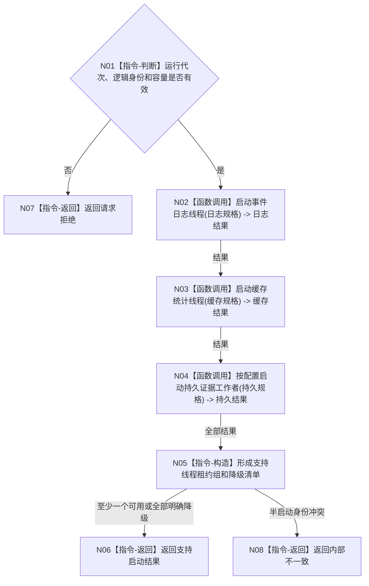

# BIZ-L2-001-04 启动支持线程组目标函数流程图 v0.1

更新时间：2026-08-03

## 依据

```text
0050、8110、8120；目标线程归属与跨线程材料；BIZ-L1-T01
```

## 身份与边界

正式目标函数设计图。启动日志、缓存统计和持久证据旁路；支持线程不拥有业务事实，失败不得伪造业务启动失败。

## 函数合同

```text
根函数：启动支持线程组
归属模块 / 文件 / 层级：线程启动协调 / 海中鱼巣/启动.线程组协调.ixx / L2
现有或待新增：待新增；复用现有事件日志线程和缓存统计线程壳
完整签名：支持线程组启动结果 启动支持线程组(const 支持线程组启动请求& 请求)
参数：请求为只读借用；含运行代次、线程逻辑身份组、容量、可选持久证据端口和启动时限
返回结果：支持线程组启动结果；逐线程给出已进入、降级、拒绝或内部错误及调用方拥有的线程租约组
被调函数流程图：支持线程逐项启动函数进入L3时按线程类别展开
```

## 流程图



## 节点合同

| 节点 | 类型 | 输入 | 输出 | 事实读写 | 验证 |
| --- | --- | --- | --- | --- | --- |
| N01 | 指令-判断 | 启动请求 | 准入 | 无 | 重复身份与零容量 |
| N02—N04 | 函数调用 | 各线程规格 | 逐线程结果 | 只发8110生命周期消息 | 启动失败与端口不可用 |
| N05—N08 | 指令 | 全部结果 | 租约组或具名非成功 | 不改变业务初始化结论 | 降级守恒与零悬空线程 |

## 关键边界

SQL、日志和缓存线程不可用只形成支持降级；不得覆盖已经成立的内存业务事实或阻止必需业务线程启动。
