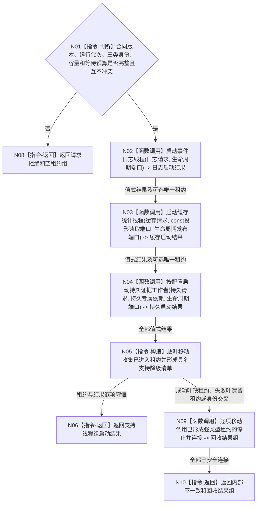

# BIZ-L2-001-04 启动支持线程组目标函数流程图 v0.1

更新时间：2026-08-15

## 依据

```text
0050、8110、8120、日志系统规范；目标线程归属与跨线程材料；BIZ-L1-T01；
SUPPORT-THREAD-CANDIDATE-LIFECYCLE v0.1 最终实现；BIZ-L2-001-15
```

## 身份与边界

正式目标函数设计图。按强类型叶分别启动事件日志、缓存统计和可选持久证据旁路，并把每个成功叶返回的唯一移动租约组合为支持线程租约组。支持线程不拥有业务事实，任一叶失败只形成具名支持降级，不得伪造业务启动失败。

## 函数合同

```text
根函数：启动支持线程组
归属模块 / 文件 / 层级：线程启动协调 / 海中鱼巣/启动.线程组协调.ixx / L2
现有或待新增：待新增组合函数、预冻结占位；共享 SUPPORT 候选生命周期 ABI 已实现，EVENT 与 CACHE 各自最终消费合同已冻结，具体入口不得用旧线程壳或通用运行消息队列补位；持久叶 ABI 仍待后继
完整签名：支持线程组启动结果 启动支持线程组(const 支持线程组启动请求& 请求)
参数：请求为只读借用；当前只冻结合同版本、运行代次、三类不重复线程逻辑身份、各叶容量、启动等待和回收诊断预算语义。精确 DTO、普通应用同一生命周期端口来源及三叶最终 ABI 闭合后机械匹配
返回结果：预冻结移动值式支持线程组启动结果；逐叶给出已进入或具名支持降级；只为已进入叶持有各一份唯一移动强类型租约。精确字段待三叶最终 ABI 闭合后机械匹配
被调函数流程图：BIZ-L3-001-04-01 v0.2 启动事件日志线程；BIZ-L3-001-04-02 v0.2 启动缓存统计线程；可选持久证据叶由后继设计承接
```

## 流程图



## 节点合同

| 节点 | 类型 | 输入 | 输出 | 事实读写 | 验证 |
| --- | --- | --- | --- | --- | --- |
| N01 | 指令-判断 | 请求 -> L2 参数 | 准入或请求拒绝 | 无事实写入 | 版本、错代、重复身份和零容量/预算 |
| N02 | 函数调用 | 请求中的事件日志语义 -> 日志请求；普通应用同一生命周期端口 -> 生命周期端口（组合层来源待闭合） | 日志启动结果 -> 日志结果及可选 `事件日志线程租约`；成功租约向阶段15提供右值限定结构化 `停止并连接` | 日志只作人读旁路；8110仅诊断投影 | 创建、等待、失败移动回收、成功唯一强类型租约；阶段15须证明已停收且已完成到截止或同截止快照已成功读取，否则仍安全连接但返回前置未闭合；不接触裸SUPPORT租约 |
| N03 | 函数调用 | 缓存请求、普通应用同一 8110 const 读取端口和生命周期发布端口 -> CACHE 参数 | 缓存结果及可选唯一 `缓存统计线程租约` | 只读 8110 当前投影组；只写非权威统计 | `已读取+空组`合法全零；叶失败必须已安全回收或零创建；不依赖 EVENT 成功才能调用 |
| N04 | 函数调用 | 持久请求和专属依赖 -> 持久叶参数 | 持久结果及可选租约 | 不写业务事实 | 叶失败必须已安全回收或零创建 |
| N05/N06 | 指令 | 全部逐叶结果和可选租约 | 租约组、降级清单或不一致分流 | 不改变业务初始化结论 | 每个成功叶恰一租约，非成功叶零租约 |
| N09/N10 | 函数调用 / 返回 | 已形成的各强类型租约 -> 各叶右值 `停止并连接` | 逐叶结构化安全回收结果和内部不一致 | 只回收线程资源 | 显式安全连接后返回，不依赖析构作为正常控制流 | 半启动、前置未闭合但已安全连接、入口故障 |

## 关键边界

```text
SQL、日志和缓存线程不可用只形成支持降级；不得覆盖已经成立的内存业务事实或阻止必需业务线程启动。
L2 不读取 8110 投影判断物理进入，不接收第二份租约，不从摘要字段推导机器事实。
SUPPORT 固定只负责创建、内部进入等待和失败候选安全回收；具体叶入口拥有队列消费与出口调用。
事件日志成功叶只向支持线程租约组交付 `事件日志线程租约`；阶段15经该租约的右值限定结构化 `停止并连接` 能力移动消费内部唯一SUPPORT租约，不得拆出或暴露裸SUPPORT租约。正常收口前置固定为队列已停收，且处理已完成到接受截止或同一截止的剩余快照已成功读取；前置未闭合也必须安全 stop + join，但只能返回“前置未闭合但已安全连接”。
组合启动中途发现内部不一致时也必须显式移动调用各叶结构化停止连接能力；租约析构仅作异常离开所有权域的 fallback，不能替代回收结果。
旧事件日志线程、旧缓存统计线程和有界运行消息队列均已删除或载荷不适用，不得复活或复用。
正常停止由 BIZ-L2-001-15 先冻结接受截止并刷新，再请求停止；刷新失败时先快照接管未取出材料，线程入口不承担接管裁决。
本 L2 签名仍待持久叶和普通应用依赖来源闭合后机械匹配；CACHE 已冻结为同一运行代次 8110 const 读取端口与生命周期发布端口，不得发明 DATA、SQL 或泛化缓存依赖。
```
