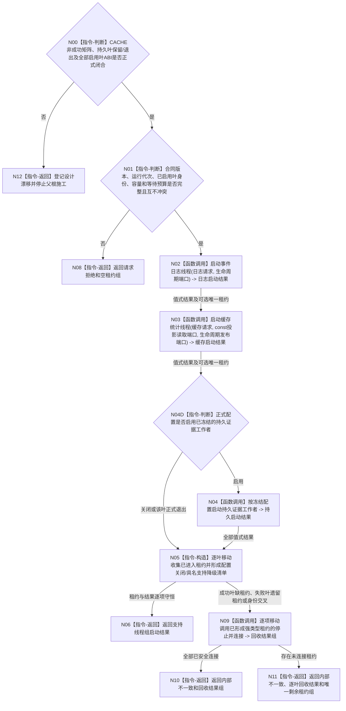

# BIZ-L2-001-04 启动支持线程组目标函数流程图 v0.2

更新时间：2026-08-28

## 依据

```text
0050、8110、8120、日志系统规范；目标线程归属与跨线程材料；BIZ-L1-T01；
SUPPORT-THREAD-CANDIDATE-LIFECYCLE v0.1 最终实现；BIZ-L2-001-15 v0.3
```

## 身份与边界

正式目标函数设计图。按强类型叶分别启动事件日志、缓存统计和可选持久证据旁路，并把每个成功叶返回的唯一移动租约组合为支持线程租约组。支持线程不拥有业务事实，任一叶失败只形成具名支持降级，不得伪造业务启动失败。

## 函数合同

```text
根函数：启动支持线程组
归属模块 / 文件 / 目标分解深度：线程启动协调 / 海中鱼巣/启动.线程组协调.ixx / BIZ-L2
现有或待新增：目标聚合根、请求 DTO、结果 DTO 和租约组仍待新增；冻结发布提交 `d24ea5d4` 只有 `启动.应用程序.ixx` 内同名无参 `bool` 空壳并固定返回 `true`。EVENT 叶已实现并登记工程但未接生产，CACHE 与持久证据叶仍不存在；CACHE 启动非成功矩阵另有具名DRIFT
完整签名：支持线程组启动结果 启动支持线程组(const 支持线程组启动请求& 请求)
参数：请求为只读借用；当前只冻结合同版本、运行代次、已启用叶互不重复的线程逻辑身份、各启用叶容量、启动等待和回收诊断预算语义。持久叶是否存在、关闭配置如何表达、精确 DTO、普通应用同一生命周期端口来源及各叶最终 ABI 闭合后机械匹配
返回结果：预冻结移动值式支持线程组启动结果；逐个已冻结叶给出已进入、配置关闭或具名支持降级；只为已进入叶持有各一份唯一移动强类型租约。精确字段、未连接租约返还形状待各叶最终 ABI 与父级异常回收矩阵闭合后机械匹配
被调函数流程图：BIZ-L3-001-04-01 v0.2 启动事件日志线程；BIZ-L3-001-04-02 v0.2 启动缓存统计线程；BIZ-L3-001-04-03 v0.2 按配置启动持久证据工作者（生产必要性与ABI仍有具名DRIFT）
```

## 流程图



## 节点合同

| 节点 | 类型 | 输入 | 输出 | 事实读写 | 验证 |
| --- | --- | --- | --- | --- | --- |
| N00 | 指令-判断 | 各叶现行正式设计 | 父根可施工或具名设计漂移 | 无事实写入 | CACHE完整非成功矩阵、持久叶保留/退出和启用叶完整ABI |
| N01 | 指令-判断 | 请求 -> 各启用叶参数 | 准入或请求拒绝 | 无事实写入 | 版本、错代、已启用叶重复身份和零容量/预算；关闭叶不得强制伪参数 |
| N02 | 函数调用 | 请求中的事件日志语义 -> 日志请求；普通应用同一生命周期端口 -> 生命周期端口（组合层来源待闭合） | 日志启动结果 -> 日志结果及可选 `事件日志线程租约`；成功租约向阶段15提供右值限定结构化 `停止并连接` | 日志只作人读旁路；8110仅诊断投影 | 创建、等待、失败移动回收、成功唯一强类型租约；阶段15须证明已停收且已完成到截止或同截止快照已成功读取，否则仍安全连接但返回前置未闭合；不接触裸SUPPORT租约 |
| N03 | 函数调用 | 缓存请求、普通应用同一 8110 const 读取端口和生命周期发布端口 -> CACHE 参数 | 缓存结果及可选唯一 `缓存统计线程租约` | 只读 8110 当前投影组；只写非权威统计 | `已读取+空组`合法全零；叶失败必须已安全回收或零创建；不依赖 EVENT 成功才能调用 |
| N04D/N04 | 判断 / 函数调用 | 正式配置与已冻结持久叶合同 | 配置关闭结果，或持久结果及可选租约 | 不写业务事实 | 当前不得施工；后继若退出或关闭本叶则零调用、零伪租约，若保留并启用则失败必须已安全回收或零创建，且不得读取当前租约或同义复用 |
| N05/N06 | 指令 | 全部逐叶结果和可选租约 | 租约组、降级清单或不一致分流 | 不改变业务初始化结论 | 每个成功叶恰一租约，非成功叶零租约 |
| N09—N11 | 函数调用 / 返回 | 已形成的各强类型租约 -> 各叶右值 `停止并连接` | 逐叶结构化回收结果、内部不一致及必要时的唯一剩余租约组 | 只回收线程资源 | 已连接租约不再返还；任何未连接租约保持唯一所有权并显式交付，不依赖析构或空结果 | 半启动、前置未闭合但已安全连接、入口故障、未连接所有权守恒 |

## 关键边界

```text
SQL、日志和缓存线程不可用只形成支持降级；不得覆盖已经成立的内存业务事实或阻止必需业务线程启动。
L2 不读取 8110 投影判断物理进入，不接收第二份租约，不从摘要字段推导机器事实。
SUPPORT 固定只负责创建、内部进入等待和失败候选安全回收；具体叶入口拥有队列消费与出口调用。
事件日志成功叶只向支持线程租约组交付 `事件日志线程租约`；阶段15经该租约的右值限定结构化 `停止并连接` 能力移动消费内部唯一SUPPORT租约，不得拆出或暴露裸SUPPORT租约。正常收口前置固定为队列已停收，且处理已完成到接受截止或同一截止的剩余快照已成功读取；provider 防御性完成 stop + join 而返回“前置未闭合但已安全连接”时，只能记为异常资源回收，不能记为正常支持收口。
组合启动中途发现内部不一致时也必须显式移动调用各叶结构化停止连接能力；租约析构仅作异常离开所有权域的 fallback，不能替代回收结果。
旧事件日志线程、旧缓存统计线程和有界运行消息队列均已删除或载荷不适用，不得复活或复用。
正常停止由 BIZ-L2-001-15 v0.3 按类别专属能力先停收并取得接受截止，再等待完成或形成同截止材料；材料资格由上层逐类裁决，线程入口不承担 owner、舍弃或正常收口裁决。v0.3仍是设计门禁，不证明共同组ABI或阶段15生产接线已闭合。
本 L2 签名仍待持久叶和普通应用依赖来源闭合后机械匹配；CACHE 已冻结为同一运行代次 8110 const 读取端口与生命周期发布端口，不得发明 DATA、SQL 或泛化缓存依赖。
持久叶存在 `DRIFT-BIZ-PERSISTENT-EVIDENCE-WORKER-ABI-AND-OWNER-UNFROZEN` 与 `DRIFT-BIZ-PERSISTENT-EVIDENCE-WORKER-SUPPORT-LIFECYCLE-OBSOLETE`；它不是可直接施工的第三叶，也不得用现行 SUPPORT 的身份墓碑反推启动幂等或同义复用。正式裁决为关闭或退出时父根必须零调用、零伪租约；只有保留且启用并闭合完整ABI后才进入第三叶。
父根异常回收不得只画“全部已连接”成功出口。任一叶最终仍持有未连接物理线程时，结果必须显式返还对应唯一强类型租约和逐叶回收状态；不得空结果、析构、detach或日志化后遗失所有权。
```

## 冻结发布源码对照（提交 `655d9284`）

- `海中鱼巣/启动.应用程序.ixx` 中当前入口为 `bool 启动支持线程组()`，正文只返回 `true`；它不接收版本化请求、不调用三个叶、不保存任何强类型租约，也不能形成逐叶支持降级或内部不一致结果。因此它是实现漂移，不是本目标根的合法空壳实现。
- `运行普通程序` 以 `启动成功 = 启动成功 && 启动支持线程组()` 消费该布尔值。目标合同要求普通叶不可用只形成支持降级，不得阻断必需业务线程；当前布尔接口若未来返回 `false` 会错误地把支持旁路失败升级为整体启动失败。
- `海中鱼巣/线程/事件日志线程.数据.h` 与 `海中鱼巣/线程/运行.事件日志线程.ixx` 已实现 EVENT 启动、队列、唯一移动租约和显式停止连接，并受根工程登记；当前发布源码树 除模块自身外没有 `启动事件日志线程` 生产调用。
- 当前发布源码中不存在 `缓存统计线程.数据.h`、`运行.缓存统计线程.ixx`、持久证据工作者生产模块或目标 `启动.线程组协调.ixx`；CACHE 启动还存在 `DRIFT-BIZ-CACHE-STATISTICS-START-NON-SUCCESS-MATRIX-INCOMPLETE`，持久叶的生产必要性、owner、完整 ABI 与 SUPPORT 生命周期模型也未闭合。CACHE、持久叶、三叶聚合、普通应用依赖来源、阶段15总收口均不得记为已实现。
- 本批只读核对已发布源码、工程登记和调用点，不重跑 EVENT 专项或根工程构建；EVENT 历史验证记录不能替代父聚合与正式接线验收。

## v0.2 校正记录

- 在父根入口增加叶合同闭合门禁；CACHE 非成功矩阵和持久叶保留/退出未冻结前，不得把三叶组合交给代码临场设计。
- 持久叶改为正式配置关闭/退出时零调用，只有保留且启用并闭合完整 ABI 后才调用，删除“可选叶却无条件启动”的矛盾。
- 补齐内部不一致回收的未连接分支：已连接租约不返还，未连接租约以唯一强类型所有权随结构化结果交付。
