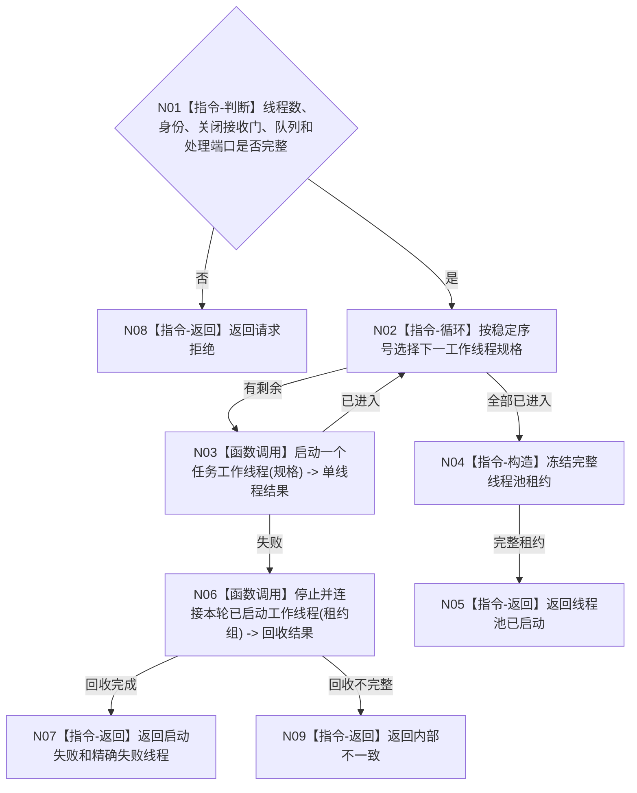

# BIZ-L2-001-05 启动任务工作线程池目标函数流程图 v0.1

更新时间：2026-08-03

## 依据

```text
8100、8110、8120；目标线程归属与跨线程材料；BIZ-L1-T01
```

## 身份与边界

正式目标函数设计图。建立可配置任务工作线程池；线程只消费强类型筹办或执行工作包，不裁决任务阶段。

## 函数合同

```text
根函数：启动任务工作线程池
归属模块 / 文件 / 层级：线程启动协调 / 海中鱼巣/启动.线程组协调.ixx / L2
现有或待新增：适配扩展；复用现有任务工作线程壳
完整签名：任务工作线程池启动结果 启动任务工作线程池(const 任务工作线程池启动请求& 请求)
参数：请求为只读借用；含运行代次、线程数、唯一逻辑身份组、处于关闭态的工作包接收门身份、工作包队列、回执队列、筹办/执行处理端口和启动时限
返回结果：任务工作线程池启动结果；成功时调用方拥有完整线程池租约，失败含精确线程和回收结果
被调函数流程图：单工作线程启动与进入确认在L3展开
```

## 流程图



## 节点合同

| 节点 | 类型 | 输入 | 输出 | 事实读写 | 验证 |
| --- | --- | --- | --- | --- | --- |
| N01 | 指令-判断 | 线程池请求 | 准入 | 无 | 零线程、重复身份和缺端口 |
| N02—N03 | 循环 / 函数调用 | 稳定线程规格 | 单线程进入结果 | 只发线程生命周期消息 | 每个启动位置故障注入 |
| N04—N09 | 指令 / 函数调用 | 已启动租约 | 完整池或失败 | 失败必须回收 | 零半线程池外泄 |

## 关键边界

线程池启动不派发工作包；全部线程进入时工作包接收门仍关闭，由后续任务管理启动合同按同一运行代次开放。同一任务筹办/执行互斥由任务正式合同裁决，不能由线程数量推导。
