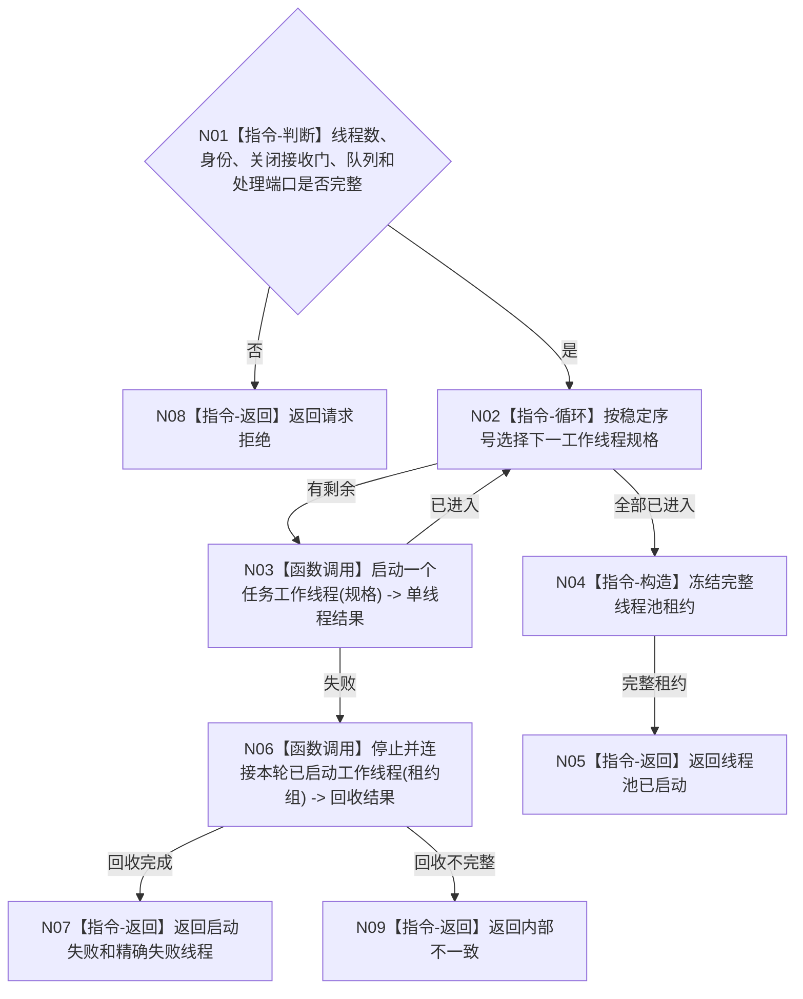

# BIZ-L2-001-05 启动任务工作线程池目标函数流程图 v0.1

更新时间：2026-08-27

## 依据

```text
8100、8110、8120；目标线程归属与跨线程材料；BIZ-L1-T01
```

## 身份与边界

正式目标函数设计图。建立可配置任务工作线程池；线程只消费强类型筹办或执行工作包，不裁决任务阶段。

## 函数合同

```text
根函数：启动任务工作线程池
归属模块 / 文件 / 目标分解深度：线程启动协调 / 海中鱼巣/启动.线程组协调.ixx / BIZ-L2
现有或待新增：目标根、请求/结果DTO和完整线程池租约均未实现；HEAD `95b4df74` 只有`任务结果生产运行包`内一个不可移动`任务工作线程`，并先启动T03再调用其无参`启动()`
完整签名：任务工作线程池启动结果 启动任务工作线程池(const 任务工作线程池启动请求& 请求)
参数：请求为只读借用；含运行代次、线程数、唯一逻辑身份组、处于关闭态的工作包接收门身份、工作包队列、回执队列、筹办/执行处理端口和启动时限
返回结果：任务工作线程池启动结果；成功时调用方拥有完整线程池租约，失败含精确线程和回收结果
被调函数流程图：单工作线程启动与进入确认在BIZ-L3展开
```

## 流程图



## 节点合同

| 节点 | 类型 | 输入 | 输出 | 事实读写 | 验证 |
| --- | --- | --- | --- | --- | --- |
| N01 | 指令-判断 | 线程池请求 | 准入 | 无 | 零线程、重复身份和缺端口 |
| N02—N03 | 循环 / 函数调用 | 稳定线程规格 | 单线程进入结果 | 只发线程生命周期消息 | 每个启动位置故障注入 |
| N04—N09 | 指令 / 函数调用 | 已启动租约 | 完整池或失败 | 失败必须回收 | 零半线程池外泄 |

## 关键边界

线程池启动不派发工作包；全部线程进入时工作包接收门仍关闭，由后续任务管理启动合同按同一运行代次开放。同一任务筹办/执行互斥由任务正式合同裁决，不能由线程数量推导。

## 当前代码对应（HEAD `95b4df74`）

- HEAD不存在`启动任务工作线程池`、`任务工作线程池启动请求/结果`、线程规格组、池租约或目标`启动.线程组协调.ixx`。
- `任务结果生产运行包`只内嵌一个`任务工作线程`对象，并在`任务管理线程_.启动()`成功后才调用`工作线程_.启动()`；这与本目标“消费者池先全部进入、后启动T03生产者”的顺序相反。
- 当前`任务工作线程::启动()`只校验旧结果队列容量，创建一个调用`运行结果尾部()`的`std::thread`；没有运行代次、逻辑身份、池内稳定序号、关闭接收门、唯一移动候选租约或进入见证。
- 当前线程消费的是已经形成的`任务工作结果材料`，只形成旧回执并直接上交T03，不消费筹办/执行强类型工作包。因此单线程对象和物理线程创建只能作为机械实现候选，不能证明本目标根或BIZ-L1-T04已经实现。
- 本批只读复核已发布源码与调用点，未构建、未运行线程专项；当前能力判断不把异主未提交源码WIP纳入证据。
