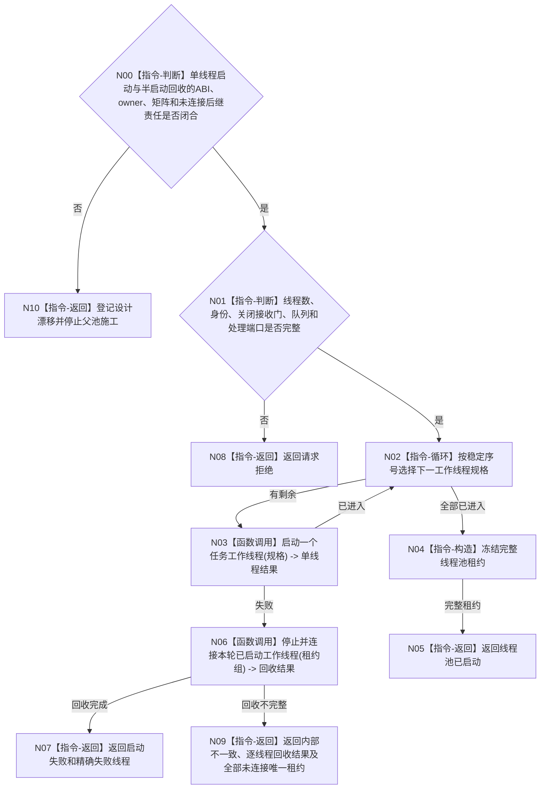

# BIZ-L2-001-05 启动任务工作线程池目标函数流程图 v0.2

更新时间：2026-08-28

## 依据

```text
8100、8110、8120；目标线程归属与跨线程材料；BIZ-L1-T01
```

## 身份与边界

正式目标函数设计图。建立可配置任务工作线程池；线程只消费强类型筹办或执行工作包，不裁决任务阶段。

## 函数合同

```text
根函数：启动任务工作线程池
归属模块 / 文件 / 目标分解深度：线程启动协调 / 海中鱼巣/启动.线程组协调.ixx / BIZ-L2
现有或待新增：目标根、请求/结果DTO和完整线程池租约均未实现；HEAD `41673a21` 只有`任务结果生产运行包`内一个不可移动`任务工作线程`，并先启动T03再调用其无参`启动()`
完整签名：未冻结；旧候选为 `任务工作线程池启动结果 启动任务工作线程池(const 任务工作线程池启动请求& 请求)`
参数：未冻结；运行代次、线程数、唯一逻辑身份组、关闭接收门、工作包来源、结果定位交付端、BIZ-L1-T04 provider组、8110端口、等待/回收预算和全部借用寿命必须与单线程叶共同闭合
返回结果：未冻结；成功须交付完整唯一线程池租约，失败须逐线程安全回收或返还未连接唯一租约，不能只给裸状态
被调函数流程图：BIZ-L3-001-05-01 v0.2 单工作线程启动；BIZ-L3-001-05-02 v0.2 启动半失败候选回收（两叶均有具名设计DRIFT）
```

## 流程图



## 节点合同

| 节点 | 类型 | 输入 | 输出 | 事实读写 | 验证 |
| --- | --- | --- | --- | --- | --- |
| N00 | 指令-判断 | 两个直接BIZ-L3叶的正式设计 | 父池可施工或具名设计漂移 | 无 | 单线程启动与半启动回收ABI、唯一owner、有限预算、状态矩阵和未连接后继责任 |
| N01 | 指令-判断 | 线程池请求 | 准入 | 无 | 零线程、重复身份和缺端口 |
| N02—N03 | 循环 / 函数调用 | 稳定线程规格 | 单线程进入结果 | 只发线程生命周期消息 | 单线程叶存在 ABI/owner/矩阵未冻结和重放唯一租约冲突，闭合前父级不可施工 |
| N04—N09 | 指令 / 函数调用 | 已启动租约 | 完整池、已回收失败，或携带逐线程结果与全部未连接唯一租约的内部不一致 | 失败必须先全量停、再逐项回收 | 半启动回收ABI、有限预算和未连接租约后继owner未冻结；已连接项清空所有权，未连接项与其借用依赖责任必须显式交付，不得宣称零外泄 |

## 关键边界

线程池启动不派发工作包；全部线程进入时工作包接收门仍关闭，由后续任务管理启动合同按同一运行代次开放。同一任务筹办/执行互斥由任务正式合同裁决，不能由线程数量推导。
`BIZ-L3-001-05-01 v0.2` 已登记 `DRIFT-BIZ-TASK-WORKER-START-ABI-OWNERSHIP-AND-NON-SUCCESS-MATRIX-UNFROZEN` 与 `DRIFT-BIZ-TASK-WORKER-START-REPLAY-UNIQUE-LEASE-CONFLICT`；父池不得继续把旧单线程签名和“同义复用”当作闭合合同。
`BIZ-L3-001-05-02 v0.2` 已登记半启动失败回收 ABI、租约存活和有限返回后继 owner 未冻结；预算耗尽或内部矛盾时，仍可连接的唯一租约必须返还，不能压成裸失败或依赖析构收口。
父池在两个直接叶的上述合同闭合前必须停在 N00 设计门禁，不得把目标骨架当成可执行公开 ABI。门禁闭合后，任何回收不完整结果都必须逐线程返还未连接唯一租约及继续覆盖其入口、队列和 provider 借用的依赖责任；不得只返回 `内部不一致`。

## 当前代码对应（HEAD `b6592647`）

- HEAD不存在`启动任务工作线程池`、`任务工作线程池启动请求/结果`、线程规格组、池租约或目标`启动.线程组协调.ixx`。
- `任务结果生产运行包`只内嵌一个`任务工作线程`对象，并在`任务管理线程_.启动()`成功后才调用`工作线程_.启动()`；这与本目标“消费者池先全部进入、后启动T03生产者”的顺序相反。
- 当前`任务工作线程::启动()`只校验旧结果队列容量，创建一个调用`运行结果尾部()`的`std::thread`；没有运行代次、逻辑身份、池内稳定序号、关闭接收门、唯一移动候选租约或进入见证。
- 当前线程消费的是已经形成的`任务工作结果材料`，只形成旧回执并直接上交T03，不消费筹办/执行强类型工作包。因此单线程对象和物理线程创建只能作为机械实现候选，不能证明本目标根或BIZ-L1-T04已经实现。
- 现行 SUPPORT 候选详细设计明确只允许 EVENT/CACHE/持久三组类别—模块并禁止任务线程旁路复用；父池不能把已发布 SUPPORT provider 当作任务工作线程候选的缺省实现。
- 本批只读复核已发布源码与调用点，未构建、未运行线程专项；当前能力判断不把异主未提交源码WIP纳入证据。

## v0.2 校正记录

- 增加单线程启动与半启动回收合同闭合门禁；两个 BIZ-L3 叶仍有具名 DRIFT 时，父线程池不得进入代码施工。
- 将半启动回收不完整从裸 `内部不一致` 改为“内部不一致 + 逐线程回收结果 + 全部未连接唯一租约”，明确继续覆盖借用依赖的后继责任。
