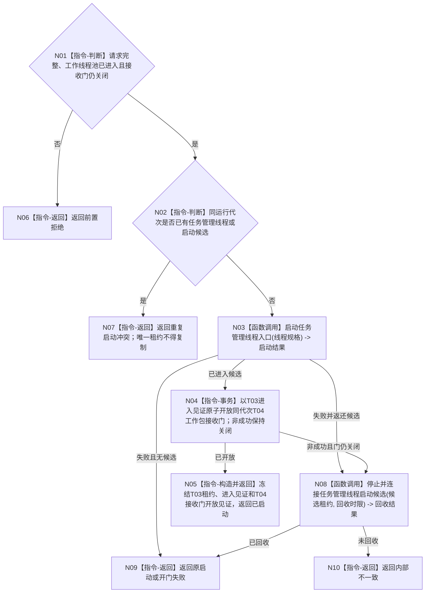

# BIZ-L2-001-06 启动任务管理线程目标函数流程图 v0.1

更新时间：2026-08-27

## 依据

```text
8100、8110、8120；目标线程归属与跨线程材料；BIZ-L1-T01、BIZ-L1-T03
```

## 身份与边界

正式目标函数设计图。在线程池消费者进入关闭接收门后的等待态后启动唯一任务管理线程；任务管理线程进入等待态后，本函数才原子开放同代次工作包接收门并发布完整启动结果。不创建任务、不直接推进任务状态。

## 函数合同

```text
根函数：启动任务管理线程
归属模块 / 文件 / 目标分解深度：线程启动协调 / 海中鱼巣/启动.线程组协调.ixx / BIZ-L2
现有或待新增：目标根、请求/结果DTO、候选租约和接收门开放事务均未实现；已发布代码基线 `d5e6373e` 只有运行包内先启动T03、后启动单个旧结果尾部线程的反序组合
完整签名：任务管理线程启动结果 启动任务管理线程(const 任务管理线程启动请求& 请求)
参数：请求为只读借用；含运行代次、唯一逻辑身份、三类输入队列、工作包派发端口、领域处理器、已进入且接收门仍关闭的工作线程池租约和启动时限
返回结果：任务管理线程启动结果；成功时同时含唯一任务管理线程租约、同代次进入见证和工作线程池接收门开放见证；任一失败结构化返回且不得遗留已发布T03或半开放T04
被调函数流程图：任务管理线程启动与进入确认在L3展开
```

## 流程图



## 节点合同

| 节点 | 类型 | 输入 | 输出 | 事实读写 | 验证 |
| --- | --- | --- | --- | --- | --- |
| N01—N02 | 指令-判断 | 启动请求和当前租约 | 准入或冲突 | 无业务写入 | 消费者未进入、重复启动和唯一租约不可复制 |
| N03/N08 | 函数调用 | 线程规格或候选租约 | 进入或回收结果 | 只发8110消息 | 进入超时和异常退出 |
| N04 | 指令-事务 | 同代次T03进入见证和仍关闭的T04池租约 | 接收门开放见证或零变化非成功 | 只改线程间工作包接收门 | T03未进入不得开放；非成功保持关闭 |
| N05—N10 | 指令 | 启动、开门或回收结论 | 组合唯一租约或非成功 | 不裁决任务状态 | 唯一性、门状态和回收完整性 |

## 关键边界

任务管理线程只有调度和调用领域服务的权力；线程进入不等于已有任务，也不等于任务可执行。T04进入见证、T03进入见证和T04接收门开放见证三者必须分账：T03未进入时T04零消费，只有N04成功后T03才可派发且T04才可接管工作包。N04非成功必须保持门关闭并回收尚未对外发布的T03候选。

## 当前代码对应（已发布基线 `d5e6373e`）

- HEAD不存在`启动任务管理线程`、目标`启动.线程组协调.ixx`、目标请求/结果、候选租约、同代次进入见证或接收门开放事务。
- `任务结果生产运行包::启动()`先调用无参`管理线程_.启动()`，成功后才调用单个`工作线程_.启动()`；既没有先取得T04完整池租约，也没有T03进入后开放T04接收门。
- 当前T03启动成功只表示平台线程构造调用未抛异常；调用方不等待`线程已进入()`，旧T04也没有关闭接收门，因此不能映射为本图任一完整成功形状。
