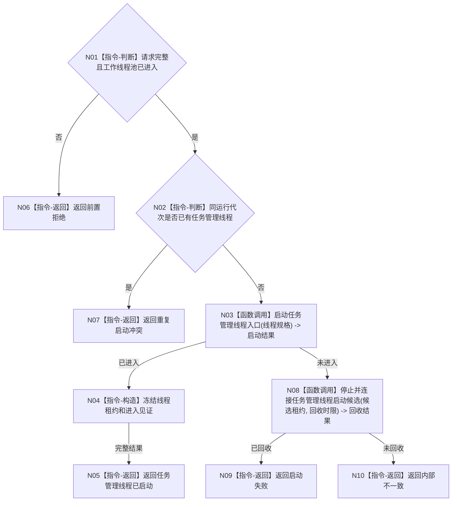

# BIZ-L2-001-06 启动任务管理线程目标函数流程图 v0.1

更新时间：2026-08-03

## 依据

```text
8100、8110、8120；目标线程归属与跨线程材料；BIZ-L1-T01、BIZ-L1-T03
```

## 身份与边界

正式目标函数设计图。在线程池消费者进入后启动唯一任务管理线程；不创建任务、不直接推进任务状态。

## 函数合同

```text
根函数：启动任务管理线程
归属模块 / 文件 / 层级：线程启动协调 / 海中鱼巣/启动.线程组协调.ixx / L2
现有或待新增：适配扩展；复用现有任务管理线程壳
完整签名：任务管理线程启动结果 启动任务管理线程(const 任务管理线程启动请求& 请求)
参数：请求为只读借用；含运行代次、唯一逻辑身份、三类输入队列、工作包派发端口、领域处理器、已进入工作线程池租约和启动时限
返回结果：任务管理线程启动结果；成功时含唯一线程租约和进入见证，失败结构化返回
被调函数流程图：任务管理线程启动与进入确认在L3展开
```

## 流程图



## 节点合同

| 节点 | 类型 | 输入 | 输出 | 事实读写 | 验证 |
| --- | --- | --- | --- | --- | --- |
| N01—N02 | 指令-判断 | 启动请求和当前租约 | 准入 | 无业务写入 | 消费者未进入、重复启动 |
| N03/N08 | 函数调用 | 线程规格或候选租约 | 进入或回收结果 | 只发8110消息 | 进入超时和异常退出 |
| N04—N10 | 指令 | 启动结论 | 唯一租约或非成功 | 不裁决任务状态 | 唯一性和回收完整性 |

## 关键边界

任务管理线程只有调度和调用领域服务的权力；线程进入不等于已有任务，也不等于任务可执行。
