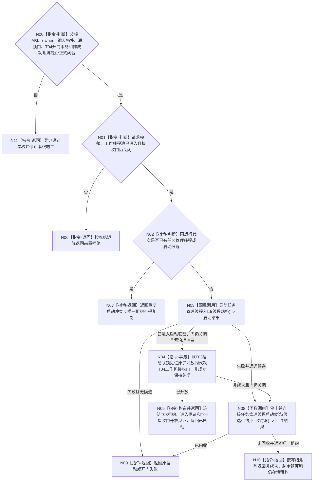

# BIZ-L2-001-06 启动任务管理线程目标函数流程图 v0.1

更新时间：2026-08-27

## 依据

```text
8100、8110、8120；目标线程归属与跨线程材料；BIZ-L1-T01、BIZ-L1-T03
```

## 身份与边界

正式目标治理图。目标是在 T04 工作线程池消费者全部进入且工作包接收门仍关闭后形成唯一 T03 候选；只有候选内部已经进入“等待父级开放同代次 T04 门”的启动联锁态，父级才可原子开放 T04 门并组合发布完整启动结果。不创建任务、不直接推进任务状态；T04 开门前不调用 BIZ-L1-T03、不消费治理输入、不派发工作包。

当前只冻结上述业务顺序。T03 启动 ABI、候选/正式租约 owner、四种业务输入到物理源的拓扑、启动联锁见证、T04 开门事务及完整非成功矩阵均未由详细设计和有效计划闭合，因此本图不能直接作为代码施工合同。

## 函数合同

```text
根函数候选：启动任务管理线程
归属模块 / 文件 / 目标分解深度：线程启动协调 / 物理文件待设计治理冻结 / BIZ-L2
现有或待新增：目标根、请求/结果DTO、候选/正式租约、启动联锁门和T04接收门开放事务均未实现；已发布代码基线 `191375eb` 仍由运行包先启动T03、后启动单个旧结果尾部线程
完整签名：未冻结；旧 `任务管理线程启动结果 启动任务管理线程(const 任务管理线程启动请求& 请求)` 只作目标草图
参数：未冻结；必须明确运行代次、逻辑身份、T04完整池/关闭门、四种业务输入语义到物理队列/端口/provider的映射、工作包派发端口、领域provider组、8110端口、启动预算和全部借用寿命
返回结果：未冻结；目标成功至少分账唯一T03正式租约、内部启动联锁见证和父级T04开门见证，任一非成功不得遗留已发布T03或半开放T04
被调函数流程图：[BIZ-L3-001-06-01 v0.2](../L3/BIZ-L3-001-06-01_启动任务管理线程入口_目标函数流程图_v0.2.md) 与 [BIZ-L3-001-06-02 v0.2](../L3/BIZ-L3-001-06-02_停止并连接任务管理线程启动候选_目标函数流程图_v0.2.md) 均已校正为设计门禁与目标骨架
```

## 流程图



## 节点合同

| 节点 | 类型 | 输入 | 输出 | 事实读写 | 验证 |
| --- | --- | --- | --- | --- | --- |
| N00/N11 | 指令-判断 / 返回 | 正式设计、ABI与事务合同 | 可施工或具名漂移 | 无 | 缺少任一合同即停止，不从旧图补造 |
| N01—N02 | 指令-判断 | 启动请求和当前租约 | 准入或冲突 | 无业务写入 | 消费者未进入、重复启动和唯一租约不可复制 |
| N03/N08 | 函数调用 | 线程规格或候选租约 | 进入或回收结果 | 只发8110消息 | 进入超时和异常退出 |
| N04 | 指令-事务 | 同代次T03启动联锁见证和仍关闭的T04池租约 | 接收门开放见证或零变化非成功 | 只改线程间工作包接收门 | 未证明联锁进入和零治理消费不得开放；非成功保持关闭 |
| N05—N10 | 指令 | 启动、开门或回收结论 | 组合唯一租约或非成功 | 不裁决任务状态 | 唯一性、门状态和回收完整性 |

## 关键边界

任务管理线程只有调度和调用领域服务的权力；平台线程进入不等于多源输入等待就绪、已有任务或任务可执行。T04进入见证、T03启动联锁见证和T04接收门开放见证三者必须分账：父级开门前T03/T04均零业务消费，只有N04成功后T03才进入BIZ-L1-T03治理循环且T04才可接管工作包。N04非成功必须保持门关闭并回收尚未对外发布的T03候选。

## 当前代码对应（已发布基线 `191375eb`）

- 发布源码不存在`启动任务管理线程`、目标`启动.线程组协调.ixx`、目标请求/结果、候选租约、同代次进入见证或接收门开放事务。
- `任务结果生产运行包::启动()`先调用无参`管理线程_.启动()`，成功后才调用单个`工作线程_.启动()`；既没有先取得T04完整池租约，也没有T03进入后开放T04接收门。
- 当前T03启动成功只表示平台线程构造调用未抛异常；调用方不等待`线程已进入()`，旧T04也没有关闭接收门，因此不能映射为本图任一完整成功形状。
- 当前没有四种业务输入到物理源的完整交付拓扑，也没有父根签名、DTO、T04开门事务、启动联锁见证或非成功矩阵；这些缺口必须先由设计治理闭合。
