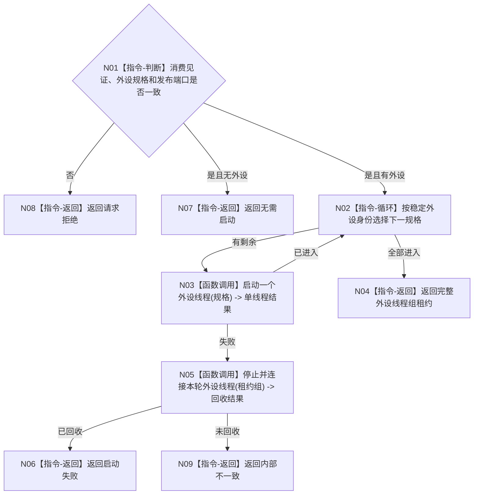

# BIZ-L2-001-07 启动外设线程组目标函数流程图 v0.1

更新时间：2026-08-03

## 依据

```text
6340、8110、8120；目标线程归属与跨线程材料；BIZ-L1-T01、BIZ-L1-T06
```

## 身份与边界

正式目标函数设计图。任务管理消费者进入后按配置启动外设线程组；外设线程只形成材料，不写世界事实。

## 函数合同

```text
根函数：启动外设线程组
归属模块 / 文件 / 层级：线程启动协调 / 海中鱼巣/启动.线程组协调.ixx / L2
现有或待新增：适配扩展；复用现有外设采样材料线程壳
完整签名：外设线程组启动结果 启动外设线程组(const 外设线程组启动请求& 请求)
参数：请求为只读借用；含运行代次、已登记外设规格、逻辑身份组、6340发布端口、任务管理消费见证和启动时限
返回结果：外设线程组启动结果；允许配置为空并返回无需启动，否则成功时含完整线程租约组
被调函数流程图：按外设主题的单线程启动函数进入L3展开
```

## 流程图



## 节点合同

| 节点 | 类型 | 输入 | 输出 | 事实读写 | 验证 |
| --- | --- | --- | --- | --- | --- |
| N01 | 指令-判断 | 外设请求 | 准入或无需启动 | 无 | 空配置与未就绪消费者 |
| N02—N03 | 循环 / 函数调用 | 稳定外设规格 | 逐线程结果 | 只发生命周期消息 | 每种外设启动失败 |
| N04—N09 | 指令 / 函数调用 | 租约组 | 完整组或非成功 | 失败回收 | 不泄漏采集生产者 |

## 关键边界

外设线程进入只证明采集载体存在；报告必须走6340正式发布和承接路径，不能由线程状态伪造世界事实。
