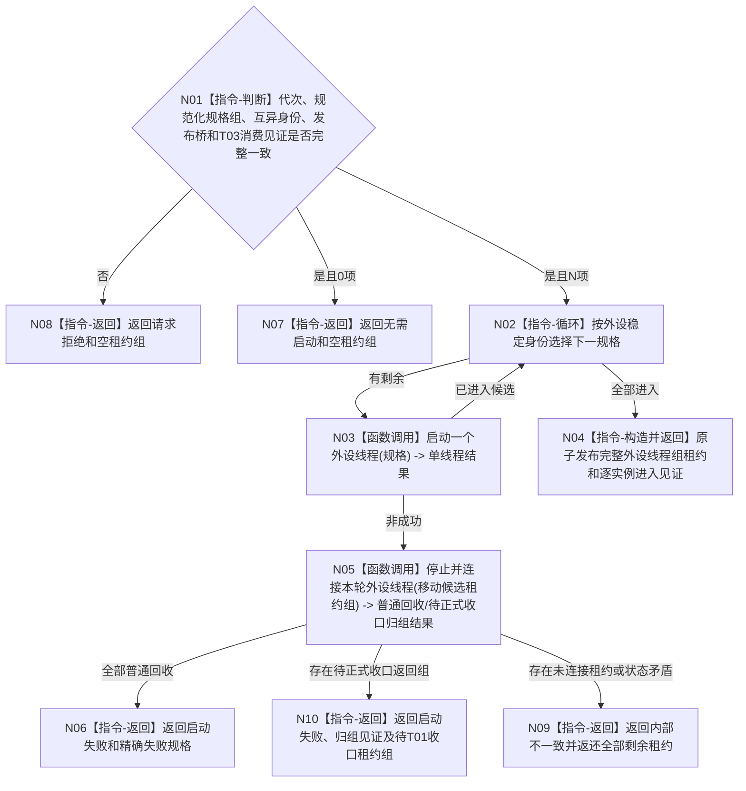

# BIZ-L2-001-07 启动外设线程组目标函数流程图 v0.1

更新时间：2026-08-27

## 依据

```text
6340、8110、8120；目标线程归属与跨线程材料；BIZ-L1-T01、BIZ-L1-T06
```

## 身份与边界

正式目标函数设计图。任务管理线程已经取得同代次多源输入等待见证和6340外设报告消费入口后，按规范化启动配置建立0..N个外设实例控制域。空配置合法返回无需启动；非空配置只有全部实例进入采集等待态后才发布完整线程组租约。外设线程只形成材料，不写世界事实。

## 函数合同

```text
根函数：启动外设线程组
归属模块 / 文件 / 目标分解深度：线程启动协调 / 海中鱼巣/启动.线程组协调.ixx / BIZ-L2
现有或待新增：目标根、请求/结果DTO、完整组租约和失败回收结果均未实现；HEAD `79985857` 的同名无参空壳恒返回true
完整签名：外设线程组启动结果 启动外设线程组(const 外设线程组启动请求& 请求)
参数：请求为只读借用；含运行代次、按外设稳定身份规范排序且身份互异的0..N项启动规格、唯一逻辑线程身份组、6340唯一物理报告发布桥、任务管理多源等待/外设消费见证和总启动时限
返回结果：移动值式外设线程组启动结果；空配置返回无需启动和空租约组，非空成功含完整线程组租约与逐实例进入见证；失败含精确失败规格、已普通回收项、待正式收口项和所有未连接唯一租约
被调函数流程图：按外设主题的单线程启动函数进入L3展开
```

## 流程图



## 节点合同

| 节点 | 类型 | 输入 | 输出 | 事实读写 | 验证 |
| --- | --- | --- | --- | --- | --- |
| N01 | 指令-判断 | 外设请求 | 准入或无需启动 | 无 | 空配置、乱序/重复规格和未就绪T03消费者 |
| N02—N03 | 循环 / 函数调用 | 稳定外设规格 | 逐线程候选结果 | 只发生命周期消息和本地资源取得 | 每位置驱动/线程/进入失败 |
| N04—N10 | 指令 / 函数调用 | 候选租约组 | 完整组、普通回收或正式收口转交 | 完整组一次发布；失败租约不丢失 | 不泄漏控制域、线程或不可舍弃材料 |

## 关键边界

外设线程进入只证明采集载体存在；报告必须走6340正式发布和承接路径，不能由线程状态伪造世界事实。完整线程组发布前任一实例失败时，已经进入的实例必须先全部锁存停止；无不可舍弃在途材料者普通连接回收，已形成不可舍弃在途材料者必须把唯一租约和材料见证返还T01并由其交BIZ-L2-001-13正式收口，不能以启动失败销毁、detach或遗失。

## 当前代码对应（HEAD `79985857`）

- `海中鱼巣/启动.应用程序.ixx`只有无参`bool 启动外设线程组()`，实现恒为`return true`；没有请求、结构化结果、0/N规格、完整租约、进入见证或失败回收。
- 同文件`收口并连接外设线程组()`为空函数，故当前启动成功既不创建外设线程，失败/退出也不停止或连接任何控制域。
- `海中鱼巣/线程/外设采样材料线程.ixx`明确只承载模拟或空外部材料并禁止接真实外设、D455、体素和外设动作；它有一个忙等线程、`线程已进入()`原子量和无时限`join`，只能作为少量机械资源候选，不能复用为本目标组租约或T06业务入口。
- `海中鱼巣/适配/采集器.D455相机.ixx`已提供`创建并打开D455相机采集器`及完整四流采样、停止和状态快照，但HEAD只有声明/定义两个命中，没有生产调用者；目标`启动.线程组协调.ixx`、通用外设线程类、适配器表和6340报告队列接线均不存在。
