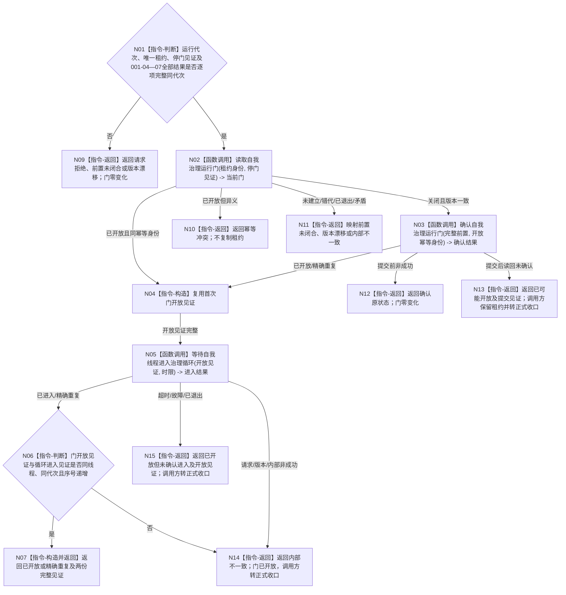

# BIZ-L2-001-08 开放自我线程治理循环目标函数流程图 v0.1

更新时间：2026-08-27

## 依据

```text
0050、8100、8110、8120 v0.10；目标线程归属与跨线程材料；BIZ-L1-T01 v0.4、BIZ-L1-T02 v0.6；BIZ-L2-001-03—07
```

## 身份与边界

正式目标函数设计图。只在自我线程已经真实进入并停在关闭门、支持线程组已经形成完整逐叶结果、T04/T03 已取得进入与接收门开放见证且 T06 已完整启动或合法无需启动后，一次性开放同运行代次的自我治理运行门，并等待内部治理循环进入见证。它不处理治理消息，不把线程门解释为业务授权。

## 函数合同

```text
根函数：开放自我线程治理循环
归属模块 / 文件 / 目标分解深度：线程启动协调 / 海中鱼巣/启动.线程组协调.ixx / BIZ-L2
现有或待新增：目标根、请求/结果 DTO 和同根开门收束未实现；HEAD `745ef2ae` 的同名无参 `bool` 恒真空壳不执行开门，父函数随后旁路调用无返回的 `自我线程::开放治理运行门()`
完整签名：自我治理开放结果 开放自我线程治理循环(const 自我治理开放请求& 请求) noexcept
参数：请求为只读借用；含运行代次、普通应用持有的唯一自我线程租约借用、阶段20完整停门见证、支持线程组完整逐叶结果、T04线程池启动结果、T03启动/T04开门组合见证、T06完整组或无需启动结果、开放幂等身份和非零单调进入等待时限
返回结果：值式自我治理开放结果；唯一成功为已开放或精确重复且同时携带同代次门开放见证和治理循环进入见证；提交后未确认进入必须保留已开放/已可能开放状态，调用方继续持有唯一租约并进入正式收口
被调函数流程图：BIZ-L3-001-08-01 读取自我治理运行门；BIZ-L3-001-08-02 确认自我治理运行门；BIZ-L3-001-08-03 等待自我线程进入治理循环
```

## 流程图



## 节点合同

| 节点 | 类型 | 输入 | 输出 | 事实读写 | 验证 |
| --- | --- | --- | --- | --- | --- |
| N01 | 指令-判断 | 自我停门见证、支持逐叶结果、T04/T03组合见证和T06结果 | 准入或门零变化非成功 | 无业务事实写入 | 支持降级合法；T04/T03必须成功；T06允许0项无需启动 |
| N02—N04 | 函数调用 / 构造 | 唯一线程租约、停门见证和开放幂等身份 | 当前门、首次或重复开放见证 | 只读或一次写线程内部门 | 同义重复、异义冲突、错代、退出和版本漂移 |
| N05—N07 | 函数调用 / 判断 / 返回 | 开放见证和单调时限 | 治理循环进入见证及完整成功 | 只读线程内部进入槽；不消费治理邮箱 | 已排队消息不要求先出现空闲等待态 |
| N09—N15 | 返回 | 精确失败阶段与已知提交边界 | 门零变化、已可能开放或已开放未确认进入 | 不回滚已开放门，不丢失租约 | 每个提交前后失败、超时、故障和内部矛盾 |

## 关键边界

运行门不是业务授权、任务权限或安全许可；它只防止自我线程在必要运行模块闭合前消费治理邮箱。停门见证只要求创建时已冻结批次数为0；其它生产者就绪期间允许邮箱积累尚未消费的合法消息，001-08不得以“当前队列非空”拒绝开门。

门由关闭提交为开放后，本运行代次不得补偿回滚为关闭。提交后读回失败为“已可能开放”，门已知开放但循环进入未确认则为“已开放但未确认进入”；两者都由T01保留唯一自我线程租约并进入BIZ-L2-001-14正式停止/连接，不能伪装成零变化启动失败。

8110生命周期投影、同名恒真空壳、父函数布尔变量和治理邮箱消息都不能替代内部开放见证或治理循环进入见证。

## 当前代码对应（HEAD `745ef2ae`）

- `海中鱼巣/启动.应用程序.ixx` 的无参 `bool 开放自我线程治理循环()` 固定返回 `true`；真实 `自我线程实例.开放治理运行门()` 在父函数分支中另行调用，故目标根没有拥有开门动作、结果或失败收束。
- `自我线程::开放治理运行门()` 只在短锁内把布尔值写成 `true` 并通知，返回 `void`；没有运行代次、停门见证、001-04—07前置、门版本、开放幂等身份、写后读回或提交后不确定状态。
- 自我线程入口已经真实停在关闭门，并在门开放后调用 `运行治理循环()`；这是可复用的控制流基础。但当前没有“治理循环已进入”的内部见证、等待入口或结构化开放结果，父函数也只持有合并后的旧运行包布尔成功，不能证明T04/T03目标组合见证。
- 本批只校正目标流程与HEAD实现映射；不修改C++、不构建、不运行线程调度专项。
