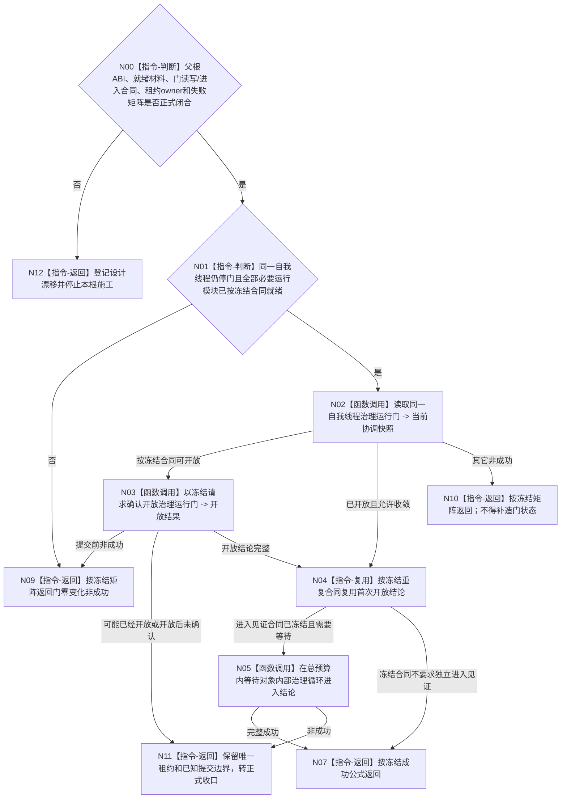

# BIZ-L2-001-08 开放自我线程治理循环目标函数流程图 v0.1

更新时间：2026-08-27

## 依据

```text
0050 v2.1、8100 v1.1、8110、8120 v0.11；目标线程归属与跨线程材料；BIZ-L1-T01 v0.5、BIZ-L1-T02 v0.7；BIZ-L2-001-03—07
```

## 身份与边界

正式目标治理图。8120 v0.11 冻结：阶段21本能根运行锚点完整成功后，阶段20才可创建唯一自我线程并使其停在关闭门；支持线程、工作线程、任务管理线程和外设等必要消费者/生产者就绪后，由本根独立开放治理运行门。开门前自我线程不得消费治理邮箱。它不处理治理消息，也不把线程门解释为业务授权。

当前尚未冻结“必要模块就绪”怎样由001-04—07结果逐字段证明，也未冻结父根请求/结果、门读取/确认/进入见证ABI、开放幂等/版本、等待预算、提交前后失败矩阵和唯一租约借用合同。旧图中的强类型签名及完整事务只能作方向草图，不能施工。

## 函数合同

```text
根函数候选：开放自我线程治理循环
归属模块 / 文件 / 目标分解深度：线程启动协调 / 物理文件待设计治理冻结 / BIZ-L2
现有或待新增：发布源码同名无参bool恒真空壳不执行开门；父函数随后旁路调用无返回的自我线程::开放治理运行门()
完整签名：未冻结；旧自我治理开放请求/结果只作目标草图，不构成ABI
参数：未冻结；必须明确普通应用唯一自我线程借用、关闭门依据、必要模块同代次就绪材料、开放请求身份和有限等待/收口边界
返回结果：未冻结；必须分账门零变化、可能已经开放、已开放但尚未证明进入及完整成功，且任何路径不得丢失唯一线程租约
被调函数流程图：[BIZ-L3-001-08-01 v0.2](../L3/BIZ-L3-001-08-01_读取自我治理运行门_目标函数流程图_v0.2.md)、[BIZ-L3-001-08-02 v0.2](../L3/BIZ-L3-001-08-02_确认自我治理运行门_目标函数流程图_v0.2.md) 与 [BIZ-L3-001-08-03 v0.2](../L3/BIZ-L3-001-08-03_等待自我线程进入治理循环_目标函数流程图_v0.2.md) 均已校正为设计门禁
```

## 流程图



## 节点合同

| 节点 | 当前可确认合同 | 仍待冻结 | 验证边界 |
| --- | --- | --- | --- |
| N00/N12 | 任一依赖合同缺失即停止施工 | 父DTO、物理位置、owner、状态和结果优先级 | 不从旧图或bool补造 |
| N01/N09 | 只在唯一自我线程停门且必要模块就绪后开门 | 001-04—07逐字段材料、代次/身份和失败映射 | 8120顺序必须保留，弱证据不得替代就绪 |
| N02—N04 | 门读取和确认必须发生在同一对象owner内 | 读取/确认ABI、开放身份、版本、重复与提交边界 | 8110投影和父级bool不证明门状态 |
| N05/N07/N11 | 开放、循环进入和完整成功必须按冻结合同分账 | 是否需要独立进入见证、生产点、等待预算和收口结果 | 零邮箱消费先于开门；任何非成功零租约遗失 |

## 关键边界

运行门不是业务授权、任务权限或安全许可；它只防止自我线程在必要运行模块闭合前消费治理邮箱。其它生产者就绪期间可以积累尚未消费的合法消息，001-08不得以“当前队列非空”自行拒绝开门。

门提交后的不确定结果必须保留唯一租约和已知提交边界，但“已可能开放”等状态名、提交见证字段和是否需要独立循环进入见证仍须正式冻结。8110生命周期投影、同名恒真空壳、父函数布尔变量和治理邮箱消息都不能替代对象内部协调事实。

## 冻结发布源码对照（提交 `16fd19c9`）

- `海中鱼巣/启动.应用程序.ixx` 的无参 `bool 开放自我线程治理循环()` 固定返回 `true`；真实 `自我线程实例.开放治理运行门()` 在父函数分支中另行调用，故目标根没有拥有开门动作、结果或失败收束。
- `自我线程::开放治理运行门()` 只在短锁内把布尔值写成 `true` 并通知，返回 `void`；没有运行代次、停门见证、001-04—07前置、门版本、开放幂等身份、写后读回或提交后不确定状态。
- 自我线程入口已经真实停在关闭门，并在门开放后调用 `运行治理循环()`；这是可复用的控制流基础。但当前没有“治理循环已进入”的内部见证、等待入口或结构化开放结果，父函数也只持有合并后的旧运行包布尔成功，不能证明T04/T03目标组合见证。
- 08-01—03登记的读取ABI、开门资格交付、确认事务、运行成功谓词/见证和等待矩阵DRIFT闭合前，本根不可交代码施工。
