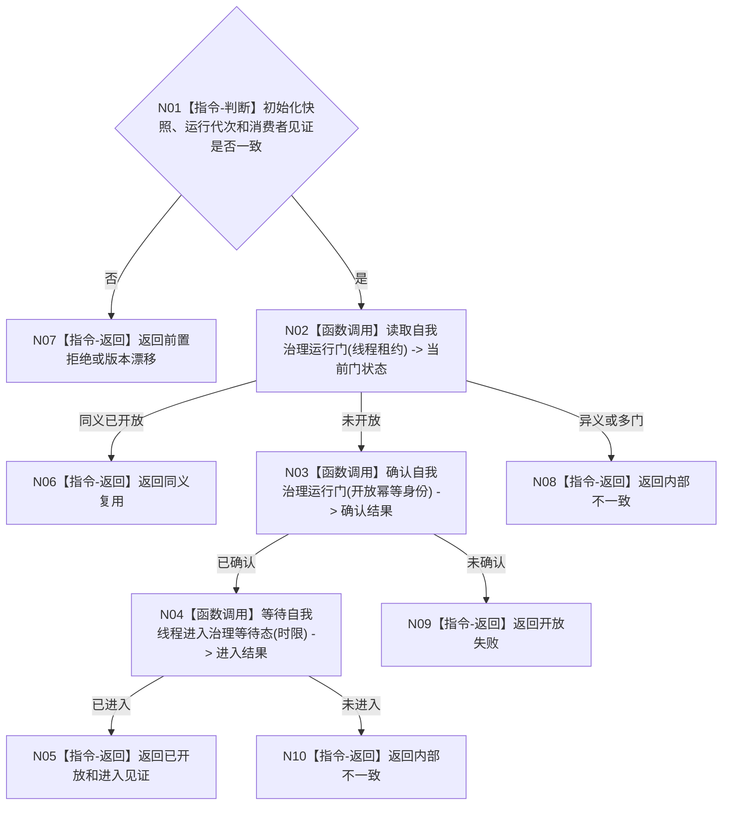

# BIZ-L2-001-08 开放自我线程治理循环目标函数流程图 v0.1

更新时间：2026-08-03

## 依据

```text
8100、8110、8120；目标线程归属与跨线程材料；BIZ-L1-T01、BIZ-L1-T02
```

## 身份与边界

正式目标函数设计图。只在初始化完成且任务消费者就绪后一次性开放自我治理运行门，不处理治理消息本身。

## 函数合同

```text
根函数：开放自我线程治理循环
归属模块 / 文件 / 层级：线程启动协调 / 海中鱼巣/启动.线程组协调.ixx / L2
现有或待新增：待新增；当前自我线程初始化后直接进入治理循环，需增加运行门
完整签名：自我治理开放结果 开放自我线程治理循环(const 自我治理开放请求& 请求)
参数：请求为只读借用；含运行代次、自我线程租约、初始化快照版本、任务管理和工作线程池进入见证及开放幂等身份
返回结果：自我治理开放结果；含已开放、同义复用、前置拒绝、版本漂移或内部不一致
被调函数流程图：自我线程运行门确认函数进入L3展开
```

## 流程图



## 节点合同

| 节点 | 类型 | 输入 | 输出 | 事实读写 | 验证 |
| --- | --- | --- | --- | --- | --- |
| N01 | 指令-判断 | 开放请求 | 准入 | 无 | 消费者未就绪和代次漂移 |
| N02—N04 | 函数调用 | 线程租约和幂等身份 | 门状态与进入见证 | 只改线程运行门和生命周期投影 | 同义重复、异义重复、进入超时 |
| N05—N10 | 指令-返回 | 开放结论 | 结构化结果 | 不处理业务消息 | 单门唯一性 |

## 关键边界

运行门不是业务授权或任务权限；它只防止自我线程在任务消费者启动前进入治理循环。
