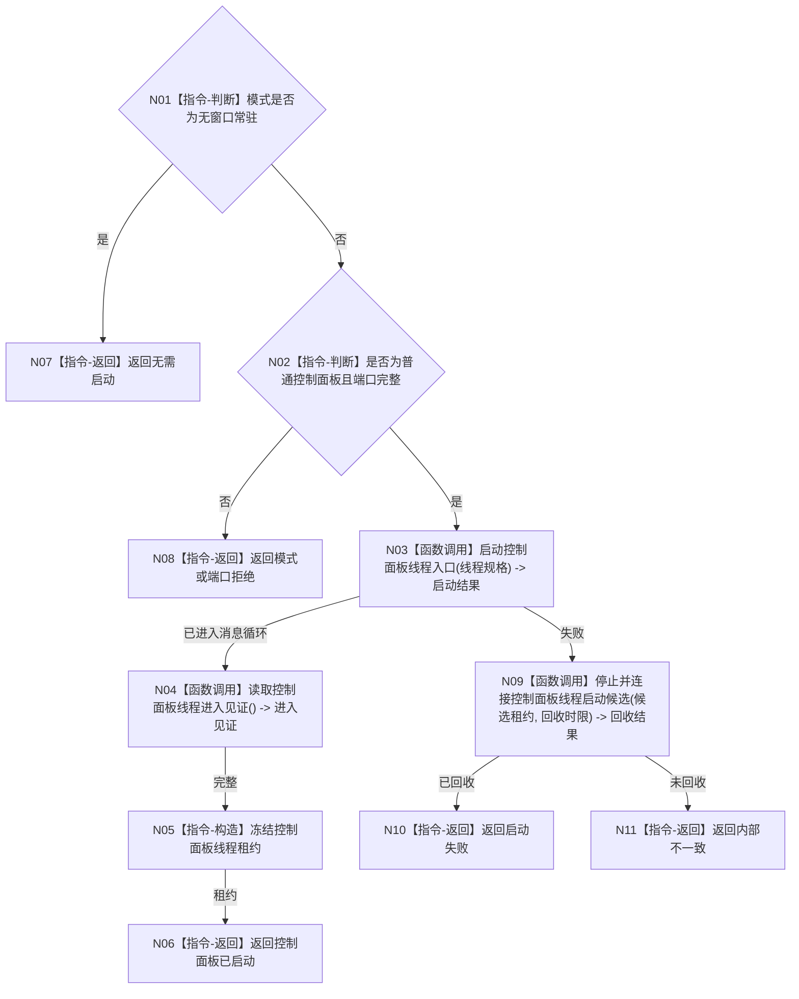

# BIZ-L2-001-09 按模式启动控制面板线程目标函数流程图 v0.1

更新时间：2026-08-03

## 依据

```text
8110、8120；目标线程归属与跨线程材料；BIZ-L1-T01、BIZ-L1-T05
```

## 身份与边界

正式目标函数设计图。普通控制面板模式启动唯一UI线程；无窗口常驻模式明确返回无需启动。控制面板只读投影且不反写业务事实。

## 函数合同

```text
根函数：按模式启动控制面板线程
归属模块 / 文件 / 层级：线程启动协调 / 海中鱼巣/启动.线程组协调.ixx / L2
现有或待新增：待新增；现有窗口宿主在程序主线程同步运行，只作适配材料
完整签名：控制面板线程启动结果 按模式启动控制面板线程(const 控制面板线程启动请求& 请求)
参数：请求为只读借用；含普通模式、运行代次、逻辑身份、只读投影端口、程序控制消息桥、窗口端口和启动时限
返回结果：控制面板线程启动结果；无窗口为无需启动，控制面板成功时含唯一线程租约和窗口进入见证
被调函数流程图：控制面板线程启动与窗口进入函数进入L3展开
```

## 流程图



## 节点合同

| 节点 | 类型 | 输入 | 输出 | 事实读写 | 验证 |
| --- | --- | --- | --- | --- | --- |
| N01—N02 | 指令-判断 | 模式和端口 | 准入 | 无 | 两种普通模式与缺端口 |
| N03—N04/N09 | 函数调用 | 线程规格或候选 | 进入或回收结果 | 只发线程消息和UI状态 | 窗口创建失败、进入超时 |
| N05—N11 | 指令 | 启动结论 | 租约或非成功 | 不写业务事实 | 无窗口不创建线程 |

## 关键边界

窗口显示成功不证明业务初始化或任务闭环；控制面板线程只能发送程序控制消息并读取值式投影。
