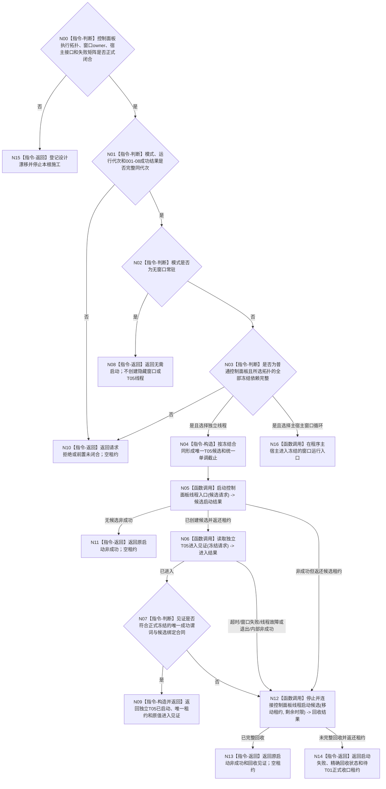

# BIZ-L2-001-09 按模式启动控制面板线程目标函数流程图 v0.1

更新时间：2026-08-28

## 依据

```text
0050、8100、8110 v0.3、8120 v0.10；目标线程归属与跨线程材料；BIZ-L1-T01 v0.4、BIZ-L1-T05 v0.4；BIZ-L2-001-02、001-08
```

## 身份与边界

正式目标治理图。无窗口常驻模式不创建窗口；普通模式必须运行控制面板窗口。8120只把窗口运行和无窗口等待归于程序运行宿主，没有冻结普通模式必须创建独立T05线程。主宿主/独立线程、窗口owner、线程亲和和消息循环生命周期未裁决前，本根不能固定为“启动控制面板线程”。

## 函数合同

```text
根函数候选：按模式进入控制面板运行宿主
归属模块 / 文件 / 目标分解深度：程序运行宿主 / 物理文件待拓扑裁决 / BIZ-L2
现有或待新增：目标根及请求/结果DTO均未实现；独立T05方案专属的唯一租约和候选回收结果同样不存在；HEAD `7e688332` 的同名函数位于启动.应用程序.ixx，只按模式返回bool，不创建线程或窗口
完整签名：未冻结；旧控制面板线程启动请求/结果只作独立线程方案草图
参数：未冻结；已接受模式、运行代次和BIZ-L2-001-08成功前置属于共同职责，普通模式还需要窗口、只读投影、程序控制、生命周期和停止材料；逻辑线程身份、候选租约和跨线程预算只在独立T05拓扑获选后才可能进入合同
返回结果：未冻结；无窗口分支不创建UI资源，普通模式成功形状取决于主宿主/独立T05拓扑及其唯一运行成功合同；独立线程方案还必须守恒0..1唯一租约并区分零候选、已完整回收和仍需T01正式收口
被调函数流程图：[BIZ-L3-001-09-01 v0.2](../L3/BIZ-L3-001-09-01_启动控制面板线程入口_目标函数流程图_v0.2.md) 与 [BIZ-L3-001-09-02 v0.2](../L3/BIZ-L3-001-09-02_读取控制面板线程进入见证_目标函数流程图_v0.2.md) 已校正为拓扑/成功谓词设计门禁；09-03仍为仅独立线程方案适用的旧草图
```

## 流程图



## 节点合同

| 节点 | 类型 | 输入 | 输出 | 事实读写 | 验证 |
| --- | --- | --- | --- | --- | --- |
| N01—N03 | 指令-判断 | 共同请求及按模式分支材料 | 准入或无需启动 | 无 | 错代、坏模式、无窗口零UI依赖、普通模式缺端口 |
| N04—N07 | 构造 / 函数调用 / 判断 | T05候选请求和统一截止 | 唯一候选、内部进入结果 | 只取得本地线程/UI资源；8110只作旁路 | 候选创建失败、窗口失败、进入超时、生命周期发布失败不冒充启动失败 |
| N08—N14 | 返回 / 函数调用 | 启动或回收结论 | 无需启动、完整成功、零候选失败、已回收失败或待收口租约 | 不写业务事实，不丢失joinable线程 | 两模式、每个提交边界、候选租约守恒 |

## 关键边界

- 无窗口常驻仍由001-02建立未锁存的程序控制停止来源和故障观察端口，但001-09不借用UI专属提交端、不创建隐藏窗口、不形成伪T05见证。
- 普通控制面板启动成功必须由所选拓扑的正式成功合同证明。主宿主方案不读取伪T05见证；独立线程方案必须读取线程内部正式材料，但窗口显示、消息循环函数体进入或首个可消费点尚未裁决为唯一成功谓词。窗口句柄、页面文本、父函数`bool`、8110当前投影或生命周期消息都不能替代该合同。
- 001-08成功结果是本函数的直接启动前置；它已经闭合更早同代次线程准备。本函数不重新解释支持、T03、T04、T06或自我门的原始材料，也不从线程投影补造它们。
- 一旦物理线程候选创建成功，任一后继非成功都必须先尝试停止和连接；未连接时把唯一租约返还T01并进入共同收口，禁止析构joinable线程、detach或用空失败结果遗失资源。

## 当前代码对应（HEAD `655a2bf3`）

- `海中鱼巣/启动.应用程序.ixx` 的 `bool 按模式启动控制面板线程(启动模式)` 对无窗口返回true，对普通模式也只比较枚举并返回true；没有请求、运行代次、001-08结果、结构化状态、租约或进入见证。
- 同文件普通控制面板与无窗口路径都调用 `运行无窗口宿主`；HEAD没有 `海中鱼巣/线程/控制面板线程.ixx`、界面目录、窗口实现或程序控制消息桥。
- 已发布 `线程生命周期投影服务` 支持控制面板线程类别及当前单项/组读取，但它只可复用为8110诊断旁路，不能成为候选所有者、窗口进入见证或启动成功依据。
- `DRIFT-BIZ-CONTROL-PANEL-EXECUTION-TOPOLOGY-WINDOW-OWNER-AND-THREAD-AFFINITY-UNFROZEN`闭合前，本根及09-02/03不可交代码施工；选择独立T05后仍须闭合09-02的成功谓词、见证生产/通知和读取矩阵。
