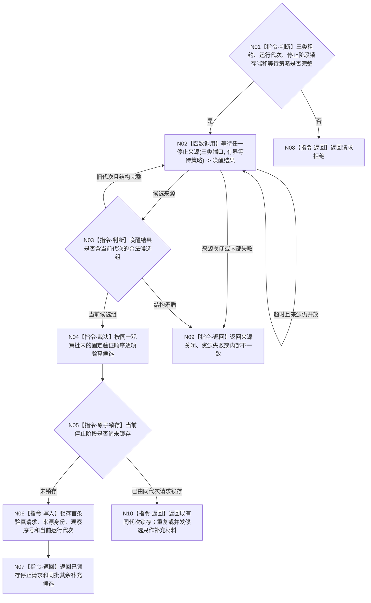

# BIZ-L2-001-10 等待程序停止请求目标函数流程图 v0.1

更新时间：2026-08-27

## 依据

```text
0050、8110、8120；目标线程归属与跨线程材料；BIZ-L1-T01 v0.4；确认稿第30项
```

## 身份与边界

正式目标函数设计图。T01 统一等待进程信号、程序控制停止消息或已由具名合同裁决的内部致命线程故障。它对候选执行同代次和来源验真，第一条验真通过的请求不可逆锁存当前运行代次的停止阶段与首要停止原因，然后返回给 T01 执行分阶段收口；它不直接停止任何线程。

启动必需门失败不经过本函数等待，由 `运行普通程序` 直接锁存启动失败并进入相同收口链。普通线程退出、业务非成功、任务等待、生命周期投影或日志错误不能成为本函数的隐式候选。

## 函数合同

```text
根函数：等待程序停止请求
归属模块 / 文件 / 目标分解深度：程序运行宿主 / 海中鱼巣/启动.程序运行宿主.ixx / BIZ-L2
现有或待新增：待新增；复用现有停止信号租约和运行无窗口宿主的有界等待模式
完整签名：程序停止等待结果 等待程序停止请求(const 程序停止等待请求& 请求)
参数：请求为只读借用；含同代次三类停止来源租约、T01唯一停止阶段锁存端和有界等待策略；逐字段 ABI 待详细设计冻结
返回结果：程序停止等待结果；成功时证明停止阶段已锁存并含首要停止来源、来源稳定身份和锁存观察序号；非成功分账请求拒绝、来源关闭、资源失败或内部不一致
被调函数流程图：BIZ-L3-001-10-01 等待任一停止来源
```

## 流程图



## 节点合同

| 节点 | 类型 | 输入 | 输出 | 事实读写 | 验证 |
| --- | --- | --- | --- | --- | --- |
| N01 | 指令-判断 | 等待请求 | 准入 | 无 | 缺租约、错代、缺锁存端和坏等待策略 |
| N02 | 函数调用 | 三个等待来源 | 唤醒候选组 | 可消费一条程序控制消息；不写业务事实 | 同时可见、伪唤醒、来源关闭和有界等待 |
| N03—N04 | 指令-判断/裁决 | 候选组 | 验真顺序 | 无 | 旧代次隔离；固定顺序只解决同一观察批，不伪造物理发生时间 |
| N05—N07/N10 | 指令-锁存/返回 | 首条验真候选 | 不可逆停止阶段和首要原因 | 只写 T01 运行宿主控制状态 | 首次、精确重复、并发候选和既有锁存不倒退 |
| N08—N09 | 指令-返回 | 非成功 | 结构化错误 | 无 | 零停止阶段误锁存 |

## 关键边界

- “第一条”指 T01 按固定验证顺序首先验真通过的候选，不伪造当前进程信号实现没有保存的物理发生时间或具体信号号。
- 停止阶段一经锁存不得撤销、倒退或重新开放业务输入。后到重复保持幂等；后到更严重故障只进入最终程序结果的补充材料。
- 同一观察批固定顺序只提供确定性，不改变各候选自己的来源身份；当前目标顺序为进程信号、程序控制、致命故障，详细设计若改变顺序必须同时修订本图和验收。
- 三类来源租约继续覆盖后继分阶段收口。T01 在最终返回前再次读取补充故障材料；本函数返回不释放租约。
- HEAD 当前只有 `运行无窗口宿主` 对单一停止信号位的轮询，没有三来源等待、同代次验真、停止阶段锁存或后到故障补充。

## 2026-08-27 校正记录

- 把“只返回原因”校正为“T01 内部先不可逆锁存停止阶段再返回”，与确认稿第30项一致。
- 把固定来源顺序限定为同一观察批的确定性验证顺序，不声称知道当前信号实现未保存的物理发生先后。
- 补入已锁存重复、来源关闭和后到更严重故障只补充最终结果的边界。
