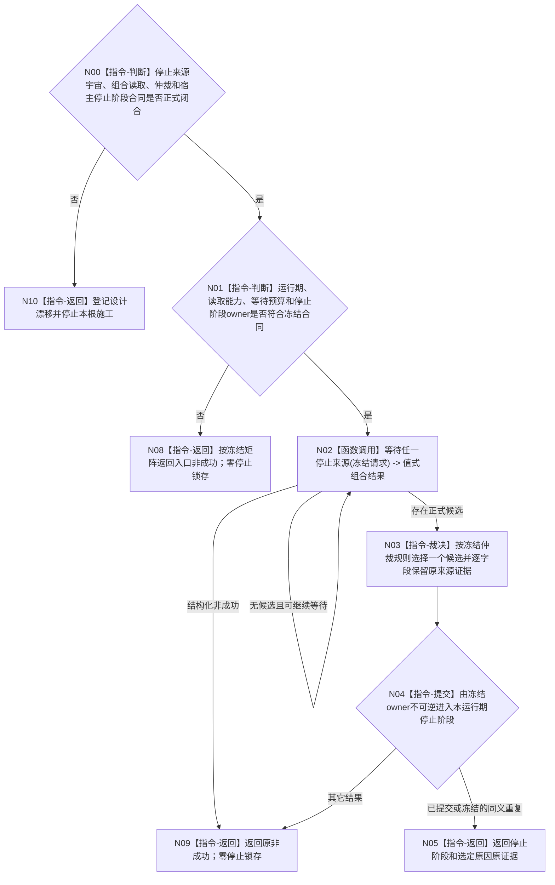

# BIZ-L2-001-10 等待程序停止请求目标函数流程图 v0.1

更新时间：2026-08-28

## 依据

```text
0050、8100 v0.7、8110 v0.3、8120 v0.10；BIZ-L1-T01 v0.4；
BIZ-L3-001-10-01 v0.2；HEAD 海中鱼巣/启动.程序运行宿主.ixx。
```

## 身份与边界

正式目标治理图。程序运行宿主需要等待正式停止原因并进入收口，但现行规范只明确了进程信号宿主能力，没有冻结封闭停止来源宇宙、多个候选的仲裁或T01停止阶段锁存结构。旧图的“三来源固定顺序首项验真”不是已获授权的机器合同。

本根必须先等待10-01的来源宇宙、各owner/生产者、组合读取和仲裁合同闭合。启动前置失败仍由`运行普通程序`直接进入其正式失败收口，不应伪装成运行期来源候选。

## 函数合同

```text
根函数候选：等待程序停止请求
归属模块 / 文件 / 目标分解深度：程序运行宿主 / 物理文件待合同冻结 / BIZ-L2
现有或待新增：HEAD仅由运行无窗口宿主轮询单一信号位；目标根不存在
完整签名：未冻结；旧程序停止等待请求/结果和停止阶段锁存端不构成ABI
参数：未冻结；取决于正式停止来源组合器、运行宿主状态和调用方等待预算
返回结果：未冻结；成功必须绑定一个按正式仲裁规则选定的停止原因及其原来源证据，非成功不得锁存伪停止阶段
被调函数流程图：[BIZ-L3-001-10-01 v0.2](../L3/BIZ-L3-001-10-01_等待任一停止来源_目标函数流程图_v0.2.md)
```

## 设计门禁与目标骨架



## 当前代码对应（HEAD `ef3c8ec9`）

- `运行无窗口宿主`只轮询单一信号位；没有本目标根、组合读取结果、仲裁或T01停止阶段owner。
- 普通控制面板当前也复用无窗口宿主；程序控制桥尚不存在。
- 8110线程生命周期投影不能成为停止候选、致命分类器或停止阶段提交证据。

## 具名偏差

- `DRIFT-BIZ-HOST-STOP-SOURCE-UNIVERSE-OWNERS-AND-ARBITRATION-UNFROZEN`
- `DRIFT-BIZ-HOST-STOP-COMPOSER-READ-ABI-WAIT-CURRENTNESS-AND-TERMINAL-MATRIX-UNFROZEN`
- `DRIFT-BIZ-HOST-STOP-STAGE-OWNER-COMMIT-IDEMPOTENCY-AND-READBACK-MATRIX-UNFROZEN`

## 2026-08-28 校正记录

- 撤销三来源固定顺序首项验真、本地观察批标记和停止阶段结构已冻结的旧口径。
- 只保留“正式来源组合读取 -> 正式仲裁 -> 唯一宿主停止阶段owner提交 -> 返回原来源证据”的职责骨架。
