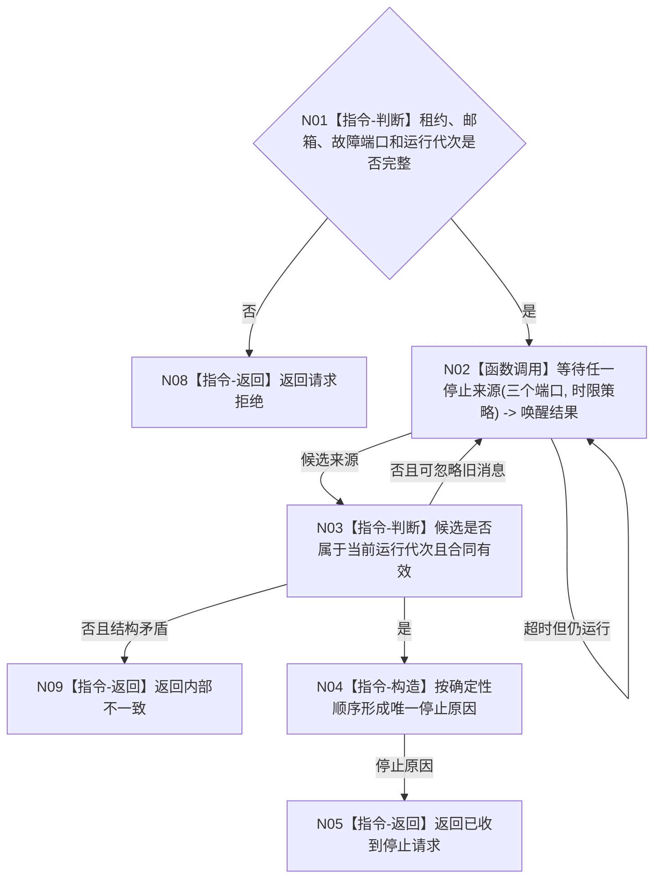

# BIZ-L2-001-10 等待程序停止请求目标函数流程图 v0.1

更新时间：2026-08-03

## 依据

```text
8110、8120；目标线程归属与跨线程材料；BIZ-L1-T01
```

## 身份与边界

正式目标函数设计图。统一等待进程信号、控制面板停止消息或内部致命线程故障；只返回原因，不直接停止线程。

## 函数合同

```text
根函数：等待程序停止请求
归属模块 / 文件 / 层级：程序运行宿主 / 海中鱼巣/启动.程序运行宿主.ixx / L2
现有或待新增：待新增；复用现有停止信号租约
完整签名：程序停止等待结果 等待程序停止请求(const 程序停止等待请求& 请求)
参数：请求为只读借用；含停止信号租约、程序控制邮箱、线程故障观察端口、运行代次和等待时限策略
返回结果：程序停止等待结果；含停止来源、消息或信号身份、发生顺序和等待内部错误
被调函数流程图：三个等待来源的只读/取出端口进入L3展开
```

## 流程图



## 节点合同

| 节点 | 类型 | 输入 | 输出 | 事实读写 | 验证 |
| --- | --- | --- | --- | --- | --- |
| N01 | 指令-判断 | 等待请求 | 准入 | 无 | 缺端口与错代 |
| N02 | 函数调用 | 三个等待来源 | 唤醒候选 | 可消费程序控制消息；不写业务事实 | 同时到达与伪唤醒 |
| N03—N05/N08—N09 | 指令 | 候选 | 结构化停止原因 | 不直接停线程 | 来源优先序和旧代次隔离 |

## 关键边界

线程普通退出不自动成为程序停止原因；只有具名停止控制或被合同认定的致命故障可以触发收口。
