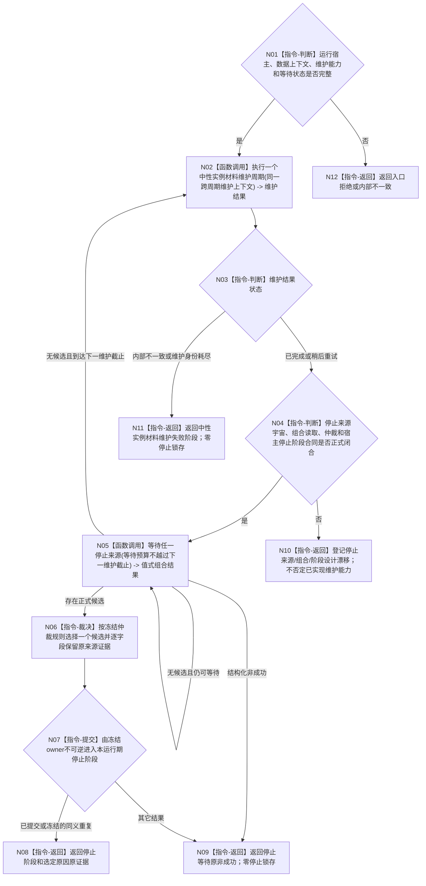

# BIZ-L2-001-10 等待程序停止请求目标函数流程图 v0.2

更新时间：2026-08-28

## 依据

```text
0050、1160、4230、8100 v0.7、8110 v0.3、8120 v0.10；BIZ-L1-T01 v0.5；
BIZ-L3-001-10-01 v0.2、BIZ-L3-001-10-02 v0.1；HEAD 07283c7b 的海中鱼巣/启动.程序运行宿主.ixx与海中鱼巣/启动.应用程序.ixx。
```

## 身份与边界

正式目标治理图。普通应用唯一运行宿主在数据上下文可用后立即执行一次中性实例材料维护，此后每60秒执行一次，同时等待正式停止请求。维护只调用DATA状态/动态服务的同步清理入口，不创建线程、定时器、后台owner或第二清理权威。

周期维护与停止来源严格分账：维护内部不一致或维护身份耗尽形成`程序失败阶段::中性实例材料维护`并进入T01统一收口，但不冒充进程信号、程序控制或致命线程故障停止候选。停止侧仍须等待10-01的来源宇宙、各owner/生产者、组合读取、仲裁和T01停止阶段锁存合同闭合；当前单一信号轮询不证明目标停机合同完成。

## 函数合同

```text
根函数候选：等待程序停止请求
归属模块 / 文件 / 目标分解深度：程序运行宿主 / 物理文件待停止合同冻结；现行宿主为海中鱼巣/启动.程序运行宿主.ixx / BIZ-L2
现有或待新增：部分现有；HEAD运行无窗口宿主已执行维护回调并轮询单一信号位，正式多来源等待与停止阶段owner不存在
完整签名：未冻结；旧程序停止等待请求/结果和停止阶段锁存端不构成ABI。现行维护回调参数只证明同步维护接线
参数：未冻结；必须含正式停止来源组合能力、运行宿主状态、等待预算，以及由普通应用上下文形成且跨周期保留请求的中性实例材料维护能力
返回结果：未冻结；停止成功必须绑定正式仲裁选定原因及原来源证据；维护内部不一致必须返回专属程序失败阶段；所有非成功不得锁存伪停止阶段
被调函数流程图：BIZ-L3-001-10-01 v0.2、BIZ-L3-001-10-02 v0.1
```

## 流程图



## 节点合同

| 节点 | 当前可确认合同 | 仍待冻结 | 验证边界 |
| --- | --- | --- | --- |
| N01—N03/N11/N12 | 1160/4230冻结唯一宿主立即一次、随后每60秒同步维护；DATA服务不自建线程 | 仅目标具名维护helper代码形态可后续机械整理 | 资源失败保留原请求；内部不一致进入专属失败阶段，不变成停止原因 |
| N04/N10 | 维护合同闭合不等于停止来源合同闭合 | 来源宇宙、owner/生产者、仲裁、组合ABI和停止阶段owner | 设计漂移只阻断目标多来源停止路径，不抹除HEAD单信号/维护代码事实 |
| N05 | 等待预算不得越过下一维护截止；通知只促使重读 | 多来源等待、当前性、关闭、超时和部分失败矩阵 | 不能因等待阻止每60秒维护，也不能以维护唤醒构造停止候选 |
| N06—N09 | 正式候选须保留原来源证据；停止阶段由唯一owner提交 | 仲裁优先序、幂等、提交后读回和非成功矩阵 | 维护失败、线程投影和本地计时器都不进入来源宇宙 |

## 当前代码对应（HEAD `07283c7b`）

- `运行普通程序`在普通应用上下文可用后形成中性实例材料维护回调，并传给`运行无窗口宿主`。
- `运行无窗口宿主`立即执行一次维护，随后每60秒执行；`已完成/稍后重试`继续等待，`内部不一致`返回`程序失败阶段::中性实例材料维护`。
- 同一宿主仍只每100毫秒轮询单一进程信号位；没有正式多来源组合结果、仲裁或T01停止阶段owner。

## 具名偏差

- `DRIFT-BIZ-HOST-STOP-SOURCE-UNIVERSE-OWNERS-AND-ARBITRATION-UNFROZEN`
- `DRIFT-BIZ-HOST-STOP-COMPOSER-READ-ABI-WAIT-CURRENTNESS-AND-TERMINAL-MATRIX-UNFROZEN`
- `DRIFT-BIZ-HOST-STOP-STAGE-OWNER-COMMIT-IDEMPOTENCY-AND-READBACK-MATRIX-UNFROZEN`

## v0.2校正记录

- 补入1160/4230已冻结且HEAD已实现的普通应用唯一宿主同步周期维护；维护失败与正式停止来源分账。
- 等待预算必须允许宿主按60秒周期重新执行维护；维护资源失败保留同一请求，内部不一致进入专属程序失败阶段。
- 多停止来源、仲裁和停止阶段继续保持设计门禁，不以维护已实现或单一信号轮询冒充闭环。
