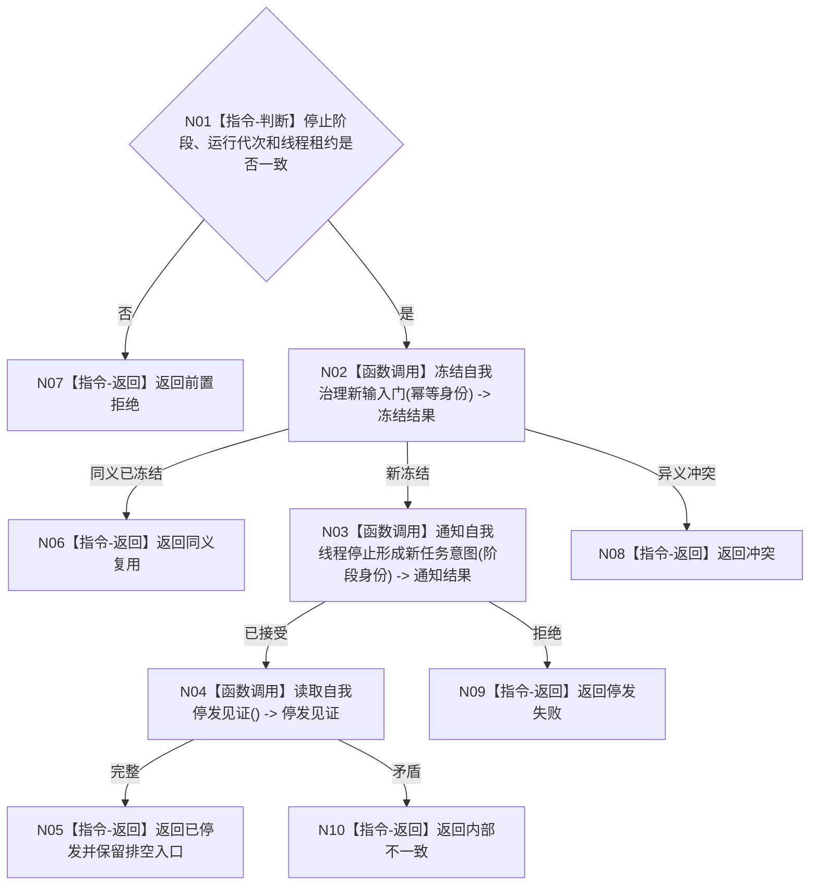

# BIZ-L2-001-11 请求自我线程停止产生新任务意图目标函数流程图 v0.1

更新时间：2026-08-03

## 依据

```text
8100、8110；目标线程归属与跨线程材料；BIZ-L1-T01、BIZ-L1-T02
```

## 身份与边界

正式目标函数设计图。关闭自我线程的新治理批次和新任务意图生产，但保留已允许结算与最终结果排空入口。

## 函数合同

```text
根函数：请求自我线程停止产生新任务意图
归属模块 / 文件 / 层级：分阶段停止协调 / 海中鱼巣/启动.分阶段停止.ixx / L2
现有或待新增：待新增；现有自我线程只有整体请求停止，粒度不足
完整签名：自我停发结果 请求自我线程停止产生新任务意图(const 自我停发请求& 请求)
参数：请求为只读借用；含运行代次、自我线程租约、停止阶段身份、允许排空的材料类别和幂等身份
返回结果：自我停发结果；含已停发、同义复用、未启动、错代或内部不一致
被调函数流程图：自我治理输入门冻结与停发确认进入L3展开
```

## 流程图



## 节点合同

| 节点 | 类型 | 输入 | 输出 | 事实读写 | 验证 |
| --- | --- | --- | --- | --- | --- |
| N01 | 指令-判断 | 停发请求 | 准入 | 无 | 错代和未启动 |
| N02—N04 | 函数调用 | 阶段和租约 | 门、通知、见证 | 只改线程输入门和生命周期投影 | 同义/异义重复 |
| N05—N10 | 指令-返回 | 停发结论 | 结构化结果 | 不终止已允许结算 | 排空许可保留 |

## 关键边界

停发不等于自我线程已退出，也不得撤销已经发布的任务意图或业务事实。
